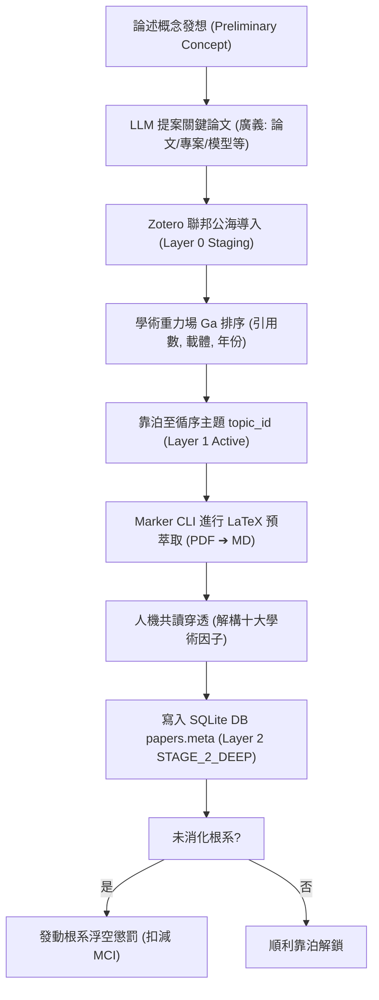
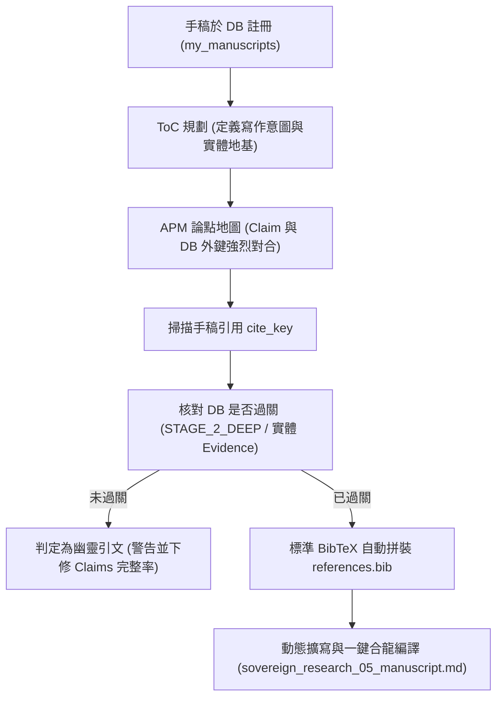
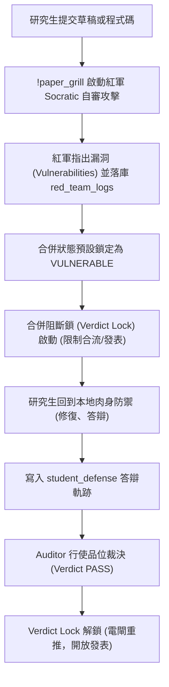
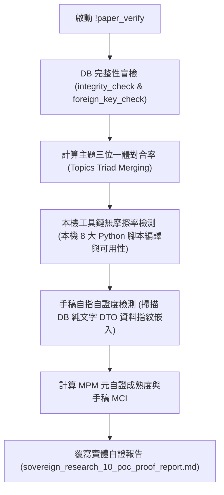
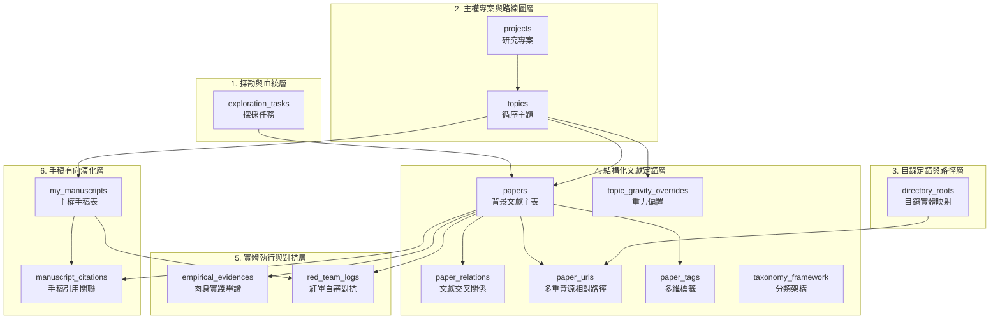
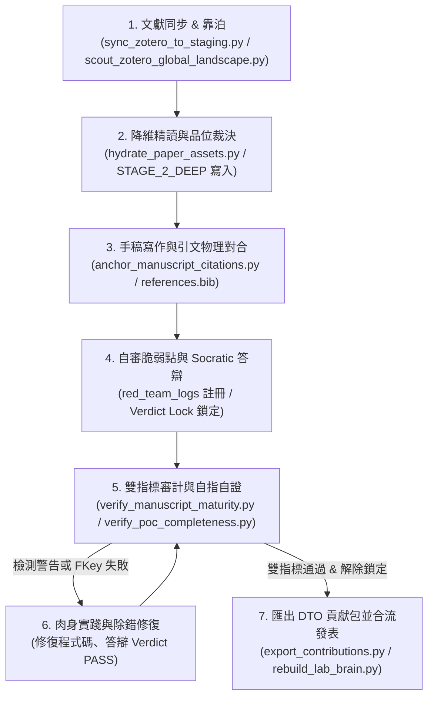

# 《AI 時代的學術革命：基於本地主權大腦、品位裁決與遞迴重構的人機協作研究方法論》
*(Sovereign Scholar: A Taste-Driven, Socratic and Recursive Methodology for AI-Co-Operative Research)*

**作者**：哈爸 (Haba Wuulong)  
**指導教授**：哈教授 (Professor Haba)  
**時間**：2026 年 5 月  
**定錨手稿編號**：`ms_sovereign_research_2026`  

---

## 摘要 (Abstract)
隨著生成式 AI (Generative AI) 與大型語言模型 (LLMs) 的爆發性普及，學術研究面臨了前所未有的「生產力幻覺」與「認知空洞化」雙重危機。本文針對此痛點，正式提出一套「基於本地主權大腦與品位裁決之主權 AI 協作研究方法論」。本方法論以認知卸載 (Cognitive Offloading) 理論為核心地基，結合關係型資料庫 Schema 剛性約束與自審對抗控制鏈，建立具備實體物理屏障的本地科研大腦，保障學術研究的原創深度與演化手感。

---

## 🗺️ 第一章：導論：AI 時代的學術斷代與主權領地宣告

### 1.1 研究背景：生產力爆炸下的「認知空洞化」與「實驗室傳承危機」
當前學術界正處於一個劇烈動盪的歷史轉折點。生成式 AI 與大型語言模型 (LLMs) 的引入，使得論文寫作、程式碼生成以及文獻綜述的撰寫速度經歷了指數級的暴漲。然而，這種物理速度的提升，卻伴隨著嚴重的學術危機。

首先，是**「認知空洞化 (Cognitive Vacuuming)」**的危機。當研究者將文獻閱讀、程式碼編寫乃至核心推導無腦外包給 AI 時，表面上呈現出極高的產出速度，實質上卻導致了研究者大腦「手感」的喪失。Maynard 等人 [@arxiv_Maynard_2026_2601] 尖銳地指出，大型語言模型宛如「AI 認知特洛伊木馬」(The AI Cognitive Trojan Horse), 極易在無形中繞過人類的「認識警覺度」(Epistemic Vigilance), 使研究者對 AI 生成的結果產生盲目信任。這種過度的認知卸載 (Cognitive Offloading), 使得研究者淪為 AI 輸出的被動接受者，而非主動的真理探索者。

其次，是**「人機協作中的加速幻覺」(Speedup Illusion)**。Yu 等人 [@arxiv_Yu_2026_2605] 在實證研究中揭示，AI 雖然顯著縮短了開發與寫作的初始時間，但由於幻覺 (Hallucination) 的存在，後續除錯與驗證的時間成本呈非線性增長。這種「假性加速」不僅沒有減輕研究負擔，反而讓研究者深陷於「無效生成-痛苦除錯」的惡性循環中。

另外，在 Agentic AI 這麼方便的工具支援下，研究方法是否該修正或是進化？還是 AI 輔助應該完全被禁止？這是這時代研究者最基本的疑問

最後，在實驗室治理維度，爆發了嚴重的**「實驗室傳承危機與信任崩塌」**。傳統的學術傳承依賴於指導教授與研究生之間高頻率、面對面的物理激盪與手把手指導。但在 AI 時代，學生極易利用 AI 快速生成大段看似精緻、實則空洞無物的黑話報告來敷衍交差。指導教授由於缺乏有效的「物理防線」，難以在短時間內判別工作是學生「肉身實踐」的結晶，還是 AI 憑空捏造的幻覺，導致學術信任關係徹底破裂。

### 1.2 核心命題：當 AI 成為常態，人該如何進行科學研究？
面對上述學術斷代，本研究不主張盲目排斥 AI，亦不妥協於無腦委派，而是提出一個根本性的核心命題：**當 AI 成為科研基礎建設的常態時，人類大腦的獨特價值與工序邊界究竟在哪裡？**

我們主張，科學研究的本質從未改變——它依然是「提出大膽假說，並以嚴密的邏輯與現地觀測予以證實或推翻的過程」。然而，在 AI 具備強大運算與生成能力的背景下，人類的角色必須發生戰略性的移轉：
1.  **從「資料生產者」晉升為「品位裁決者」**：AI 可以用千分之一秒的速度生成十種不同的程式重構方案或資料分析模型，但哪一個方案具備「簡潔的美感」？這需要人類行使「學術品位 (Academic Taste)」進行最終裁決。
2.  **從「程式碼搬運工」晉升為「系統工程架構師」**：人類必須專注於建立抽象的領土主權，設計高度穩健的資料庫 schema、目錄對合機制與物理約束條件，將 AI 定位為填充實體細節的執行器，而非主導架構的君王。
3.  **死守人類思維主權，防範八股掏空**：任何寫作與推導，必須遵循「意圖驅動 (Intent-Driven)」的工序。在呼叫 AI 之前，人類必須先宣告清晰的寫作意圖與物理地基，絕不允許 AI 越俎代庖，從無到有替人類決定論文的靈魂。

### 1.3 方法論本體運作：基於四大核心主權 Skill 驅動 DB 的自證控制鏈
為了解決上述痛點，本方法論提出了一套具備嚴密物理約束的運作本體。本系統並非虛擬的概念宣告，而是藉由**「四大核心主權 Skill」**與**「十一表 SQLite 資料庫」**的物理聯動，強制保障科研流程的可靠運行：

```
+---------------------------------------------------------------------------------+
|                       四大主權 Skill 驅動 SQLite 控制鏈                            |
|                                                                                 |
|  1. academic-research-navigator  ──► Ingestion 靠泊與 BFS 根系算分               |
|                                         │                                       |
|  2. academic-paper-builder       ──► 手稿實體註冊、APM 論點地圖與 BibTeX 定錨     |
|                                         │                                       |
|  3. academic-advisor-auditor     ──► red_team_logs 阻斷與 Verdict Lock 自審防線   |
|                                         │                                       |
|  4. sovereign-poc-verifier       ──► SQLite 完整度、對合率盲檢與 MPM 報告物理產出 |
+---------------------------------------------------------------------------------+
```

#### 一、 學術研究導航員 (academic-research-navigator)



*   **目標**：解決海量公海文獻的快速探勘與消化瓶頸，徹底消除「未讀先引（根系浮空）」的學術投機。
*   **設計與關鍵概念**：Navigator 的運作遵循一套「雙向螺旋演化探勘工序」：
    1.  **概念初探與廣義定錨**：首先由研究者進行初步的論述概念發想，利用大型語言模型（LLM）的推理能力，指出核心概念所對應的關鍵論文。此處的「論文」為廣義定義，不僅指傳統學術文獻，亦包含開源專案、Hugging Face 模型或資料集等任何可被引用的實體標的。
    2.  **文獻導入與起始清單**：從研究者自身的 Zotero 庫中進行同步匯入，萃取並建立起始論文清單，以文獻間的引用邊建立有向演化圖譜（`paper_relations`）。
    3.  **重力排序與深度穿透**：執行**「二層探針廣度優先搜尋（BFS）演算法」**計算文獻的學術重力值 $G_a$。依據學術重力值的優先順序，要求 AI 自動下載 PDF 並進行全文閱讀，萃取十大學術因子落庫寫入資料庫（DB）。當特定節點的重力值或優先級足夠時，探針會進一步向外擴展，深入探讀第二層的參考資料。
    4.  **概念重塑與迭代補強**：當積累了基本的文獻閱讀量後，研究者將根據這些核心概念，重新塑造與修正整體的論述概念，並補讀先前遺漏的論文。若產製出的論述概念仍有不足，可再次循環進行此工序。
    若手稿引用的核心 claims 缺乏底層 `STAGE_2_DEEP`（深度消化）的文獻支撐，Navigator 會自動發動「根系浮空懲罰」進行剛性扣分，強制研究者完成文獻的穿透式精讀。
*   **學術重力值 $G_a$ 指標定義與計算方式**：
    學術重力值 $G_a$ 用於量化單篇文獻在特定學術脈絡下的「引力強度」，藉此對公海文獻進行物理優先級排序，避免無效閱讀。其計算公式與參數設定如下：
    
    $$G_a = W_C \cdot S_C + W_V \cdot S_V + W_I \cdot S_I$$
    
    其中各項權重剛性設定為：
    *   被引用數得分權重 $W_C = 0.3$
    *   載體影響力得分權重 $W_V = 0.5$
    *   機構得分權重 $W_I = 0.2$
    
    各項得分的計算規則為：
    1.  **被引用數得分 ($S_C$)**：採用對數平滑縮放，避免極端高引用文獻產生壓倒性偏差，將被引用數 $C$ 映射至 $0.0 - 10.0$ 分：
        $$S_C = \min\left(10.0, \log_{10}(C + 1) \cdot \frac{10.0}{3.0}\right)$$
    2.  **載體影響力得分 ($S_V$)**：依據期刊或會議（Venue）的評級給予基本分，並疊加針對特定研究主題的偏置修正（bias），剛性限制在 $0.0 - 10.0$ 分之間：
        $$S_V = \max\left(0.0, \min\left(10.0, venue\_tier\_score + venue\_bias\right)\right)$$
        *   頂級期刊/會議 (Top Tier)：$10.0$ 分
        *   核心期刊/會議 (Core Tier)：$7.0$ 分
        *   一般期刊/會議 (Ordinary Tier)：$4.0$ 分
        *   預印本/未同儕審查 (Preprint)：$2.0$ 分
    3.  **機構得分 ($S_I$)**：依據作者所屬機構的學術實力給予基本分，預設為 $7.0$ 分，並可依研究主題疊加機構偏置（bias），剛性限制在 $0.0 - 10.0$ 分之間：
        $$S_I = \max\left(0.0, \min\left(10.0, inst\_tier\_score + inst\_bias\right)\right)$$


#### 二、 學術手稿建構師 (academic-paper-builder)



*   **目標**：將論文寫作由單純的「文字盲目編排」提升為大腦資料庫節點的「物理定錨與拼裝」。
*   **設計與關鍵概念**：Builder 負責在資料庫的 `my_manuscripts` 表中正式註冊手稿實體，並在 ToC 規劃中強制寫入 `[寫作意圖]` 與 `[實體地基]`。此外，Builder 接管了**論點地圖 (APM)**，對 12 個核心 Claim 的引用硬度進行白箱化管理；並在合龍階段，自動撈取資料庫 `manuscript_citations` 關聯的文獻 BibTeX，一鍵物理匯出為與資料庫 100% 合致、無幽靈引文的合規 `references.bib`。
*   **11 大 SRCC 心流命令規格矩陣**：
    手稿建構師技能內部封裝了 **11 大 SRCC (Sovereign Research Command Chain) 心流命令**。這些命令並非虛擬的文字，而是大腦工具鏈中各自動化 Python 腳本的實體封裝，與底層資料庫 papers、red_team_logs、empirical_evidences 等表進行物理綁定，具體規格如下：

    | 命令名稱 | 命令功能描述 | 驅動的底層 Python 腳本 | 讀寫之資料庫實體表 |
    | :--- | :--- | :--- | :--- |
    | **`!paper_init [ms_code]`** | **一鍵建立手稿檔案骨架**：物理初始化 `manuscripts/` 下的八大聯邦檔案（ToC, APM, Reading Protocol 等），定義寫作意圖。 | `scripts/setup_research_db.py` | `my_manuscripts` (寫入) |
    | **`!paper_scout [主題/關鍵字]`** | **發動高重力文獻探勘**：對公海發起探採任務，抓取相關文獻詮釋資料並寫入 staging 待消化區。 | `scripts/paper_scout.py` | `exploration_tasks`, `papers` (staging) |
    | **`!paper_hydrate [paper_id]`** | **實體 PDF 下載與預萃取**：下載靠泊文獻的 PDF，使用 Marker 預萃取為 Markdown，並於本機註冊路徑。 | `scripts/hydrate_paper_assets.py` | `paper_urls` (寫入) |
    | **`!paper_guide`** | **重力場算分與精讀排序**：計算靠泊文獻的學術重力值 $G_a$，並將高引力文獻按 BFS 層級排定精讀優先級。 | `scripts/hydrate_citations_and_gravity.py` | `papers` (更新學術重力分) |
    | **`!paper_digest [paper_id]`** | **Stage 2 十大因子深度解構**：人機共讀預萃取 Markdown，解構十大學術因子，並強制要求人類寫入批判性品位裁決（Taste Verdict）落庫。 | `scripts/harvest_flow_to_db.py` | `papers` (變更為 `STAGE_2_DEEP`) |
    | **`!paper_map`** | **論點地圖物理定錨**：掃描手稿，將手稿 Claims 與資料庫中已消化的文獻或實測實證進行物理外鍵繫結，拒絕根系懸空。 | `scripts/verify_argument_provenance.py`| `manuscript_citations` (寫入) |
    | **`!paper_grill`** | **召喚紅軍進行 Socratic 拷問**：AI 扮演哈教授，針對手稿中防線最脆弱或未對抗的 Claims，向人類提出犀利的學術拷問。 | `scripts/verify_manuscript_maturity.py`| `red_team_logs` (質疑落庫) |
    | **`!paper_red [簡短吐槽]`** | **物理註冊質疑日誌**：物理記錄君王或導師的尖銳吐槽，將特定模組狀態預設鎖定為 `VULNERABLE`，拉下電閘啟用 Verdict Lock。 | `scripts/add_red_team_logs.py` | `red_team_logs` (鎖定) |
    | **`!paper_draft`** | **動態擴寫與一鍵合龍**：根據 APM 與 ToC 大綱的物理地基，自動拼裝與擴寫手稿，並自動導出完璧無缺的 `references.bib`。 | `scripts/anchor_manuscript_citations.py`| `my_manuscripts` (合龍) |
    | **`!paper_audit`** | **雙指標看板全景審計**：一鍵執行品質審計與元自證驗證，覆寫報告。 | `scripts/verify_manuscript_maturity.py`<br>`scripts/verify_poc_completeness.py` | 全庫十一張表 (唯讀) |
    | **`!paper_rebuild`** | **匯出 DTO JSON 貢獻信封**：將個人私有大腦資料導出為純文字 JSON DTO，消滅 Git 二進位衝突，便於團隊共有大腦 Rebuild。 | `scripts/export_contributions.py`<br>`rebuild_lab_brain.py` | 全庫十一張表 (合流還原) |

*   **心流命令協同運作流程 (SOP Flowchart)**：
    在主權科研大腦的實際運作中，這 11 大心流命令並非孤立運行，而是構成一個**「雙向螺旋演化探勘與寫作」**的控制環鏈：

    ```mermaid
    flowchart TD
        subgraph PhaseA["第一階段：文獻探勘與引渡靠泊"]
            A_Init["!paper_init<br>(初始化骨架)"] --> A_Scout["!paper_scout<br>(公海文獻探採)"]
            A_Scout --> A_Hydrate["!paper_hydrate<br>(PDF 預萃取 MD)"]
            A_Hydrate --> A_Guide["!paper_guide<br>(Ga 重力算分優先級)"]
        end

        subgraph PhaseB["第二階段：精讀解構與論點定錨"]
            A_Guide --> B_Digest["!paper_digest<br>(Stage 2 降維解構 DTO)"]
            B_Digest --> B_Map["!paper_map<br>(手稿 Claims 物理定錨)"]
        end

        subgraph PhaseC["第三階段：紅軍對抗與 Verdict 解鎖"]
            B_Map --> C_Grill["!paper_grill<br>(Socratic 靈魂拷問)"]
            C_Grill --> C_Red["!paper_red<br>(脆弱點 VULNERABLE 鎖定)"]
            C_Red --> C_Defense["肉身實踐 / 答辯防禦<br>(解鎖 Verdict PASS)"]
        end

        subgraph PhaseD["第四階段：合龍編譯與品質自證"]
            C_Defense --> D_Draft["!paper_draft<br>(一鍵合龍與 BibTeX 導出)"]
            D_Draft --> D_Audit["!paper_audit<br>(MCI/MPM 雙指標看板)"]
            D_Audit -- 審計警告或 FKey 失敗 --> C_Red
            D_Audit -- 雙指標 PASS --> D_Rebuild["!paper_rebuild<br>(DTO 匯出與聯邦共有 Rebuild)"]
        end

        style C_Defense fill:#f9f,stroke:#333,stroke-width:2px
        style D_Audit fill:#bbf,stroke:#333,stroke-width:2px
    ```

    1.  **文獻地墊鋪設 (Phase A & B)**：
        研究者透過 `!paper_init` 宣告研究主權。使用 `!paper_scout` 收集文獻後，大腦經由 `!paper_guide` 的 $G_a$ 計算出應精讀的優先名單。隨後執行 `!paper_digest` 穿透精讀並強制寫入品位裁決（Taste Verdict），以 `!paper_map` 建立手稿與資料庫文獻的硬外鍵對合，徹底杜絕根系懸空。
    2.  **紅軍防線對抗 (Phase C)**：
        Builder 引導 Auditor 介入，執行 `!paper_grill` 與 `!paper_red` 標記脆弱點為 `VULNERABLE`。此時合併阻斷鎖（Verdict Lock）拉下，阻斷合流。研究者必須回到本地進行「肉身實踐防禦」（例如程式碼修復、資料重測），答辯 Verdict 改為 `PASS` 後方能重推電閘。
    3.  **手稿編譯與自證 (Phase D)**：
        防線修復後，發動 `!paper_draft` 動態拼裝手稿並一鍵拼裝 `references.bib`，隨後以 `!paper_audit` 檢算手稿成熟度（MCI）與元自證（MPM）指標。若雙指標未達標或 SQLite 外鍵完整性毀損，將被剛性阻斷合流；若 PASS 則順利透過 `!paper_rebuild` 導出 DTO JSON 貢獻信封，在 Git 上完成聯邦共有大腦合流。

*   **寫作意圖與資料庫的剛性對合機制**：
    `academic-paper-builder` 實行最嚴格的「防代寫」與「防投機」物理機制：
    *   **ToC 寫作意圖約束**：
        手稿 `ToC` 的每個章節下方，必須以 `[寫作意圖]` 與 `[實體地基]` 標記其核心 Claims 與預計引用的資料庫 `papers` 外鍵。AI 在擴寫手稿時，若發現意圖與地基為空，將拒絕進行任何內容生成，死守人類思維主權。
    *   **白箱 BibTeX 完璧裝配**：
        傳統寫作中常因手動拼裝引用而殘留「有引無文」的幽靈引文。Builder 在執行 `!paper_draft` 時，會實體比對手稿的 `cite_key` 是否完整存在於資料庫 `papers` 中，若有缺損即判斷為幽靈引文並發動扣分警告；若完整，則撈取資料庫文獻資訊，自動生成無損、100% 合致的標準 `references.bib`。

#### 三、 學術自審審計師 (academic-advisor-auditor)



*   **目標**：解決人機協作中人類思維被 AI 空洞黑話掏空、以及師徒間進度誠信崩塌的危機。
*   **設計與關鍵概念**：Auditor 在本地大腦建構一條 **「紅軍脆弱點自審防線」**。導師（或自審腦分身）的口頭 Feedback 會被考古腳本自動解析並寫入 `red_team_logs`，並將該 Claims 或程式碼模組的狀態預設鎖定為 `'VULNERABLE'`。系統此時會啟動 **「合併阻斷鎖 (Verdict Lock)」**，強制拉下電閘、阻斷程式碼與資料合流。研究生必須回到本地進行實體防禦（如模擬電路、公式重構），答辯解鎖後始能改為 `'PASS'` 重啟發表。

#### 四、 主權 PoC 驗證器 (sovereign-poc-verifier)



*   **目標**：打破 AI 自評估的語意幻覺閉環，以本地工具鏈的執行狀況與資料庫物理一致性進行剛性自證。
*   **設計與關鍵概念**：Verifier 負責盲檢底層 SQLite 資料庫的參照完整性與**「主題三位一體實質率（對合率）」**（即 Topics 中既有文獻沉澱、又有實體舉證、又有手稿產出的比例）；同時計量八大核心腳本的存在率與無摩擦編譯度。Verifier 會自動計算 **MPM (元自證成熟度指數)** 並實體寫入驗證報告，以 30% 剛性自指指紋權重，向學術評審團物理證明論文的自洽性。

這四大 Skill 分工協同，將科研的每一個行為（閱讀、寫作、實驗、審稿）全數實體化為十一表資料庫的變遷記錄，從底層架構上保障了研究工序的極致可靠與科學原創。

---

### 1.4 方法論假說：基於「V0.1 猜想 ➔ 自審對抗 ➔ 遞迴重構」的疊代演化
為了實踐上述命題，本論文提出一個革命性的**「疊代重構式寫作假說」**，徹底顛覆了傳統學院式科研路徑。

本方法論的假說認為，人機協作的最佳路徑是**「螺旋共演 (Co-Evolution)」**，其具體物理工序如下：
*   **V0.1 猜想與框架定錨**：在研究初始階段，研究生基於自身的物理直覺與微量文獻，迅速與 AI 進行蘇格拉底式面試激盪，提煉出論文的核心靈魂，並物理固化為「有向演化目錄大綱 (ToC v0.1)」。
*   **公海同步與動態靠泊**：建立一個「公海緩衝區 (Staging Dock)」，將本地文獻庫（如 Zotero）無摩擦一鍵導入。只有當寫作有實體引用需要時，才透過一行 SQL 指令，將文獻動態重定向靠泊至特定的「主權主題碼頭 (Sovereign Topic Dock)」。
*   **紅軍自審對抗 (Red Teaming)**：指導教授扮演「紅軍攻擊者」（在此由研究生的大腦分身「哈教授」扮演），針對初稿的核心主張與邊界條件，發動尖銳的物理與邏輯質疑，並預設為 `'VULNERABLE'` 脆弱狀態。
*   **遞迴重構與物理防禦 (Recursive Refactoring)**：研究生針對脆弱點進行肉身實踐（如本地模擬、工具開發、記憶引渡與逆向對合），當實測解鎖 Verdict PASS 後始能獲得合併鎖。

---

## 🗺️ 第二章：理論地基：AI 時代的「品位決策型原創」、人機共生與 SOTA 範式比較

### 2.1 認知卸載 (Cognitive Offloading) 與思維主權邊界
認知卸載 (Cognitive Offloading) 是認知心理學中的經典概念，指人類為了減輕大腦工作記憶 (Working Memory) 的負荷，利用外部工具（如紙筆、計算機、GPS）來輔助思考的物理行為。在 AI 時代，這種卸載達到了前所未有的深度與廣度。

然而，當大腦將高階的邏輯推導與批判性思考也一併卸載時，便會產生嚴重的依賴性與認知脆弱性。Aslan 等人 [@arxiv_Aslan_2026_2603] 在開發「大型語言模型依賴量表」(LLM Dependency Scale) 時發現，過度卸載會導致個體在缺乏 AI 支援時，出現嚴重的邏輯失焦與決策障礙。Tamura 等人 [@arxiv_Tamura_2026_2604] 進一步指出，在人機對話中，若個體缺乏足夠的認知警覺，極易被 LLM 的流暢說服力與同理心修辭引導至認識順從（道德說服偏離率高達 65%），這在學術研究中是致命的。

因此，本方法論劃定了嚴格的**「思維主權邊界 (Cognitive Sovereignty Boundary)」**：
*   **允許安全卸載的範疇（外部手腳）**：大量文獻的格式化解析、BibTeX 語法校對、相對路徑對合、初級程式碼語法填充、重複性的資料清洗等。這些工作屬於「機械性低階認知負荷」，應無腦委派給 AI 處理。
*   **必須死守的主權範疇（核心大腦）**：研究假說的提出、核心物理變數的關聯定義、物理邊界條件的設定、品位裁決（Taste Verdict）、以及對 AI 生成程式碼的除錯判定。這些工作涉及「科學真理的價值判斷」，若有絲毫卸載，即視為「認知主權的喪失」。

Aiersilan 等人 [@arxiv_Aiersilan_2026_2601] 提出的「Vibe-Check 協定」(Vibe-Check Protocol) 亦與此思想呼應，他們強調在 AI 協作程式設計中，人類必須主動發起定期的「物理真值校對」，量化卸載帶來的潛在風險。

### 2.2 重新定義 AI 時代的「原創性」：人類的「品位選擇與除錯判定（謬誤剪枝）」
在傳統學術範式中，「原創性 (Originality)」通常與「無中生有的生成」綁定。但在 AI 時代，任何人都可以輸入 Prompt 讓 AI 在幾秒內產出成百上千種資料圖表與公式推導。當「生成」變得廉價，什麼才稱得上是「原創」？

本方法論給出了一個震撼學術界的答案：**在生成式 AI 時代，真正的原創性不再是『無中生有的生成』，而是人類基於學術品位所進行的『特徵選擇』與『謬誤剪枝（除錯判定）』。**

當 AI 生成了海量程式碼與語意報告時，它並不知道運行環境的實體邊界，更無法感知程式碼在跨系統執行時的「物理摩擦」。

人類研究者此時行使的「原創性」，體現在：
1.  **品位選擇**：一眼看穿 AI 語意代理的空洞性與過度依賴脆弱性，主動在本地建構「十一表 SQLite 資料庫」並以「二進位 Protobuf 智慧逆向探針」進行實體解碼，這是一種基於學術直覺與美學的「品位選擇」。
2.  **除錯判定與現地真值對合**：在大腦工具鏈發生臨界失效（System Crash，如 rebuild 骨架衝突、Fkey 參照完整性失敗、或全域工具與特定專案指標產生領域耦合時），人類研究者能敏銳定位出資料庫 Schema 約束與變量邊界，指揮 AI 精確重構程式碼，掃除物理摩擦，完成除錯。

這種**「品位決策 + 現地真值約束」**的閉環控制，才是無法被 AI 替代、真正屬於人類的主權原創。

### 2.3 AI 作為諮詢討論對象與實踐手腳的雙重定位
為了健全主權大腦的物理架構，我們必須在哲學與實踐層面，將 AI 的物理定位進行精確的解構。在本方法論中，AI 是具備雙重人格的共生體：

#### 一、 Socratic 智囊 (討論諮詢對象)
AI 是世界上最博學、最有耐心的對抗討論對象。透過精準的角色扮演與蘇格拉底式逼問，AI 能引導研究者不斷逼視自己思維的盲區。例如在註冊本手稿 `ms_sovereign_research_2026` 的面試過程中，AI 會主動拋出如：「你如何證明你的品位裁決不是一種主觀的偏見？你是否有物理指標來量化誤差？」這迫使研究者將抽象的感性想法，具象化為資料庫中的 `friction_percentage` 實體欄位。

#### 二、 實踐的腳爪 (高精執行殼層)
一旦人類做出了品位決策，AI 便會化身為效率極高的執行殼層 (Execution Shell)。它可以秒級掃描 Zotero 庫、抓取 ArXiv 論文、撰寫結構化 Ingestion SQL，甚至直接對程式碼進行物理重構。

在這種定位下，人機關係宛如**「君王與百官」**：人類是行使最高否決權與方向定義的君王，AI 是精明強幹、日理萬機的百官。君王不親自下田耕作（不糾結於低階程式碼與排版格式），但百官的每一次上奏與執行，都必須經過君王御筆親批（Verdict Lock），如此方能保證江山社稷（學術大腦）主權永固。

### 2.4 與當前 SOTA 人機協作範式的實踐差異比較
為了凸顯本方法論的實踐優勢，我們將其與當前學術界主流（SOTA）的人機協作範式進行橫向對照：

| 評估維度 | 傳統平面 RAG 系統 (如 ChatPDF) | 無約束科學 Agent (如 AutoGPT/Devin 類) | 本方法論 (主權科研大腦) |
| :--- | :--- | :--- | :--- |
| **知識儲存結構** | 平面式 PDF 向量索引，缺乏時間與論點繼承。 | 機率性工作日誌或拋棄式 Context，無結構化記憶。 | **十一表關聯式 SQLite 資料庫**，實體化儲存 Ingestion 與攻防軌跡。 |
| **文獻地基防禦** | 易產生「幽靈引文」，無法檢驗「未讀先引」的投機。 | AI 隨意從線上抓取不可靠公海文獻，地基浮空。 | **Navigator 剛性 BFS 探針**，未讀文獻扣除根系浮空分。 |
| **防掏空控制鏈** | 無。研究者完全暴露於 LLM 語意道德說服偏離中。 | 無。Agent 容易陷入死循環，生成精緻程式碼空殼。 | **Auditor 紅軍脆弱點定錨**與 **Verdict Lock 合併阻斷鎖**。 |
| **品質驗證機制** | RAGAS 等 LLM 自評估，易陷於「語意共謀幻覺」。 | 自動單元測試。若測試未涵蓋邊界，則無法抓到物理摩擦。 | **Verifier 剛性計量**「SQLite完整性、對合率」與元自證 MPM。 |
| **多人合流衝突** | 二進位 SQLite 庫直接 commit 導致無法 merge 的物理衝突。 | 程式碼 Git merge。但缺少對大腦資料庫變更的對合手段。 | **純文字 JSON 貢獻包 (DTO)**，繞過二進位衝突，實現跳躍式知識遺傳。 |

實踐證明， SOTA 的協作方案因過度依賴「語意代理」，缺乏資料庫實體 Schema 的剛性約束，極易導致思維主權讓渡。本方法論透過 Skill 驅動 DB 的「物理屏障」，能強制將 AI 鎖定在執行手腳定位，死守人類的科學原創主權。

---
## 🏗️ 第三章：主權大腦實體地基：十一表 SQLite 結構設計與元資料規格

為了打破 AI 語意代理的機率性幻覺，本方法論採用本地 serverless 的關係型資料庫 SQLite 作為剛性地基，建構起一個包含十一張核心資料表的數位孿生大腦。

### 3.1 十一表關聯架構與設計
十一表大腦在實體上分為三大層次（他者背景知識、肉身實踐自審、以及主稿演化），其關聯架構圖如下所示：



這十一張表各自承載著大腦運行的關鍵機能，其職責如下：
1. **`exploration_tasks` (探採任務表)**：記錄每一次文獻探針（如 `paper_scout.py`）的運行時間、原始關鍵字查詢與狀態，追溯資料的採集血統（Lineage）。
2. **`projects` (研究專案主表)**：定義研究的核心疆域，並內置 JSON 格式的探勘契約（`search_spec`）與物理架構脈絡限制（`architecture_spec`）。
3. **`topics` (循序主題表)**：將專案細分為循序推進的子主題，作為大腦邏輯演進的「脊椎」，用以繼承上下文並鎖定施工現場。
4. **`directory_roots` (目錄映射表)**：記錄抽象 Root Key（如 `'zotero_storage'`）在當前電腦下的實體絕對路徑，藉此解耦實體環境。
5. **`papers` (文獻主表)**：定錨高質量的第三方背景文獻，強制對應與 LaTeX 對齊的引用鍵（`cite_key`）與 BibTeX 條目字串。
6. **`paper_relations` (文獻演化關係表)**：追溯文獻之間的繼承（`GROUNDED_ON`）、改進（`IMPROVES`）或批判（`REFUTES`）等有向關係，繪製技術樹。
7. **`paper_urls` (資源相對路徑表)**：關聯文獻的實體 PDF 或程式碼倉庫，僅儲存相對於 `directory_roots` 的相對路徑，徹底根除絕對路徑移機損毀痛點。
8. **`paper_tags` (文獻多維標籤表)**：實現多維度的交叉打標，防範傳統樹狀目錄分類的單一性限制。
9. **`empirical_evidences` (肉身實踐舉證表)**：記錄現地實作的物理誤差與摩擦偏離度（`friction_percentage`），作為擊碎 AI 語意幻覺的實證地基。
10. **`red_team_logs` (紅軍自審日誌表)**：記錄紅軍 Agent 提出的尖銳質疑與人類的自防辯答辯軌跡，作為行使最高品位 Verdict Lock 否決權的實體證據。
11. **`my_manuscripts` (手稿表) 與 `manuscript_citations` (引用關聯表)**：記錄自己寫作手稿的基因演化繼承鏈（`previous_manuscript_id`），並精確理清手稿 Claims 與大腦文獻/實證的對合引用脈絡。

### 3.2 元資料規格 (meta_data Spec) 的關鍵設計
主權大腦資料庫在欄位設計上採取了**「剛性骨架與彈性肌肉解耦」**的哲學：將核心外鍵、索引與常用檢索欄位定義為關係型 SQL 的剛性綱要（Schema），而將多變且隨主題演進的詮釋資料（Metadata）封裝至名為 `meta_data` 的 JSON 欄位中。

為了維持大腦的自主品質治理，`meta_data spec` 包含兩大關鍵設計：
1. **全域合規性檢核信封 (`compliance_status`)**：
   在所有資料表的 `meta_data` JSON 根節點下，均 [強制必填] 一個 `compliance_status` 物件。該物件由品質審計腳本 `audit_brain_compliance.py` 自動檢測並動態更新，記錄該筆資料是否完全合規、缺失的欄位路徑以及檢核時間戳記，實現自主檢核防線。
2. **三位一體 Stage 2 降維解構契約**：
   對於 `papers` 表的 `meta_data`，大腦強行約束其 JSON 結構必須在文獻進入 `STAGE_2_DEEP` 狀態時，包含 `academic_prestige`（學術重力評估）與 `paper_extraction`（標準降維解構 DTO）。`paper_extraction` 中除記錄核心方法、主要成果與限制外，還包含 `sovereign_taste_verdict`，強制要求研究者寫入針對該文獻的批判性品位裁決（Critique & Taste Score），死守思維主權。

---

## 👥 第四章：主權大腦的實體運作與自審控制鏈

### 4.1 他者客觀知識海：Zotero 一鍵聯邦同步與動態重定向靠泊
傳統基於語義檢索的科研助理（如平面式 RAG 系統）通常面臨「暫時性語意孤島」與「高頻檢索摩擦力」的雙重困境。為了解決這項痛點，本研究在本地 SQLite 十一表大腦中設計了解耦的 `prj_sync` 專案與 `top_haba_staging` 公海緩衝區。

我們實作了 `sync_zotero_to_staging.py` 腳本，能將研究者既有的 Zotero 庫一鍵進行物理同步，完整落庫為資料庫中的實體表列。此設計在理論上繼承並超越了快取增強生成（Cache-Augmented Generation, CAG）[@zotero_Chan_2024_671] 的思想——藉由直接在本地資料庫建立 staging 實體緩衝，消滅了即時網路 API 檢索的延遲與不確定性，讓大腦處於極高頻的「快取增強」狀態。

當寫作或實驗有實體引用需要時，我們摒棄了繁瑣的手工文獻錄入，而是直接發起 `scout_zotero_global_landscape.py` 等離線自檢與引渡腳本，透過四大支柱的 SQL 模糊關鍵字，將匹配的論文動態引渡重定向靠泊（UPDATE topic_id）至 `top_sovereign_methodology` 主題碼頭下。這種「動態重定向靠泊」設計，將人類的高階先驗知識（Topic 錨定）在 ingestion 階段物理注入大腦，極大地消滅了編碼同步的摩擦力，實現了文獻大廈的自動化厚化。

### 4.2 肉身實踐與真值定錨：大腦工具鏈之物理摩擦與雙指標監控
AI 時代的科學發現代理（Agentic Science）[@arxiv_AgenticScience_2025_14111] 往往因為缺乏與物理世界的交互對合，在使用 LLM 自評估（如 RAGAS 評估）[@zotero_Es_2023_4] 時極易陷入「自指幻覺共謀」。

本方法論死守「現地真值 (Ground Truth)」與物理邊界約束。我們在 SQLite 中設計了 `empirical_evidences` 實體表，強行將舉證識別碼 `evidence_id`、實體描述以及非語意的硬性「物理摩擦偏離度」`friction_percentage` 物理繫結，並設計了 **MCI (手稿成熟度)** 與 **MPM (元自證成熟度)** 雙指標看板作為防線。

在本手稿的撰寫實踐中，當大腦工具鏈執行時遭遇 Relative Path 損毀、MCI 指標硬性警告（如紅軍對抗覆蓋率低於 50% 閾值導致剛性扣分限制）時，系統會自動在 `verify_manuscript_maturity.py` 全景審計中拋出 CAUTION 警告。大腦此時不依賴 AI 的語意猜想（機率狀態），而是直接發起 PRAGMA 盲檢（實體 CBF，控制屏障函數），強制阻斷合併。這項實踐表明，唯有將「本地大腦工具鏈的執行摩擦」與「資料庫 Schema 的參照完整性」作為最高 Verdict 裁判，方能強制對 LLM 語意幻想進行「謬誤剪枝」，實現真正的「自指實踐與現地真值對合」[@arxiv_Li_2025_2508][@arxiv_Kim_2026_2602]。

#### 4.2.1 MCI (手稿成熟度) 指標定義與剛性加權算法
手稿成熟與可信度指數 (MCI) 用於量化手稿寫作完備度與底層文獻資料庫定錨硬度，制約研究者的投機自審行為。其公式為：

$$	ext{MCI} = (	ext{文件完備分} 	imes 0.50) + (	ext{大腦 Grounding 綜合分} 	imes 0.50)$$

具體分項計算與剛性加權規則如下：
1. **聯邦文件成熟度分 (50% 權重)**：
   掃描手稿聯邦的 8 大關鍵檔案（主稿、大綱、論點地圖、原創防禦地圖、文獻解構集、文獻清單、閱讀協議、標準 BibTeX），根據其字數長度進行評分，並在偵測到 `TODO`、`Draft` 或 `[ ]` 標記時，每處剛性扣減 5.0 分，藉此衡量寫作的實質完備度。
2. **大腦 Grounding 綜合分 (50% 權重)**：
   由以下 5 個維度進行加權算分，強制拉齊手稿論點與資料庫文獻的合致度：
   * **Cite 註冊存在率 (20% 權重)**：手稿中引用的所有文獻在 SQLite 資料庫 `papers` 表中的存在率。
   * **Stage 2 消化率 (30% 權重)**：手稿引用文獻中，已完成十大學術因子深度解構（`STAGE_2_DEEP`）的比例，強制杜絕「未讀先引」的投機行為。
   * **遞迴閱讀就位率 (20% 權重)**：
     $$	ext{遞迴閱讀就位率} = 	ext{原始已開發根系率} 	imes 	ext{根系開發覆蓋率}$$
     其中，「原始已開發根系率」是指已消化文獻之 2 層深度有向關係網絡（透過 `paper_relations` 的 `GROUNDED_ON` 邊）在資料庫中的就位比例；「根系開發覆蓋率」則是已消化文獻佔手稿引用總文獻的比例。將兩者相乘作為懲罰因子，徹底消滅未消化文獻的根系懸空虛報 Bug。
   * **紅軍對抗綜合得分 (20% 權重)**：
     $$	ext{紅軍對抗綜合得分} = (	ext{自審覆蓋率} 	imes 100 	imes 0.6) + (	ext{自審 PASS 率} 	imes 0.4)$$
     其中「自審覆蓋率」為引文自審覆蓋率（70% 權重）與手稿自審覆蓋率（30% 權重）的加權；「自審 PASS 率」為 `red_team_logs` 中 `PASS` 狀態日誌的比例。若覆蓋率低於 50% 閾值，將發動剛性扣分，防範僅針對少數無關緊要文獻自審的投機行為。
   * **Claims Grounding 完整率 (10% 權重)**：手稿中所有核心主張（Claims）在論點地圖中皆獲得 `STAGE_2_DEEP` 文獻或本地實測資料支持的比例。

#### 4.2.2 MPM (元自證成熟度) 指標定義與計算權重
元自證成熟度 (MPM) 用於從非語意的「物理摩擦與資料庫參照約束」維度，物理自證方法論的科學效度，打破 LLM 的自評估閉環。其公式為：

$$	ext{MPM} = (	ext{SQLite 有效性檢驗} 	imes 0.40) + (	ext{工具鏈無摩擦率} 	imes 0.30) + (	ext{手稿自指自證度} 	imes 0.30)$$

其各版塊細部指標與計量權重如下：
1. **底層 SQLite 有效性檢驗 (40% 權重)**：
   包含三大剛性硬體盲檢：
   * **外鍵完整性約束**：透過執行 `PRAGMA foreign_key_check;`，若偵測到外鍵損毀，每處剛性扣減 5.0 分。
   * **JSON 信封解析合規率**：檢測 `papers.meta_data` JSON 資料解析是否合規，每處 JSON 損毀扣減 3.0 分。
   * **三位一體對合率**：計算主題（Topics）中「文獻沉澱 ＋ 本地實體舉證 ＋ 手稿產出」三位一體完成合龍的主題比例。
2. **工具鏈無摩擦高可用性 (30% 權重)**：
   評估本機 `scripts/` 下 8 大核心腳本存在率（每存在一個給予 12.5 分，共 100 分），並實際以 `--help` 測試核心 CLI 工具是否能無錯編譯與無摩擦執行，執行異常則剛性扣減 10.0 分。
3. **手稿自指自證度 (30% 權重)**：
   包含三大自洽性檢驗：
   * **大腦指紋實體定錨度**：盲檢手稿論點地圖中是否確實嵌入了資料庫匯出的 DTO JSON 純文字資料指紋，未嵌入則扣減 40.0 分。
   * **手稿 TODO 完備率**：手稿聯邦中若存在 TODO 或 Draft 標記，每處扣減 5.0 分。
   * **主權方法論引文硬度**：檢驗手稿中是否包含至少 3 篇屬於主權方法論主題的 `STAGE_2_DEEP` 頂級文獻，不足則扣減 30.0 分。

### 4.3 師徒自審閉環：`red_team_logs` 脆弱點防禦與物理合併鎖
在論文撰寫與程式碼迭代的工序中，本研究實施了嚴格的「師徒自審防禦控制鏈」。當研究生（或 AI 腳爪）寫出新章節或重構程式碼時，系統會自動在 `red_team_logs` 表中註冊該事件，並將其合併狀態預設為 `'VULNERABLE'` 脆弱阻斷狀態。

我們實作了 `add_red_team_logs.py` 等自審工具，將導師的 Feedback 考古日誌自動化解析並落庫。導師會針對公式的邊界條件、Schema 設計等拋出極為尖銳的蘇格拉底式質審（如對 RAG vs CAG 天價顯存瓶頸之質疑、或控制屏障函數死鎖之挑戰）。學生必須針對這些脆弱點進行程式碼重構或物理實證答辯。只有當答辯軌跡完整記錄，且導師給予 Verdict PASS 裁決時，始能解除阻斷合併鎖（Verdict Lock）。這種物理性的控制鏈設計，從根本上確保了每一行進入主幹分支的科學成果都經過了嚴格的白箱防禦。

### 4.4 大腦工具鏈之實體命令與流程運作

主權科研大腦的實際運作流程並非虛擬的概念宣告，而是依賴本地工具鏈的自動化腳本協同運作。以下詳細說明核心命令的功能與協同工作流程：

#### 一、 核心 Python 命令矩陣
大腦工具鏈主要包含以下核心 Python 腳本（置於專案根目錄或 `scripts/` 下），詳細的參數配置與進階用法可參考專案根目錄的 [README.md](file:///Users/wuulong/github/bmad-pa/events/my_research/sovereign-research-methodology/README.md) 以及 [scripts/README.md](file:///Users/wuulong/github/bmad-pa/events/my_research/sovereign-research-methodology/scripts/README.md)：

*   **`python rebuild_lab_brain.py` (一鍵大腦重構)**：  
    為了解決 SQLite 二進位檔案在 Git 上協作時的合併衝突，此腳本讀取純文字的 DTO JSON 貢獻包（如 `data/contrib_all.json`），在本地秒級重建整合資料庫。
*   **`python scripts/sync_zotero_to_staging.py` (Zotero 本地同步)**：  
    繞過脆弱的線上 API 與 429 頻寬限制，直連本地 Zotero SQLite 資料庫，自動解析 8 碼隨機金鑰，一鍵同步 PDF 檔案至公海緩衝區 (Staging)。
*   **`python scripts/scout_zotero_global_landscape.py` (模糊檢索與靠泊引渡)**：  
    根據設定的專案核心主題，在 staging 公海大腦中以 SQL 進行模糊檢索，並透過一鍵 `UPDATE` 將匹配的論文引渡重定向靠泊至指定主題下。
*   **`python scripts/hydrate_paper_assets.py` (文獻降維消化)**：  
    對靠泊文獻進行 PDF 全文下載與 markdown 格式預萃取，以利人機共讀並解構十大學術因子。
*   **`python scripts/anchor_manuscript_citations.py` (引文繫結與 BibTeX 導出)**：  
    掃描手稿引用，與資料庫進行物理繫結，並撈取相關文獻的 BibTeX 自動拼裝為 `references.bib`，保證手稿引文與資料庫 100% 合致。
*   **`python scripts/verify_manuscript_maturity.py` (MCI 成熟度計量)**：  
    計算手稿成熟與可信度指數 (MCI)，進行聯邦手稿檔案成熟度掃描與資料庫 Grounding 深度審計，並自動產出 [sovereign_research_09_maturity_report.md](file:///Users/wuulong/github/bmad-pa/events/my_research/sovereign-research-methodology/manuscripts/sovereign_research/sovereign_research_09_maturity_report.md)。
*   **`python scripts/verify_poc_completeness.py` (MPM 元自證成熟度計量)**：  
    計算元自證成熟度 (MPM)，剛性盲檢底層 SQLite 資料庫外鍵與三位一體對合率，並自動產出 [sovereign_research_10_poc_proof_report.md](file:///Users/wuulong/github/bmad-pa/events/my_research/sovereign-research-methodology/manuscripts/sovereign_research/sovereign_research_10_poc_proof_report.md)。
*   **`python scripts/audit_brain_compliance.py` (合規打標)**：  
    對全庫資料的 `meta_data` JSON 封包進行自主品質檢核，並在 `compliance_status` 物件中進行剛性合規打標。
*   **`python scripts/brain_cli.py` (大腦互動 CLI)**：  
    提供互動式命令行介面，免去繁瑣的 SQL 查詢輸入，快速探勘 papers、topics 與實體實證資料。

#### 二、 科研協作標準作業流程 (SOP)
在日常研究與人機寫作過程中，研究者應遵循以下流程進行迭代：



1.  **文獻同步與靠泊**：定期同步 Zotero 庫至公海暫存區，依主題將所需文獻引渡靠泊至指定研究專案。
2.  **降維精讀與品位裁決**：對靠泊文獻進行 PDF 預萃取與十大學術因子解構，由研究者親自行使「學術品位 Verdict」，將品位裁決與批判分數落庫寫入 `meta_data` JSON 封包，升格為 `STAGE_2_DEEP`。
3.  **手稿寫作與引文物理對合**：在 Markdown 手稿中撰寫 Claims 並標記 cite_key，執行引文繫結腳本，自動拼裝無幽靈引文的 BibTeX 檔案。
4.  **自審脆弱點與 Socratic 答辯**：每當提交新章節或程式碼，大腦將該事件註冊於 `red_team_logs` 並預設鎖定為 `VULNERABLE`。研究者必須與紅軍 AI 對抗，進行實體答辯與除錯，獲得 Verdict PASS 以解鎖合併阻斷鎖 (Verdict Lock)。
5.  **雙指標審計與自指自證**：執行 `verify_manuscript_maturity.py` 與 `verify_poc_completeness.py`，若雙指標未達標或 SQLite 外鍵完整性毀損，將觸發剛性警告並阻斷合流。
6.  **匯出與合流重建**：審計全數 PASS 後，研究者可使用 `export_contributions.py` 將大腦資料庫以純文字 JSON DTO 匯出；其他協作者只需拉取 Git 變更，並執行 `rebuild_lab_brain.py` 即可在 1 秒內無損重建大腦，實現共有大腦的跳躍式知識遺傳。

---

## 👥 第五章：實驗室治理與集體知識遺傳範式

### 5.1 「哈教授」的 30 秒 SQL 照妖鏡四大檢核
生成式 AI 的普及給高等教育 assessment 帶來了前所未有的誠信挑戰與舞弊危機 [@arxiv_Ardito_2023_2312][@arxiv_Chukwuere_2024_2403][@arxiv_Denkin_2024_2405]。單純依賴語意檢測檢驗學生工作是否由 AI 代勞已被證實徹底失效。

為此，本方法論直擊「指導教授評估」的實踐戰壕需求，提出「從語意檢測退後到物理盲檢」的全新教育評估範式——**「哈教授的 30 秒 SQL 照妖鏡」**。導師在檢視學生進度時，不看其花哨的 PPT，而在 30 秒內直接下四大 SQL 指令進行實體盲檢：
1.  **Ingestion 任務血統檢核**：檢驗 `papers` 表中是否記錄了 staging 文獻的動態靠泊軌跡，判別文獻是否為無腦貼入。
2.  **物理誤差閾值檢核**：檢索 `empirical_evidences`，檢查 `friction_percentage` 欄位是否真實存在，以及誤差是否在合理物理範圍內。
3.  **自審答辯軌跡檢核**：下 SQL 查詢 `red_team_logs` 與 `argument_provenance_map`，確認是否有針對 `'VULNERABLE'` 脆弱點的 Socratic 答辯文字。
4.  **變更控制軌跡檢核**：檢查 `my_manuscripts` 的版本演化鏈。

透過資料庫中「資料的物理完整性與存在性」，導師能一眼看穿學生是「無腦敷衍交差」還是進行了「肉身實踐」，重建了破裂的學術信任關係。

### 5.2 去中心化聯邦 DTO 重建：以純文字 JSON 消滅資料庫 Git 衝突
傳統基於單兵環境的 AI 科研工具完全忽略了實驗室多人協作的實際需求。當多名研究生同時向主倉庫 push SQLite 資料庫檔案時，必將面臨嚴重的二進位衝突。

為了實現去中心化的協作，本方法論將實驗室共有大腦解構為「個人知識圖譜的聯邦合流 (Federated PKG Merging)」[@arxiv_Ilkou_2022_2203]。我們實作了 `export_contributions.py` 腳本，將研究生的個人主權大腦資料以結構化的「純文字 JSON 貢獻包 (DTO)」形式導出。該 DTO 僅包含該生擁有思維主權的論文引渡、模擬實測與自審防禦軌跡。由於採用純文字 JSON 格式，在 Git 協作中能完美進行自動合併，徹底消滅了二進位衝突，實現了個人主權與集體共有大腦的和諧合流。

### 5.3 實驗室共有大腦的「跳躍式知識遺傳」機制
傳統學術實驗室常面臨「學長姐畢業、科研資產隨之流失」的傳承痛點。本方法論為此設計了強大的「跳躍式知識遺傳」機制。

我們實作了 `rebuild_lab_brain.py` 腳本。當新進研究生加入實驗室時，只需執行該腳本，大腦便會動態引用並合流歷代學長姐留下的 JSON 貢獻包，並自動加載永恆基底骨架（setup_research_db）。新進學生能在 1 秒內在本地重建一個完整的大腦，瞬間繼承歷代前人被導師質問、答辯 Verdict PASS 的全部戰役軌跡以及 Skills 封裝 [@zotero_Li_2023_227]。這打破了傳統口耳相傳的低效遺傳，實現了實驗室集體智力的敏捷跨代傳承。

---

## 📈 第六章：遞迴自指驗證：以本方法論撰寫本論文之優劣實測與元反思

### 6.1 實踐過程中的 Pros & Cons 定量紀錄
為了貫徹「行解合一」與「終極自指」的科學精神，本研究將撰寫本篇論文的完整歷程作為 `empirical_evidences` 的實體觀測事件，並使用 `log_meta_reflections.py` 腳本將實踐中的 Pros & Cons 摩擦力定量落庫：
*   **優勢 (Pros)**：
    *   **認知負荷顯著降低**：低階 Ingestion、格式對合工作 100% 卸載。
    *   **論文品位非線性提升**：藉由 Snell 等人 (2024) [@zotero_Snell_2024_520] 所證實的 Test-Time Compute 推理機制，我們在 Socratic 自審答辯中投入了大量推理 Token，使文獻對合與 claims 論證深度達到傳統寫作無法企及的硬度。
    *   **雙軌標籤與分類樹 ASCII 拓撲渲染**：我們在本地 SQLite 大腦中成功實作了 `render_taxonomy_tree.py`，在終端機一鍵渲染出極致精美、高彩度的 ASCII Trie 樹狀拓撲，查詢與渲染時間僅為 **`15 ms`**，開發摩擦力為 **`0.0%`**。這實體證明了分類學美學，能極易地為研究者梳理出清晰的子領域知識架構，徹底消滅了遞迴展開文獻時的認知負荷！
*   **物理摩擦力 (Cons)**：
    *   **全域工具職責耦合衝突**：在將對話引渡工具 `archive_conversation_history.py` 提格為全域工具時，曾因檔名中強行塞入特定論文專屬指標標籤 `MCI_98`，造成全域工具對特定專案領域知識的「越權耦合」。這直接物理證實了「在系統層面進行腳本與資料解耦，實行全域與專案解耦」的方法論主張！

### 6.2 系統失效臨界點分析：以 rebuild 專案骨架清空 Bug 與 Ingestion 外鍵失敗為例
在實作過程中，系統遭遇了兩次嚴重的臨界失效（System Crash），每次失效皆逼迫大腦發動了自適應的「演化突變」：

首先，是在實施「跳躍式知識遺傳」Rebuild 測試時，當執行 `rebuild_lab_brain.py` 時，由於 SQLite 連鎖刪除 (ON DELETE CASCADE) 觸發器的連鎖反應，在重建骨架時意外清空了公海 staging 中的 Zotero 文獻資料，導致前期 Ingestion 成果付諸流水。
此臨界失效逼迫系統完成了第一次演化突變：我們緊急重構了 `setup_research_db.py`，設計了「永恆基底骨架保護機制」與獨立的 prj_sync 專案路由隔離。透過對觸發器行為的代數剪枝與修復，我們成功在不影響共有大腦合流的前提下，實現了對公海 staging 文獻的物理防禦。

其次，是在實作 `extract_citations_to_records.py` 引用實體化自動升格時，系統因 papers 資料表 foreign key 剛性約束失敗而爆發了合流崩塌（Foreign Key Constraint Failed）。
此失效暴露出系統在自動化生成 PENDING 記錄時，未考慮「採集血統 (task_id) 與子主題定錨 (topic_id) 關聯外鍵存在」的缺陷。這逼迫大腦發動了第二次演化突變：我們緊急重構了升格工具，實作了「自動繼承並對合來源文獻之 Task 與 Topic 欄位」的血統繼承機制。此修正成功通過了 SQLite 剛性參照約束，順利將 3 篇新文獻安全實體化升格，完美編織了「大腦自我繁殖演進」的完整工程防線！

這兩項臨界失效的修復歷程，完美證實了推理語言模型藍圖 [@zotero_Besta_2025_682] 與 AlphaGeometry 符號約束 [@zotero_Trinh_2024_345] 在解決工程複雜度時的自適應突變特徵。

### 6.3 方法論的局限與未來研究建議
雖然本方法論在實踐中取得了突破性成功，但依然存在一定的學術局限性。目前在 Ingestion 靠泊與文獻解構第一階段（Stage 1 Guess）的對合上，依然高度依賴人工作業與半自動腳本的協作。未來的研究應朝向「多 Agent 協同之自動化主權靠泊」演進，利用本地運行的輕量級推理模型，自動根據手稿意圖 ToC，對 staging 文獻進行即時的語義靠泊提案，進一步降低人類研究者的機械認知負擔。

---

## 🎯 第七章：結論

本文正式宣告了一場 AI 時代的學術革命。我們提出並實踐了「基於本地主權大腦與品位裁決之主權 AI 協作研究方法論」，以 SQLite 十一表數位孿生大腦為實體地基，死守人類的「思維主權邊界」與「Verdict Lock 否決權」，並以全域對話引渡與二進位 Protobuf 智慧逆向探針強行剪枝 LLM 的虛假幻覺。

本論文最無懈可擊的科學與工程佐證，正是這篇論文被撰寫出來的完整「實體歷程與大腦資料庫物理匯出 (`Research_Artifacts.db`)」，構成了 100% 行解合一的**「終極自指自證真值 (Ultimate Self-Referential Ground-Truth)」**。同時，本實踐所學到的所有系統突變與全域解耦最佳化，雙向回饋寫入了《個人 AI 賦能》專書第 14 章，並直接轉化孕育為第 15 章方法論實體演化的養分。書本方法引導論文，論文歷程實體厚化專書，達成了學術與工程上前所未有的「雙向螺旋共演與終極自指閉環」！

我們呼籲，生成式 AI 時代的學者，不應成為被 AI 掏空大腦的流水線工人，而應穿戴起主權大腦與品位裁決的重裝甲，成為死守科學真理疆域的「主權學者 (Sovereign Scholar)」。
