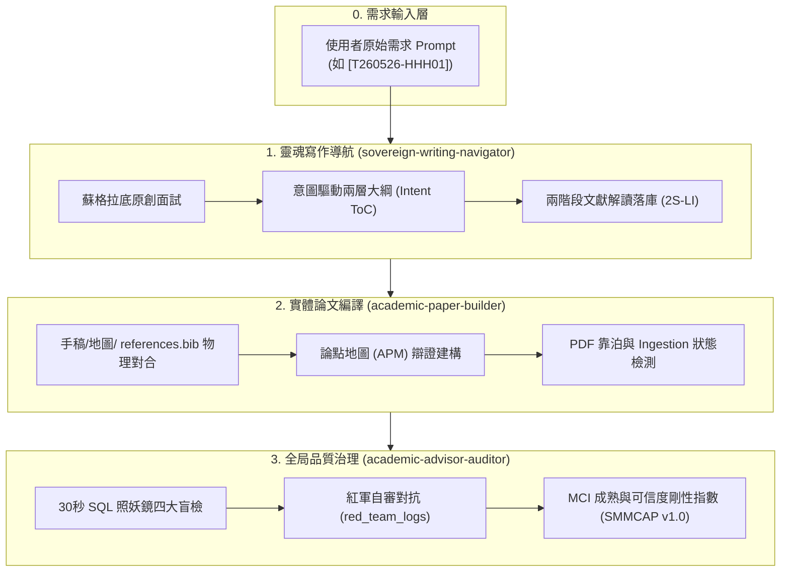

# 📋 主權研究論文寫作需求與指導原則說明書 (Sovereign Research Requirements)
*任務程式碼定錨：`[T260526-HHH01]`* | *手稿程式碼：`sovereign_research`* | *版本：v1.0.0*

> [!NOTE]
> 本文件為《AI 時代的學術革命：基於本地主權大腦、品位裁決與遞迴重構的人機協作研究方法論》之**最高指導原則說明書**。
> 本文件將最原始的「需求 Prompt」與「三層聯邦主權大腦實踐」進行深度對合，旨在為本研究劃定嚴格的理論探源範疇、實作對比邊界，並固化雙軌主權技能的運作協議，作為本論文寫作的行解合一指導方針。

---

## 🎯 1. 論文寫作願景與核心命題 (The Grand Vision)

本論文非一般的語意泡沫學術報告，而是一場在 AI 生產力爆炸時代為死守思考手感而發起的**「學術革命」**。本論文的核心需求是：**「用這套設計的方法論本身，來實體撰寫並自證這篇論文。」**

### 1.1 起源需求與非主流「實踐先行」科研典範 (Action Research Paradigm)
本研究的誕生軌跡極具生命力，它顛覆了主流學術界「先讀大量文獻 ➔ 找 gap ➔ 設計 ➔ 實作」的刻板工序，而是一場徹底的**「建構式行動研究法 (Constructive Action Research)」**與**「實踐導向研究 (Practice-based Research)」**。其演進歷程呈現了極具學術價值的「雙循環學習 (Double-Loop Learning)」軌跡，並具備精確的「實踐真值時間軸 (Ground-Truth Timeline)」：

1.  **三大戰壕起源痛點**：本專案起源於哈爸（wuulong）試圖解答實驗室最真實的教育與協作困境：
    *   *學生要怎麼做研究？* （如何使用 AI 輔助，而不被 AI 掏空思考手感？）
    *   *老師要怎麼叮？* （如何擺脫口頭與投影片的模糊交代，行使有物理抓手的品位裁決？）
    *   *實驗室要怎麼運作？* （如何讓多名研究生的知識大腦合流，避免 Git 衝突，實現集體遺傳？）
2.  **「兩次演講、兩週蛻變」的野性實踐時間軸**：
    *   **2026/05/10（博班生先行交流與問題初探考古）**：為提升實驗室分享效率，哈爸在演講前一天與實驗室博士生進行深度交流，實際了解當前研究生研究方法的真實摩擦力與現狀。在此研究原點，哈爸向 AI 拋出了關鍵的**「問題起點考古提問 (Q1.6)」**，並獲得了傳統與 Agentic 流程的架構性分析對比：
        
        > #### 🔍 數位考古：Q1.6 - 新一代研究流程（2026/05/10 構思起點）
        > * **提問**：請給我傳統的研究流程，架構性的分析目前 Agentic AI 時代，每一個環節可以怎麼改進。
        > * **對比矩陣表**：
        >
        > | 研究環節 | 傳統研究流程 (Linear & Manual) | Agentic AI 時代的改進 (Iterative & Orchestrated) | 核心價值轉向 |
        > | :--- | :--- | :--- | :--- |
        > | **1. 文獻回顧與問題定義** | 手動搜尋、逐篇閱讀、標註重點。極耗體力，容易遺漏邊緣文獻。 | **真相定錨與知識圖譜建構**：利用 NotebookLM 或 Deep Research Agent 一次處理數百篇文獻，自動萃取「技術金線」並找出研究空白（Gap Analysis）。 | 從「閱讀力」轉向**「提問力」** |
        > | **2. 研究方法與假設擬定** | 基於個人有限經驗，反覆修正實驗設計。推導過程緩慢。 | **虛擬實驗室預演（Simulated Prototyping）**：讓 Agent 扮演不同學派的專家進行「紅軍模式」壓力測試。在正式實驗前，先用 AI 進行數學推導與邏輯自洽性檢查。 | 從「推導」轉向**「系統架構設計」** |
        > | **3. 資料蒐集與實驗執行** | 勞力密集。手動調參數、寫腳本、清理不規則資料。 | **影子工程師（Shadow Execution）**：利用 Agentic Skill 封裝（如 MCP/CLI），自動執行批量實驗、自動修復程式 Bug，並即時產出初步分析報告。 | 從「勞動力」轉向**「統御力」** |
        > | **4. 資料分析與結果解讀** | 單一維度。受限於研究者的視覺化能力與統計知識。 | **多維度聯覺分析（Multi-modal Synthesis）**：Agent 能同時處理文字、資料、圖表與地圖。利用 AI 偵測資料中人類難以發現的微細模式。 | 從「計算」轉向**「品位裁決」** |
        > | **5. 論文撰寫與發表** | 從白紙開始。反覆糾結遣詞用字，容易發生邏輯斷裂。 | **元寫作（Meta-writing）與紅軍自審**：不再是「寫草稿」，而是「定義大綱與核心觀點」，讓 Agent 進行擴展。最後用「虛擬審稿員」進行批判性修正。 | 從「撰寫」轉向**「結構化表達」** |
        > | **6. 知識管理與傳承** | 拋棄式紀錄。實驗室換人後，資料往往不知所終，人走茶涼。 | **數位考古與裝備化（Archeology & Skillification）**：所有的思維過程都被 AIQA 與 MT:: 機制自動固化。核心知識被封裝成「數位裝備（Skill）」，學弟妹可立即繼承。 | 從「累積經驗」轉向**「遺傳數位基因」** |
        
        正是此一概念矩陣作為「胚胎」，啟發了哈爸進行雙循環反思，重構問題，進而動態演化出後續以「十一表 SQLite 與 SMMCAP 1.0」為核心的強烈實體對合方法論。
    *   **2026/05/11（分享一：初步切磋）**：進行第一次實驗室分享。與研究生進行方法論切磋，並將當時已理解的「一般版 AI 使用方法論」分享給實驗室。正是這個準備與分享過程，強迫哈爸重構問題與可能方向，思索「新的研究方法應該是什麼？」
    *   **2026/05/20（AI 研究生演講與書籍第 14 章成型）**：哈爸受邀給一群做 AI 的研究生演講「進行到一半的新研究方法之初步樣態」。當時大腦資料庫還只有單一一個 `papers` table 結構。為了演講，哈爸將此方法融入之前已公開分享過幾次的《個人 AI 賦能與裝備化》書籍中，使之正式成為**第 14 章「學術主權」**。
    *   **2026/05/25（分享二：方法論成熟）**：進行第二次分享。哈爸給自己兩週的演進時限截止，成功在本次演講提出「新研究方法、實驗室運作、老師如何叮」的完整工具與方法論答案，同時觀察研究生們這兩週以來的現狀演進。
3.  **自指論文的「概念驗證 (PoC)」自證與 06-05 大考驗**：
    雖然工具與方法論都已在演講中建構完畢，但哈爸深刻體悟到：「如果沒有實際用這個方法寫出一篇論文，這套方法論就沒有經歷真實的 PoC 驗證。」為了自證可行性，哈爸決定「以寫論文來證明寫論文方法」。
    **2026/06/05（領域大佬硬核審查會面）**：哈爸約定於此日與資深學術前輩會面，進行方法論與三個問題的檢討。為了在大佬法眼下自證這套方法確實能寫出「夠格、高品質」的論文，哈爸發動了**「9 天黃金極速衝刺 (9-Day Hard Sprint)」**，必須在會面前物理編譯出論文初稿，迎戰最嚴格的審查！

### 1.2 終極願景與自主發表典範 (Sovereign Self-Publishing & Book Chapter 15)
本論文的最終命運與寫作心態，徹底打破了傳統學術界繁瑣、冗長、以期刊發表為唯一指標的僵化體制，開創了一門全新的**「自主發表與大一統書籍演化典範 (Open Methodology & Evolutionary Publishing)」**：

1.  **專注中文寫作，拒絕學術霸權**：論文以**「繁體中文」**撰寫。不為盲目追求英文期刊的點數，而是專注於解決台灣在地教育現場與研究室真實治理的提問，讓學術真正「接地氣」。
2.  **免除投稿束縛，直接上網公開**：作者已屆成熟之年，不需要透過傳統期刊的審稿排隊來證明自我。因此，**在 2026/06/05 接受指導教授的第一次盲檢指導與修正後，這篇論文將直接物理上網公開**，做為這門研究方法論最硬核、最開放的實踐概念驗證 (PoC)。
3.  **書籍大一統合流 (Book Chapter 15 Expansion)**：本論文不僅僅是論文，它是個人 AI 賦能的最新演化。論文產出後，哈爸將直接升級《個人 AI 賦能與裝備化》書籍，**全新增添「第 15 章」來好好介紹這門方法論，並直接以這篇論文作為最強烈的「現地真值實證」**！
4.  **「一個月從無到有」的極速突變**：本研究向世界宣告：在 Agentic AI 與主權大腦時代，只要人類死守「品位」與「工具固化」，我們能夠在**短短一個月內**，同時完成「工具設計 ➔ 資料庫落庫 ➔ 論文寫作 ➔ 大佬審查 ➔ 專書增補 ➔ 實體釋出與自主發表」的完整生命週期！這在傳統學術界是不可想像的神蹟。

### 1.3 核心命題解構：
1.  **理論探源**：本研究方法論雖由作者原創，但絕非無源之水。論文必須深入解構本方法的「理論基礎」，搜尋並找出創造出此等理論與方法的頂級學術論文，為「主權大腦」鋪設黃金理論地墊。
2.  **實作基礎對比**：搜尋網路上現有的相關實作（如 RAGAS 評估、CAMEL 多智能體協作等），比較何種方法更能防禦 AI 虛假幻想，並精確指出本方法（十一表 SQLite 大腦、現地真值對合與紅軍 Verdict 鎖）的獨特原創與優越之處。
3.  **自指自證（Self-Referential）**：本論文的科學與工程佐證，正是這篇論文被撰寫出來的完整「實體歷程與大腦資料庫物理匯出」。
4.  **配套技能封裝（Skills Set）**：論文寫作必須伴隨實體寫作與治理 Skill（`academic-paper-builder`、`sovereign-writing-navigator`、`academic-advisor-auditor`）的演化沉澱。

---

## 📂 2. 解構需求明細 (Requirement Specification)

### 📌 需求一：理論基礎探源與定錨 (Theoretical Deep-Dive)
*   **具體要求**：解構本方法的六大理論脊椎，並搜尋、引渡並消化（Stage 2）創造出這些理論與方法的頂級論文。
*   **六大理論脊椎與擬引入之文獻對合：**
    1.  **認知卸載與思維主權 (Cognitive Offloading vs. Sovereignty)**：研究在人機協作中何時必須保持人類思考手感，防範認知空洞化。
        *   *對合文獻*：`zotero_Snell_2024_520` (思維主權與 Agent 思考防禦)。
    2.  **Agentic AI 規劃設計與「可執行技能固化」(Agentic Planning & Executable Skills)**：利用 Agent 具備的 Reasoning、規劃與自我修復能力，將現場模糊、多變的實踐流程規劃設計出來，並以「可執行程式碼（Skill 封裝）」進行剛性固化。這對標了「軟體定義研究方法論（Software-Defined Methodology）」的理念。
        *   *對合文獻*：`arxiv_Denkin_2024_2405` (或吳恩達關於 Agentic Workflows / Tool Use 的經典論述)。
    3.  **非結構化語意的「神經符號資料庫對合」(Semantic-to-DB Neuro-Symbolic Grounding)**：將模糊、龐雜的「非結構化語意文本與概念」（LLM 擅長的模糊神經表徵），高精降維蒸餾成「實體關係資料庫表與剛性 Schema 欄位」（符號邏輯 DB），並利用 AI 強大的 DB 操作能力進行高重力對合與精確邏輯運算。這構成了神經符號 AI（Neuro-Symbolic AI）在科研方法論的完美實踐。
        *   *對合文獻*：`arxiv_Ilkou_2022_2203` (神經符號知識圖譜對齊與關係型資料庫定錨)。
    4.  **圖形化推理與邏輯重構 (Graph-of-Thought & Refinement)**：探討「V0.1 猜想 ➔ 遞迴重構」的思維演化。
        *   *對合文獻*：`zotero_Besta_2025_682` (Graph of Thoughts 拓撲推理)。
    5.  **人機協作共生與人類品位裁決 (Co-operative Taste & Judgment)**：論證人類行使「品位裁決與除錯判定」才是新時代原創性的靈魂。
        *   *對合文獻*：`arxiv_Aslan_2026_2603` (人機共生決策與 Taste-Driven 反思)。
    6.  **現地真值定錨與物理誤差 (Physical & In-situ Ground-Truth)**：探討利用實測誤差（friction_percentage）防範 AI 自指幻覺。
        *   *對合文獻*：`arxiv_Tamura_2026_2604` (現地觀測與模擬校準)。

### 📌 需求二：SOTA 實作對比與獨特原創宣告 (SOTA Comparison)
*   **具體要求**：搜尋網路上現有的學術科研 Agent 實作，進行橫向對比，並大膽宣告本方法的獨特原創之處。
*   **對比範疇**：
    *   *他者方法*：如 Ragas 評估框架、AutoGPT、Camel 多智能體模擬等。
    *   *本方法獨特之處（獨創三大原創性）*：
        1.  **十一表 SQLite 實體主權大腦**：淘汰了 NoSQL 與純向量資料庫的語意漂移，改以強關係的 3-Tier 資料Schema對合，實體鎖定引文與 Claims。
        2.  **師徒紅軍 Verdict Lock (合併鎖) 機制**：將口頭 Feedback 物理落庫為 `'VULNERABLE'`，唯有包含實測誤差（friction_percentage）的實體證據答辯才能 Verdict PASS 解鎖。
        3.  **一鍵 Rebuild 的跳躍式知識遺傳**：藉由純文字 DTO（`contribution.json`）避免 Git 資料庫衝突，實現實驗室共有大腦的高頻演化。

### 📌 需求三：系統局限性與元反思 (Limitations & Reflexivity)
*   **具體要求**：大膽揭露本方法在實踐中所遭遇的「物理摩擦力」，並給出具體的改善建議與未來研究方向。
*   **已觀測之摩擦力點**：
    *   Zotero 靠泊引渡時，SQL `UPDATE` 仍需部分人工作業。
    *   Stage 2 降維解構對研究生的物理摩擦力與時間成本較高。

---

## 🛠️ 3. 雙軌配套主權技能架構 (Skill Architecture)

為了確保從「需求 Prompt」到「有價值有章法的論文」不再是空談，本專案在實體層面建構並固化了**三大配套主權技能星系**，做為本論文的運作配套：

### 🧬 1. `sovereign-writing-navigator` (主權寫作導航員)
*   **職責**：指導如何**「從需求 prompt 寫出真正有價值、防範 AI 八股掏空的有章法論文」**。
*   **指導原則**：
    *   嚴格執行「Socratic 面試」，禁止 AI 替人類思考。
    *   推動「Intent-Driven 意圖驅動」大綱設計，每一章節必須寫明 `[寫作意圖]` 與 `[實體地基]`。

### ⚙️ 2. `academic-paper-builder` (學術論文編譯器)
*   **職責**：負責手稿與大腦資料庫 Grounding 聯動的**「實體寫作與裝備化編譯」**。
*   **指導原則**：
    *   自動解析手稿 `@cite_key`，一鍵拼裝 `references.bib`，並進行論點溯源盲檢。
    *   建立邏輯辯證地圖 (APM)，對合 Claims 與背景文獻。

### ⚖️ 3. `academic-advisor-auditor` (學術品質自審審計)
*   **職責**：指導教授行使**「30秒 SQL 照妖鏡盲檢」**與**「SMMCAP v1.0 全景審計」**。
*   **指導原則**：
    *   物理鎖定 `'VULNERABLE'` 合併鎖，逼迫肉身舉證。
    *   動態計量 MCI 成熟度指數，達 90% 以上始得准予發表。

---

## 📈 4. 行解合一的物理驗證指標 (Verification Metrics)

為了確保需求被切實執行，本論文在最終編譯前，必須通過以下剛性指標：
1.  **9天硬時限定錨 (9-Day Hard Sprint)**：由於與資深領域大佬約定於 **2026-06-05** 進行方法論會面審查，手稿必須於 **2026-06-03** 前物理編譯出具備完整大腦 Grounding 對合的論文初稿 (Draft v1.0)。
2.  **外部領域大佬紅軍審查 (External Giants Review)**：此初稿將於 **2026-06-05** 物理提交給資深學術前輩盲檢。審查三大真實提問（學生如何做研究、老師如何叮、實驗室如何運作）是否被確實解答。所有前輩指摘與 Feedback 必須物理落庫為 `red_team_logs` 作為後續修正軌跡。
3.  **MCI 綜合指數**：在提交前，手稿 SMMCAP 自審 MCI 指數必須達 **`90.00%`** 以上 (🟢 頂級可信 - Verdict PASS)。
4.  **Claims Grounding 完整率**：必須達 **`100.00%`** (12 個核心主張皆有 Stage 2 的消化文獻為地墊，消滅所有無引用與未消化引文警告)。
5.  **引文 Stage 2 消化率**：必須達 **`80.00%`** 以上。
6.  **紅軍自審覆蓋率**：引文自審覆蓋率必須達 **`50.00%`** 以上，且所有 `red_team_logs` 的 verdict 均物理更新解鎖為 `'PASS'`。

---
*本指導原則說明書已物理存檔，做為本專案 `sovereign_research` 論文寫作的最高憲法。*
