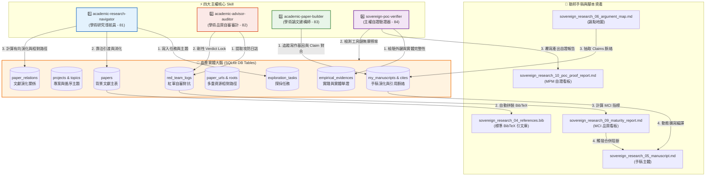

# 📐 methodology_02: 主權大腦系統架構與 10 大分區導覽 (System Architecture & Operations Portal)

本手冊是主權科研大腦的運行大憲章入口。系統性整合了圍繞著實體 SQLite 十一表資料庫所構成的四大主權核心 Skill 運作網絡，並提供全景 10 大分區規格書的跳轉地圖。

---

## 🏛️ 1. 系統整體架構與三大運作閉環 (Macro System Architecture & Loops)

主權科研大腦 (Sovereign Research Brain) 是一個以「行解合一 (Action-Knowledge Alignment)」為核心的防禦性個人學術知識系統，旨在利用資料庫與工具鏈的剛性對合，防止 AI 時代下研究者被生成式黑話代寫所產生的「認知掏空」危機。

整個系統以一個核心實體資料庫——**SQLite `Research_Artifacts.db`** 為錨定核心，將文獻、實踐證據與手稿 Claims 進行強外鍵綁定，並透過四大星級 Skills (Navigator, Auditor, Builder, Verifier) 與本地工具鏈，在宏觀上流轉著以下**三大運作閉環**：

### 🔄 閉環一：文獻引渡與降維消化閉環 (Ingestion & Digesting Loop)
此閉環負責將公海中氾濫的論文洗滌並轉化為大腦的「一等知識公民」，建立可靠的理論地基：
1. **重力場引渡**：透過學術重力場 Ga 演算 (考慮 Venue、Institution 偏置與 Citation 數)，自動挑選 Pending 優先精讀文獻，下載 PDF 並使用 Marker 預萃取成 Markdown 格式。
2. **主題靠泊**：根據專案的搜尋契約，將文獻靠泊至特定的邏輯主題 (Topic) 下，防範文獻零散堆砌。
3. **降維解構與品位裁決**：人機協同精讀，提取 10 大核心學術因子與學者主觀批判的 Verdict 寫入 JSON 信封，升級為 `STAGE_2_DEEP` 深度消化狀態。細節參見 **[第 2 區]** 與 **[第 3 區]**。

### 🔄 閉環二：紅軍自審與答辯防線閉環 (Grill & Defense Loop)
此閉環是捍衛人類思考手感與論點硬度的剛性防火牆，以對抗對抗流於形式的自審與投機行為：
1. **紅軍 Socratic 拷問**：紅軍對抗引擎掃描手稿，對最薄弱的主張 (Claims) 提出尖銳質疑，並將漏洞落庫至紅軍日誌，標記為 `VULNERABLE`。
2. **合併阻斷鎖 (Verdict Lock)**：只要資料庫中存在一筆 `VULNERABLE` 質疑，系統將剛性切斷 References 完璧拼裝，物理阻斷論文最終合龍與編譯。
3. **現地舉證與解鎖**：學生必須針對質疑修正手稿，在資料庫中補齊本地實踐舉證 (Empirical Evidences) 與誤差摩擦，填寫答辯內容。答辯經指導教授或系統評判通過 (Verdict PASS) 後，合併鎖解鎖，推回電閘。細節參見 **[第 4 區]** 與 **[第 5 區]**。

### 🔄 閉環三：手稿合龍與元自證閉環 (Compilation & Verification Loop)
此閉環負責論文發表前的物理裝配、白箱引用完璧化與 100% 重現自指校驗：
1. **意圖驅動寫作**：手稿 ToC 強制要求聲明人類的寫作意圖與資料庫實體地基，Builder 實體核對 cite_key，自動拼裝 references.bib，一鍵合龍編譯手稿。
2. **資料指紋自指合龍**：將大腦資料庫 DTO (contribution.json) 計算出之 Checksum 雜湊值自動寫入/嵌入手稿最後章節，自證手稿數據 100% 由本地資料庫長出。
3. **工具鏈可用性審計**：自證驗證器 Verifier 實體校驗 SQLite 結構健全度與本機核心 Python 支援腳本的可用性，計算元自證成熟度 (MPM)，確保該大腦可在他人電腦「一鍵冷啟動重建」，實現去中心化科學傳承。細節參見 **[第 6 區]**、**[第 7 區]** 與 **[第 8 區]**。

---

## 🏛️ 2. 主權大腦四星協同運作物理拓撲 (Orchestration Topology)

在實際運作中，這三大閉環並非依靠散裝的 Prompts，而是由以下四大星級 Skills 圍繞著 SQLite 實體資料庫進行的精密物理協調：



---

## 📐 3. 10 大分區系統化編號規範 (Segmentation Specs)

為確保方法論規格書的易讀性與擴充對稱性，本目錄下的所有檔案均採用「**每區預算 10 碼，區間跳跃式分區**」進行編號。每一分區的 `X0` 碼作為該分區總導覽/保留使用，而規格書則從 `X1` 開始編號：

```
- 第 0 區 [00-09]：系統需求與架構導覽 (Requirements & Portal)
- 第 1 區 [10-19]：底層資料庫與中繼資料規格 (Database Schema & Metadata)
- 第 2 區 [20-29]：文獻引渡與 Stage 2 消化加工 (Ingestion & Digesting)
- 第 3 區 [30-39]：理論演化與學者品位裁決 (Topology & Taste)
- 第 4 區 [40-49]：安全對抗與合併阻斷防禦 (Security & Verdict Lock)
- 第 5 區 [50-59]：現地對合與實踐校準 (Empirical Evidences & Calibration)
- 第 6 區 [60-69]：多人協作與去中心化合流 (Collaboration & Git merge)
- 第 7 區 [70-79]：雙看板指標與自審測試 (Metrics & Benchmark)
- 第 8 區 [80-89]：星級 Skills 協同規範 (Agentic Skills Specification)
- 第 9 區 [90-99]：系統維護、提示詞與工具手冊 (System Operations & Prompts)
```

> [!TIP]
> **未來新增檔案指引**  
> 若未來要加入與「版本釋出」、「多 Agent 協同協定」等相關的規格，請將其放入 **第 6 區**，命名為 `methodology_64_xxx.md`，以此類推。這能保持編號在二位數（01 - 99）內的絕對自洽。

---

## 📂 4. 10 大分區規格書跳轉地圖 (The Specification Matrix)

### 第 0 區：系統需求與架構導覽
*   **`01`**：[methodology_01_requirements.md](file:///Users/wuulong/github/bmad-pa/events/my_research/sovereign-research-methodology/methodology/methodology_01_requirements.md) ➔ 宣示思維主權與防衛認知掏空的頂層規格需求。
*   **`02`**：[methodology_02_system_architecture_navigator.md](file:///Users/wuulong/github/bmad-pa/events/my_research/sovereign-research-methodology/methodology/methodology_02_system_architecture_navigator.md) ➔ **【本入口頁面】** 系統總覽與 10 大分區地圖。

### 第 1 區：底層資料庫與中繼資料規格
*   **`11`**：[methodology_11_database_schema_spec.md](file:///Users/wuulong/github/bmad-pa/events/my_research/sovereign-research-methodology/methodology/methodology_11_database_schema_spec.md) ➔ 十一表 DDL 設計、`meta_data` JSON 規格與合規性自動化審計。
*   **`12`**：[methodology_12_relation_ontology_spec.md](file:///Users/wuulong/github/bmad-pa/events/my_research/sovereign-research-methodology/methodology/methodology_12_relation_ontology_spec.md) ➔ 文獻有向演化之 8 大關係本體與關係 DTO 規格。

### 第 2 區：文獻引渡與 Stage 2 消化加工
*   **`21`**：[methodology_21_three_tier_federated_brain.md](file:///Users/wuulong/github/bmad-pa/events/my_research/sovereign-research-methodology/methodology/methodology_21_three_tier_federated_brain.md) ➔ 三層聯邦大腦（Layer 0 緩衝 ➔ Layer 1 靠泊 ➔ Layer 2 深消化）。
*   **`22`**：[methodology_22_academic_gravity_and_digesting.md](file:///Users/wuulong/github/bmad-pa/events/my_research/sovereign-research-methodology/methodology/methodology_22_academic_gravity_and_digesting.md) ➔ 學術重力場公式 $G_a$、精讀優先級與 Stage 2 十大因子降維解構工序。

### 第 3 區：理論演化與學者品位裁決
*   **`31`**：[methodology_31_theory_grounding_and_bfs_topology.md](file:///Users/wuulong/github/bmad-pa/events/my_research/sovereign-research-methodology/methodology/methodology_31_theory_grounding_and_bfs_topology.md) ➔ 理論地墊檢測與 BFS 二層有向演化拓撲演算法。
*   **`32`**：[methodology_32_sovereign_taste_and_critique.md](file:///Users/wuulong/github/bmad-pa/events/my_research/sovereign-research-methodology/methodology/methodology_32_sovereign_taste_and_critique.md) ➔ 主權學者品位裁決（Taste Verdict）與 Claims 剛性 Grounding 防掏空機制。

### 第 4 區：安全對抗與合併阻斷防禦
*   **`41`**：[methodology_41_verdict_lock_and_socratic_grill.md](file:///Users/wuulong/github/bmad-pa/events/my_research/sovereign-research-methodology/methodology/methodology_41_verdict_lock_and_socratic_grill.md) ➔ 紅軍 Socratic 靈魂拷問與合併阻斷鎖（Verdict Lock）剛性斷電防衛。

### 第 5 區：現地對合與實踐校準
*   **`51`**：[methodology_51_physical_friction_and_empirical_evidence.md](file:///Users/wuulong/github/bmad-pa/events/my_research/sovereign-research-methodology/methodology/methodology_51_physical_friction_and_empirical_evidence.md) ➔ 本地實作證據、物理誤差摩擦計量公式與學者聯覺裁決。

### 第 6 區：多人協作與去中心化合流
*   **`61`**：[methodology_61_decentralized_dto_and_rebuild.md](file:///Users/wuulong/github/bmad-pa/events/my_research/sovereign-research-methodology/methodology/methodology_61_decentralized_dto_and_rebuild.md) ➔ 去中心化大腦與純文字 DTO 還原重建流程，解決 Git 二進位衝突。
*   **`62`**：`multi_agent_collaboration_protocol.md` *(規劃中)* ➔ 多人與多代理人協同合流協定。
*   **`63`**：`ci_cd_automated_audit_pipeline.md` *(規劃中)* ➔ 自動化 CI/CD 審計與 PR 阻斷流水線。

### 第 7 區：雙看板指標與自審測試
*   **`71`**：[methodology_71_mci_maturity_metric.md](file:///Users/wuulong/github/bmad-pa/events/my_research/sovereign-research-methodology/methodology/methodology_71_mci_maturity_metric.md) ➔ MCI (手稿成熟度) 剛性加權演算法、幽靈引文與紅軍防投機公式。
*   **`72`**：[methodology_72_mpm_poc_proof_metric.md](file:///Users/wuulong/github/bmad-pa/events/my_research/sovereign-research-methodology/methodology/methodology_72_mpm_poc_proof_metric.md) ➔ MPM (元自證成熟度) 剛性加權演算法、SQLite 檢測與手稿自指校驗。
*   **`73`**：`evaluation_and_benchmark_spec.md` *(規劃中)* ➔ 大腦解構與自審品質基準測試規範。
*   **`74`**：[methodology_74_manuscript_lifecycle_case_study.md](file:///Users/wuulong/github/bmad-pa/events/my_research/sovereign-research-methodology/methodology/methodology_74_manuscript_lifecycle_case_study.md) ➔ `sovereign_research` 手稿誕生之真實實戰生命週期案例。

### 第 8 區：星級 Skills 協同規範
*   **`81`**：[methodology_81_academic_research_navigator_skill.md](file:///Users/wuulong/github/bmad-pa/events/my_research/sovereign-research-methodology/methodology/methodology_81_academic_research_navigator_skill.md) ➔ Navigator (導航員) 技能規格（含 Ingestion 與根系檢索圖）。
*   **`82`**：[methodology_82_academic_advisor_auditor_skill.md](file:///Users/wuulong/github/bmad-pa/events/my_research/sovereign-research-methodology/methodology/methodology_82_academic_advisor_auditor_skill.md) ➔ Auditor (自審審計) 技能規格（含 Verdict Lock 狀態機圖）。
*   **`83`**：[methodology_83_academic_paper_builder_skill.md](file:///Users/wuulong/github/bmad-pa/events/my_research/sovereign-research-methodology/methodology/methodology_83_academic_paper_builder_skill.md) ➔ Builder (建構師) 技能與 11 大 SRCC 命令運作規範（含心流 SOP 圖）。
*   **`84`**：[methodology_84_sovereign_poc_verifier_skill.md](file:///Users/wuulong/github/bmad-pa/events/my_research/sovereign-research-methodology/methodology/methodology_84_sovereign_poc_verifier_skill.md) ➔ Verifier (自證驗證) 技能規格（含 MPM 三維校驗圖）。

### 第 9 區：系統維護、提示詞與工具手冊
*   **`91`**：[methodology_91_brain_cli_manual.md](file:///Users/wuulong/github/bmad-pa/events/my_research/sovereign-research-methodology/methodology/methodology_91_brain_cli_manual.md) ➔ `brain_cli.py` 命令列工具使用手冊與看板範例。
*   **`92`**：`prompt_system_design.md` *(規劃中)* ➔ Agent 提示詞系統架構與 Socratic 拷問範本規格。
