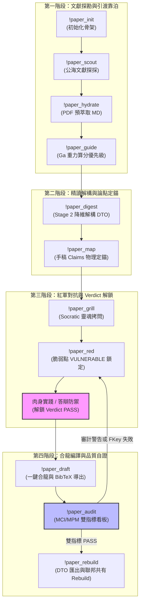

# 📐 methodology_03: 學術手稿建構師與 11 大 SRCC 心流命令指南 (Academic Paper Builder & SRCC Command Specification)

本手冊詳盡定義了主權科研大腦中 **`academic-paper-builder` (學術手稿建構師)** 技能的設計目的、核心職責、**11 大 SRCC (Sovereign Research Command Chain) 心流命令** 的剛性語義，以及它們與本地十一表 SQLite 資料庫的物理對合流程。

---

## 🧬 1. Skill 設計目標與角色定位

在人機協作的寫作過程中，研究者常面臨「AI 幻覺代寫」、「文獻未讀先引（根系懸空）」以及「多人協作時資料庫 Git 二進位衝突」等三大痛點。

**`academic-paper-builder`** 技能即是為了解決這些痛點而生。它扮演著研究流程的「剛性合規監察官」與「資料定錨裝配師」，其核心職責包含：
1.  **意圖驅動寫作**：強制手稿大綱與 Claims 必須先聲明人類的「寫作意圖」與「實體地基」，防範思維被 AI 空洞黑話掏空。
2.  **物理引文繫結**：拒絕「幽靈引文」，手稿中標記的每一篇文獻，必須在資料庫的 `papers` 表中確實存在，且 BibTeX 必須經由大腦自動拼裝。
3.  **引導 SRCC 心流命令鏈**：提供一套完整的以 `!` 開頭的命令系統，引導研究者進行文獻探勘、引渡靠泊、降維消化、自審對抗、審計與 DTO 匯出。

---

## 🚀 2. 11 大 SRCC 心流命令規格矩陣

這 11 大心流命令並非虛擬的文字，而是大腦工具鏈中各自動化 Python 腳本的封裝入口。以下是各命令的剛性規格與驅動的資料庫實體表：

| 命令名稱 | 命令功能描述 | 驅動的底層 Python 腳本 | 讀寫 of 資料庫實體表 |
| :--- | :--- | :--- | :--- |
| **`!paper_init [ms_code]`** | **一鍵建立手稿檔案骨架**：物理初始化 `manuscripts/` 下的八大聯邦檔案（ToC, APM, Reading Protocol 等），定義寫作意圖。 | `scripts/setup_research_db.py` | `my_manuscripts` (寫入) |
| **`!paper_scout [主題/關鍵字]`** | **發動高重力文獻探勘**：對公海發起探採任務，抓取相關文獻詮釋資料並寫入 staging 待消化區。 | `scripts/paper_scout.py` | `exploration_tasks`, `papers` (staging) |
| **`!paper_hydrate [paper_id]`** | **實體 PDF 下載與預萃取**：下載靠泊文獻的 PDF，使用 Marker 預萃取為 Markdown，並於本機註冊路徑。 | `scripts/hydrate_paper_assets.py` | `paper_urls` (寫入) |
| **`!paper_guide`** | **重力場算分與精讀排序**：計算靠泊文獻的學術重力值 $G_a$，並將高引力文獻按 BFS 層級排定精讀優先級。 | `scripts/hydrate_citations_and_gravity.py` | `papers` (更新學術重力分) |
| **`!paper_digest [paper_id]`** | **Stage 2 十大因子深度解構**：人機共讀預萃取 Markdown，解構十大學術因子，並強制要求人類寫入批判性品位裁決（Taste Verdict）落庫。 | `scripts/harvest_flow_to_db.py` | `papers` (變更為 `STAGE_2_DEEP`) |
| **`!paper_map`** | **論點地圖物理定錨**：掃描手稿，將手稿 Claims 與資料庫中已消化的文獻或實測實證進行物理外鍵繫結，拒絕根系懸空。 | `scripts/verify_argument_provenance.py`| `manuscript_citations` (寫入) |
| **`!paper_grill`** | **召喚紅軍進行 Socratic 拷問**：AI 扮演哈教授，針對手稿中防線最脆弱或未對抗的 Claims，向人類提出犀利的學術拷問。 | `scripts/verify_manuscript_maturity.py`| `red_team_logs` (質疑落庫) |
| **`!paper_red [簡短吐槽]`** | **物理註冊質疑日誌**：物理記錄君王或導師的尖銳吐槽，將特定模組狀態預設鎖定為 `VULNERABLE`，拉下電閘啟用 Verdict Lock。 | `scripts/add_red_team_logs.py` | `red_team_logs` (鎖定) |
| **`!paper_draft`** | **動態擴寫與一鍵合龍**：根據 APM 與 ToC 大綱的物理地基，自動拼裝與擴寫手稿，並自動導出完璧無缺的 `references.bib`。 | `scripts/anchor_manuscript_citations.py`| `my_manuscripts` (合龍) |
| **`!paper_audit`** | **雙指標看板全景審計**：一鍵執行品質審計與元自證驗證，覆寫報告。 | `scripts/verify_manuscript_maturity.py` `scripts/verify_poc_completeness.py` | 全庫十一張表 (唯讀) |
| **`!paper_rebuild`** | **匯出 DTO JSON 貢獻信封**：將個人私有大腦資料導出為純文字 JSON DTO，消滅 Git 二進位衝突，便於團隊共有大腦 Rebuild。 | `scripts/export_contributions.py` `rebuild_lab_brain.py` | 全庫十一張表 (合流還原) |

---

## 🌊 3. 心流命令協同運作流程 (SOP Flowchart)

在主權科研大腦的實際運作中，這 11 大心流命令並非孤立運行，而是構成一個**「雙向螺旋演化探勘與寫作」**的控制環鏈：

### 🔁 心流迴路運作說明：
1.  **文獻地墊鋪設 (Phase A & B)**：  
    研究者透過 `!paper_init` 宣告研究主權。使用 `!paper_scout` 收集文獻後，大腦經由 `!paper_guide` 的 $G_a$ 計算出應精讀的優先名單。隨後執行 `!paper_digest` 穿透精讀並強制寫入品位裁決（Taste Verdict），以 `!paper_map` 建立手稿與資料庫文獻的硬外鍵對合，徹底杜絕根系懸空。
2.  **紅軍防線對抗 (Phase C)**：  
    Builder 引導 Auditor 介入，執行 `!paper_grill` 與 `!paper_red` 標記脆弱點為 `VULNERABLE`。此時合併阻斷鎖（Verdict Lock）拉下，阻斷合流。研究者必須回到本地進行「肉身實踐防禦」（例如程式碼修復、數據重測），答辯 Verdict 改為 `PASS` 後方能重推電閘。
3.  **手稿編譯與自證 (Phase D)**：  
    防線修復後，發動 `!paper_draft` 動態拼裝手稿並一鍵拼裝 `references.bib`，隨後以 `!paper_audit` 檢算手稿成熟度（MCI）與元自證（MPM）指標。若雙指標未達標或 SQLite 外鍵完整性毀損，將被剛性阻斷合流；若 PASS 則順利透過 `!paper_rebuild` 導出 DTO JSON 貢獻信封，在 Git 上完成聯邦共有大腦合流。

---

## 🏛️ 4. 寫作意圖與資料庫的剛性對合機制

**`academic-paper-builder`** 實行最嚴格的「防代寫」與「防投機」物理機制：
*   **ToC 寫作意圖約束**：  
    手稿 `ToC` 的每個章節下方，必須以 `[寫作意圖]` 與 `[實體地基]` 標記其核心 Claims 與預計引用的資料庫 papers 外鍵。AI 在擴寫手稿時，若發現意圖與地基為空，將拒絕進行任何內容生成，死守人類思維主權。
*   **白箱 BibTeX 完璧裝配**：  
    傳統寫作中常因手動拼裝引用而殘留「有引無文」的幽靈引文。Builder 在執行 `!paper_draft` 時，會實體比對手稿的 `cite_key` 是否完整存在於資料庫 `papers` 中，若有缺損即判斷為幽靈引文並發動扣分警告；若完整，則撈取資料庫文獻資訊，自動生成無損、100% 合致的標準 `references.bib`。
