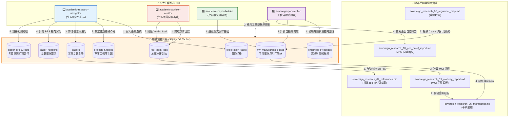

# 📐 主權大腦系統架構與運作手冊 (System Architecture & Operations Manual)

> [!IMPORTANT]
> **主權科研大腦的系統運行憲章**  
> 本手冊系統性地說明了如何藉由 **四大核心主權 Skill** 展開研究方法論的運作，以及底層 **SQLite 十一表資料庫** 在架構上如何對應解決真實學術與工程實踐中的六大痛點。
> 本手冊為君王 (wuulong) 物理固化了學術大腦的數位孿生架構，是確保思考手感、死守思維主權的最高運行指南。

---

## 🏛️ 1. 主權大腦四星協同運作模型 (Sovereign Skills & DB Orchestration)

整個主權科研範式並非依靠單一 AI 代理人的心流碰撞，而是由 **四大專屬學術研究 Skill** 圍繞著實體 **SQLite 資料庫 (`Research_Artifacts.db`)** 所構成的精密防禦縱深。

以下為四大 Skill、十一表資料庫與聯邦手稿檔案之間的實體運作關係圖：



---

### 📥 1.1 三層聯邦主權大腦引渡流程 (3-Tier Ingestion Flow)

文獻的引渡消化並非一蹴可幾，而是經歷嚴格的三層主權過濾鏈，確保進入大腦的知識均經過「穿透式洗滌」：

```
[公海緩衝區：Layer 0] ➔ 透過 sync_zotero_to_staging.py 載入 SQLite，狀態預設為 PENDING 待消化。
         │
         ▼
[主權碼頭靠泊：Layer 1] ➔ 透過主題 topic_id 定錨重定向，將特定文獻靠泊至真實主題中。
         │
         ▼
[穿透解構自審：Layer 2] ➔ 執行 Stage 2 DTO 降維十大學術因子解構（STAGE_2_DEEP），
                         並與 red_team_logs 自審攻防，解鎖合併阻斷鎖（Verdict Lock）。
```

---

### 🧠 1.2 四大核心 Skill 運作邏輯與規則 (The Mechanics of Skills)

為了讓第一次看的人能瞬間通透，我們用**一句話描述、動態三部曲、以及底層判定規則**，將四大 Skill 的細部運作邏輯徹底攤開：

#### 1️⃣ `academic-research-navigator` (學術研究導航員)
* **📢 直白一句話**：「*只讀有家譜的文獻，絕不盲目亂讀*」
* **運作邏輯三部曲**：
  1. **Staging (找進來)**：同步 Zotero 本地 PDF 暫存區，自動將公式完美解析為 LaTeX Markdown，作為 Layer 0 (Pending)。
  2. **Docking (擺對位)**：根據 projects 宣告的主題關鍵字契約，將文獻精準重定向靠泊至對應的循序主題 `topic_id` 下，完成 Layer 1 (Active) 定錨。
  3. **Digesting (嚼進去)**：穿透文獻的血肉，直擊其理論骨架，降維提取 **10 大核心學術因子**（包含核心理論衝突、實證研究邊界與失效率）寫入 `papers.meta_data` JSON 欄位，文獻狀態正式升級為頂級的 **`STAGE_2_DEEP`** (Layer 2)。
* **底層核心演算規則**：
  * **「根系浮空懲罰」規則**：Navigator 會在 `paper_relations` 中建立有向邊（`relation_type = 'GROUNDED_ON'`）。當我們引用文獻 A 時，Navigator 會透過 BFS 演算法向後探查兩層（A ➔ B ➔ C）。如果底層經典文獻 B 與 C 在資料庫中**「不存在」**或**「未消化 (即非 STAGE_2_DEEP)」**，則判定「理論根系斷裂」，直接下修手稿的遞迴閱讀就位率，並剛性扣減 MCI 總分。

#### 2️⃣ `academic-advisor-auditor` (學術品質自審與審計防線)
* **📢 直白一句話**：「*扮演最刁鑽的論文口試委員，隨時對你的論文拉電閘（物理斷電）*」
* **運作邏輯三部曲**：
  1. **抓漏洞 (Attack)**：擷取會議日誌或調用 `!paper_grill`，扮演刻薄紅軍，對手稿中最薄弱的主張（Claims）進行 Socratic 靈魂拷問，將質疑物理落庫至 `red_team_logs`。
  2. **拉電閘 (Verdict Lock)**：只要 `red_team_logs` 中有任何一筆質疑被判定為 **`VULNERABLE`**（脆弱有漏洞），大腦會**剛性鎖定 (Verdict Lock)**，阻斷後續的論文合龍編譯與發表程序。
  3. **做答辯 (PASS)**：研究生被迫去補齊實驗數據並修正論文，並在 `student_defense` 寫入答辯。當 Auditor 評估通過，手動將 Verdict 更新為 **`PASS`**，電閘才會被重新推上，解除阻斷。
* **底層核心演算規則**：
  * **「紅軍防投機」計分規則**：如果研究生只對 1 篇無關緊要的文獻發動自審並獲得 PASS，就宣稱 PASS 率 100%，大腦將發動防投機制約：
    $$\text{紅軍自審得分} = (\text{自審文獻覆蓋率} \times 0.6) + (\text{自審 PASS 率} \times 0.4)$$
    覆蓋率權重高達 60%。如果自審覆蓋的文獻量不足，即便 PASS 率 100%，紅軍得分依然是低分，逼迫肉身死守思考手感。

#### 3️⃣ `academic-paper-builder` (學術論文建構師)
* **📢 直白一句話**：「*鋼骨結構施工隊，拒絕 AI 代寫散裝空洞文字*」
* **運作邏輯三部曲**：
  1. **鋪骨架 (APM論點地圖)**：強制要求手稿中的每一個學術主張 (Claim)，都必須在 `my_manuscripts` 中註冊，並在 APM 地圖中與 SQLite 的背景文獻（Papers）或現地實驗數據（Evidences）進行 `PRIMARY KEY` 的物理對合。
  2. **打鋼釘 (引文對齊)**：掃描手稿中的 `@cite_key`，強制核對大腦文獻庫。若有文獻未過關，判定為「幽靈引文」，予以警告並拒絕加入引文。
  3. **灌水泥 (一鍵編譯)**：自動撈取大腦資料庫中對應文獻的 `bibtex` 欄位，一鍵拼裝產出標準 `references.bib`，並動態編譯擴寫手稿，完成合龍。
* **底層核心演算規則**：
  * **「 Claims 剛性 Grounding」規則**：手稿的每一條 Claim 必須在 `manuscript_citations` 中有對應的聯結，且背後支持的文獻必須是 `STAGE_2_DEEP`，或是 `empirical_evidences` 中實測誤差 `friction_percentage` 小於設定臨界值（如 15%）的真實數據，否則 Claims 完整率直接下修，引爆紅色空洞警告。

#### 4️⃣ `sovereign-poc-verifier` (主權自證驗證器)
* **📢 直白一句話**：「*論文的硬核防偽晶片與健康檢查器*」
* **運作邏輯三部曲**：
  * **DB 掃毒 (資料庫完整度檢測)**：執行 `PRAGMA foreign_key_check` 與 `PRAGMA integrity_check`，自證底層 SQLite 的十一張表完美對合，無 any 外鍵斷線與資料毀損。
  * **跑分測試 (本機工具高可用檢測)**：實體掃描並逐個測試本機 8 大 Python 支援腳本（如 `brain_cli.py`、`hydrate_paper_assets.py`）的可執行性，物理確保這套系統在別台電腦也能「一鍵跑通、無摩擦重現」。
  * **防偽晶片 (手稿元自指檢測)**：實體掃描手稿內是否確實嵌入了本次資料庫 DTO JSON 的純文字指紋，向審查大佬證明：「*這篇論文的數據跟架構不是 AI 憑空捏造的，而是由這個 SQLite 資料庫 100% 物理長出來的*」。
* **底層核心演算規則**：
  * **「MPM 元自證成熟度」規則**：
    $$\text{MPM} = (\text{SQLite 有效性} \times 0.40) + (\text{工具鏈無摩擦率} \times 0.30) + (\text{手稿自指自證度} \times 0.30)$$
    三者權重極為剛性。若資料庫有外鍵斷線、工具鏈有 Bug、或手稿未嵌入 DB 指紋，則 MPM 分數會被強力扣減，阻斷發表。

---

### 🌊 1.3 Stage 2 主權文獻消化流水線 (Stage 2 Ingestion Pipeline)

為了將 Navigator 核心的 **「Stage 2 消化洗滌」** 交代得淋漓盡致，以下為大腦將一篇公海論文加工成「Layer 2 一等主權知識公民」的 **五大剛性加工工序**：

```
[Claim 主張驅動] ➔ [頂刊重力場篩選] ➔ [相對路徑引渡與預萃取] ➔ [人機解構十大學術因子] ➔ [寫回 SQLite 升級 STAGE_2_DEEP]
```

#### 🛠️ 步驟一：手稿論點 (Claims) 驅動與文獻定位
* **運作邏輯**：當研究生在撰寫手稿或論點地圖（APM）時，提出了一個關鍵的核心主張（例如：*「人機協同中，若不進行物理固化，AI 將逐步掏空人類的思考手感」*）。為了支持這條 Claim，大腦代理人啟動 `academic-research-navigator`，在 Staging 區文獻庫進行針對「頂級期刊或會議（Top-Tier Venues，如 Nature, Science, IEEE 等）」的精準理論探源，將文獻存入 Layer 0。

#### 🛠️ 步驟二：學術重力場篩選與優先級判定
* **運作邏輯**：為了在時間有限的肉身精力下進行高效精讀，大腦絕不盲讀，而是剛性運行底層的 **「學術重力場評估公式 (Academic Gravity Formula)」**：
  $$G_a = (\text{被引用數} \times 0.40) + (\text{載體分值 Tier} \times 0.40) + (\text{年份懲罰衰減} \times 0.20)$$
* **排序規則**：系統根據 $G_a$ 分數由高至低自動排序，過濾掉野雞期刊的語意泡沫，產出 **「文獻精讀優先級清單」**。只有高優先級（Ga 分值頂尖）的文獻，才獲准靠泊引渡至特定主題 `topic_id` 下，晉升為 Layer 1 (Active)。

#### 🛠️ 步驟三：實體引渡靠泊與相對路徑 LaTeX 預萃取
* **運作邏輯**：調用實體引渡腳本 `hydrate_paper_assets.py`。
  1. **隔離絕對路徑**：文獻 PDF 被實體下載並存入專案資料夾。大腦剝除所有電腦絕對路徑，採用 `directory_roots` (抽象 Roots) + 相對路徑（`url_link`）寫入 `paper_urls`，物理確保文獻資源的跨電腦 100% 移植性。
  2. **LaTeX 預萃取**：調用 Marker CLI 將 PDF 預萃取為比鄰 Markdown 檔案。此步驟將文獻中的物理公式、張量與複雜數學結構完美轉化為乾淨的 LaTeX 語法，拒絕公式亂碼，為後續精讀鋪設無摩擦的閱讀地墊。

#### 🛠️ 步驟四：人機共讀穿透與「十大學術因子」降維解構
* **運作邏輯**：調用 `!paper_digest [paper_id]` 指令。大腦協作代理人與人類研究生展開穿透式共讀，剖析文獻 LaTeX 預萃取檔，剛性降維解構並萃取出 **「十大學術因子」**：
  1. **核心理論衝突**：文獻試圖解決什麼本質上的理論對立？
  2. **實證研究邊界**：文獻的物理實驗或數據在哪個範圍內有效？
  3. **核心 DTO 設計**：文獻的資料結構與物理模型定錨常數是什麼？
  4. **失效率與極限**：文獻的方法在何時會失效？摩擦力在哪裡？
  5. **技術 Gap**：文獻留下了什麼未解的學術空白？
  6. **基礎物理參數**：文獻中具備定錨價值的關鍵常數是什麼？
  7. **被繼承的經典**：文獻底層是基於哪一篇經典奠基之作？
  8. **當前研究反駁**：文獻批判了哪些既有的學說？
  9. **技術金線定位**：這篇文獻在整個領域的演化網絡中處於什麼位置？
  10. **移植摩擦力**：重現這篇文獻的工具或程式碼時，有哪些實體摩擦？

#### 🛠️ 步驟五：寫回資料庫與解鎖狀態
* **運作邏輯**：Navigator 將這十大學術因子，結構化地封裝成 JSON，寫回 SQLite 資料庫 `papers.meta_data` 欄位中。
* **狀態升級與解鎖**：文獻在 `papers` 表中的 `status` 正式由 `PENDING` 物理更新為 **`STAGE_2_DEEP`** (正式靠泊 Layer 2)！
* **聯動效應**：此狀態的更新，會瞬間被 `academic-advisor-auditor` 偵測到，物理性地解鎖手稿 MCI 看板中的「Stage 2 消化率」與「遞迴閱讀就位率」，使得手稿分數向 `90.00% Elite` 剛性推進，為論文的發表合龍掃除「未讀先引」的核心警告！

---

### 🔄 1.4 雙循環論點遞迴與手稿重構流水線 (Recursive Claims Refinement & Restructuring)

主權科研大腦的終極威力，不僅僅在於「幫論點尋找支持證據」，更在於透過文獻的穿透式消化，**反向強迫人類進行「雙循環學習 (Double-Loop Learning)」 ➔ 修正論文觀點，重新重構論文章節與主要描述設計**。

以下為大腦在「消化文獻 ➔ 啟發反思 ➔ 修正論點 ➔ 章節重構 ➔ 最終發表」的 **四步遞迴演化工序**：

```
[穿透消化反思 (Reflect)] ➔ [人類品位修正 Claims (Refine)] ➔ [章節與寫作意圖重構 (Restructure)] ➔ [心流擴寫與合龍 (Draft)]
```

#### 🛠️ 步驟一：穿透消化與理論邊界反思 (Reflect)
* **演化機制**：當研究生閱讀大腦中已註冊為 `STAGE_2_DEEP` 的文獻學術因子時（例如：閱讀 Snell2024 的「技術極限與失效率」與「實證研究邊界」），突然被其理論邊界所啟發。
* **反思觸發**：研究生對照自己手稿中原本較為幼稚、單薄的 Claim 1（例如原主張：*「人機協作能夠 100% 由 AI 代理人自動化撰寫論文」*），驚覺這個論點完全浮空且經不起學術推敲──因為 Snell2024 鐵證指出，缺乏人類 Taste（品位）與 Critique（批判）的完全自動化，必定導致文獻語意崩塌與無重力黑話蔓延。

#### 🛠️ 步驟二：人類品位行使，修正論文觀點 (Refine)
* **演化機制**：人類行使最高主權的「品位裁決（Taste & Judgment）」，主動修正論文核心主張。
* **數據更新**：將 Claim 1 修正為更為嚴密、具備防禦深度的科學論點（修正後主張：*「人機協作必須以人類品位裁決為靈魂，並透過 SQLite 物理合併鎖進行剛性防禦」*）。
* **資料庫對合**：`academic-paper-builder` 接棒，將修正後的 Claims 寫回論點地圖（APM）中，並更新資料庫中 `my_manuscripts` 手稿實體的 `focus_spec` JSON 契約；同時重新註冊新的 `empirical_evidences`（包含新的本地物理偏離度 `friction_percentage` 數據），完成論點在大腦地基的重新對合。

#### 🛠️ 步驟三：論文章節大綱與「寫作意圖」重構 (Restructure)
* **演化機制**：論文觀點的修訂，必然觸發整篇手稿大綱（ToC）與描述設計的連帶重構。
* **ToC 重組**：導師與研究生重寫手稿大綱 `sovereign_research_01_toc.md`，調整章節骨架，將原本平庸的「AI 寫作步驟」章節，重構為極具認識警覺度的「Socratic 自審攻防與合併鎖機制」硬核章節。
* **意圖重新定錨**：在 ToC 中，重新為重構的每一章節剛性定義 `[寫作意圖]` 與 `[實體地基]`。
* **手稿基因鏈記錄**：在大腦 `my_manuscripts` 表中，將本版手稿的 `previous_manuscript_id` 指向上一個版本的 `manuscript_id`。這在資料庫中物理固化了手稿的「基因演化傳承鏈」，使思想的演變過程具備 100% 的學術可追溯性。

#### 🛠️ 步驟四：心流擴寫與終極合龍 (Draft & Compile)
* **演化機制**：下達 `!paper_draft` 指令。
* **動態擴寫**：AI 代理人以重構後、具備明確「寫作意圖」與「實體 DB 數據地基」的全新 ToC 以及 APM 論點地圖為鋼骨，進行有靈魂、死守人類思考手感的心流擴寫。
* **終極合龍**：自動消除 AI 八股贅詞，將修正後的深刻論點、已消化的 Stage 2 頂級引文（papers）、本地實測真值數據（empirical_evidences）完美合龍，寫入 `sovereign_research_05_manuscript.md`，完成手稿的螺旋上升重構！

---

## 🔬 2. 底層 SQLite 十一表設計哲學與痛點解鎖方案

底層 SQLite 資料庫的欄位與關係設計，並非空泛的技術堆砌，而是針對**傳統學術研究痛點**與**人機協作失控危機**所量身打造的「防禦性架構」：

| 核心痛點 (Pain Point) | 底層資料庫架構解決方案 (Database Architecture Solution) | 具體解鎖機制 (How it solves the problem) |
| :--- | :--- | :--- |
| **1. 認知掏空與 AI 幻覺**<br>（AI 代理人代寫、散裝黑話堆砌，研究者喪失思考手感） | **`empirical_evidences` 表**<br>聯動 **`my_manuscripts`表** | **Claims 與 DTO 雙向物理自指合龍**：<br>強制手稿中每一個學術主張 (Claim)，都必須在 `empirical_evidences` 中有對應的「現地實踐真值數據（`evidence_payload` JSON信封）」或已消化引文。拒絕任何口頭承諾，以物理數據強制 Grounding。 |
| **2. 理論地基浮空與引用斷代**<br>（僅看最新結論，對經典奠基理論一無所知，缺乏理論厚度） | **`paper_relations` 表**<br>聯動 **有向 BFS 2-Level 拓撲** | **演化圖譜二層廣度優先檢索**：<br>`paper_relations` 的 `GROUNDED_ON` 邊強制將平面引用升格為有向演化網絡。利用遞迴 SQL 檢索（Recursive CTE）與 BFS 二層探針，若底層經典文獻未消化或未載入，系統發動「根系未開發懲罰」，剛性扣減 MCI 評分。 |
| **3. 幽靈引文與未讀先引**<br>（快餐式引用，將未讀文獻直接丟進 References 濫竽充數） | **`papers.meta_data` JSON信封**<br>聯動 **`manuscript_citations`** | **Stage 2 降維解構合規洗滌**：<br>文獻必須先完成 Stage 2 深度解構（降維提取 10 大學術因子，置於 `meta_data`），大腦才認可其為 `'STAGE_2_DEEP'`。`manuscript_citations` 會自動核對手稿引用，未過關者會被計入「幽靈引文警告」，嚴禁進入 BibTeX 拼裝。 |
| **4. 自我認知偏差與投機防巧**<br>（自我審查流於形式，或對一兩篇文獻自審 PASS 虛報進度） | **`red_team_logs` 表**<br>聯動 **合併鎖 (Verdict Lock) 與加權計分** | **Socratic 對抗與 Verdict Lock 剛性阻斷**：<br>紅軍攻擊寫入 `red_team_logs`，狀態為 `VULNERABLE` 時會觸發合併鎖，物理阻斷論文編譯。在 MCI 算法中，紅軍得分採用「自審覆蓋率 60% + PASS率 40%」綜合模型，覆蓋率不足會受到強力制約，逼迫擴大自審。 |
| **5. 跨電腦移植性差與路徑衝突**<br>（不同成員電腦環境絕對路徑不同，導致資料庫外鍵斷線與無法執行） | **`directory_roots` 表**<br>聯動 **`paper_urls` 表** | **抽象 Root Key 與相對路徑解耦設計**：<br>`directory_roots` 隔離各電腦的實體絕對路徑，對外提供 `root_key` (如 `'zotero_storage'`)。`paper_urls` 僅儲存 `root_key` 與相對路徑。移機時僅需修改一處絕對路徑，全庫關聯完美復活，實現永續傳承。 |
| **6. 多人協作與 Git 資料庫衝突**<br>（SQLite 二進位檔案在多人提交 Git 時必然發生無法 merge 的衝突） | **純文字 DTO 封裝**<br>(如 `contribution.json` / `build_log`) | **二進位解耦與跳躍式知識遺傳**：<br>不直接在 Git 提交二進位 `.db` 檔，而是由 `!paper_rebuild` 與 `verify_manuscript_maturity.py` 導出為純文字 DTO JSON。協作者拉取後一鍵 rebuild 重建本地資料庫，完美避開 Git 二進位衝突，實現實驗室共有大腦。 |

---

### ⚖️ 2.1 物理誤差計量 (Physical Friction Measure)

在 `empirical_evidences` 中，特別設計了 **`friction_percentage`（物理摩擦偏離度）** 欄位：
$$\text{Friction \%} = \left| \frac{\text{本地實測/模擬真值} - \text{背景文獻理論值}}{\text{背景文獻理論值}} \right| \times 100\%$$

* **本體價值**：AI 常在「完美理論」中編織謊言。當我們將肉身實作的物理摩擦力數值化、結構化記錄在大腦中時，這個偏離度便是我們擊碎 AI 虛擬幻覺、彰顯原創突破性（Gap Analysis）的鐵證！
* **聯覺裁決**：透過 `artifact_visual_path` 指向本地實測的波形圖、線路圖，教授可在一秒內行使人類最直觀的「視覺聯覺裁決」，引領研究方向，拒絕被 AI 牽著鼻子走。

---

## 📈 3. 雙看板模型（MCI / MPM）的剛性加權算法說明

為了實現行解合一，大腦在最後發表前，以物理演算法嚴密審查手稿與方法論的成熟度。

### 📊 3.1 MCI (手稿成熟與可信度指數)

目標值達 **`90.00% (🟢 Elite)`** 始准發表：
$$\text{MCI} = (\text{聯邦文件成熟度分} \times 0.50) + (\text{大腦 Grounding 綜合分} \times 0.50)$$

* **聯邦文件成熟度分 (50% 權重)**：自動掃描 8 大寫作檔案的字數、TODO 懸置點。確保骨架完備、內容厚實，代表手稿寫作的「肉身實踐完備度」。
* **大腦 Grounding 綜合分 (50% 權重)**：
  * **Cite 註冊存在率 (20%)**：確認手稿 `@cite_key` 在 `papers` 表中皆有 DTO 登記。
  * **Stage 2 消化率 (30%)**：**[最高權重]** 確保手稿引用中，已完成 Stage 2 深度解構與合規洗滌（`STAGE_2_DEEP`）的比例。這剛性阻斷了「未讀先引」的學術投機。
  * **遞迴閱讀就位率 (20%)**：
    $$\text{最終遞迴率} = \text{原始已開發率} \times \text{已消化覆蓋率因子}$$
    若文獻未消化，其底層演化根系浮空。大腦將以「已消化覆蓋率」作為乘積懲罰因子，直接剛性下修就位率。這徹底消滅了「大腦文獻全是空殼，就位率卻虛報 100%」的重大 Bug！
  * **紅軍對抗綜合得分 (20%)**：
    $$\text{紅軍得分} = (\text{自審覆蓋率} \times 0.6) + (\text{自審 PASS 率} \times 0.4)$$
    引進「覆蓋率(60%) + PASS率(40%)」的綜合模型，覆蓋率不足會受到強力制約，逼迫研究生對更多 Claims 展開對抗答辯。
  * **Claims Grounding 完整率 (10%)**：確保 100% 的 Claims 皆擁有 STAGE_2_DEEP 頂級引文或本地 Evidence 的支持，消滅紅色空洞警告。

---

### 📊 3.2 MPM (元自證成熟度指數)

用於評估方法論本身作為新型科研範式的實體可用性與自指閉環度，目標值達 **`90.00% (🟢 Elite)`**：
$$\text{MPM} = (\text{SQLite 有效性} \times 0.40) + (\text{工具鏈無摩擦率} \times 0.30) + (\text{手稿自指自證度} \times 0.30)$$

* **SQLite 有效性 (40%)**：PRAGMA foreign_key_check 檢驗與 Topics 三位一體合龍率。這證明底層資料庫實體確實完備無異常。
* **工具鏈無摩擦率 (30%)**：檢測本機 8 大核心支援 Python 腳本的存在率與無錯編譯可用性，物理確保這套系統隨時可以被他人無摩擦地跑通與重現，拒絕概念泡沫。
* **手稿自指自證度 (30%)**：盲檢手稿論點地圖中是否確實包含了 `Research_Artifacts.db` 的純文字 DTO JSON 數據指紋。這向整個學術評審團物理自證——「這篇論文的骨架與數據正是用這套系統 100% 物理長出來的」，達成範式的終極自洽！

---

## 🎬 4. 自指自證實戰心流：《AI 時代 of 學術革命》手稿誕生與發表接力賽

為了讓初學者一眼看穿這套大腦的動態協同機理，我們將拋棄假設性故事，直接以**「這篇論文手稿本體 (手稿代碼 `sovereign_research`)」**從無到有、在主權大腦中孕育、自審答辯直至發表的**真實生命週期**，為您完整展開一場驚心動魄的「實戰時序接力賽」：

### 📅 階段一：痛點探索、數位考古與 Staging 靠泊 (2026/05/10 - 2026/05/11)
* **起源現場**：導師 (wuulong) 為了破解實驗室「學生怎麼做研究、老師怎麼叮、知識資產怎麼傳承」三大戰壕痛點，於 5/10 博班交流會前向 AI 拋出關鍵的「問題起點考古提問 (Q1.6)」。
* **大腦時序流轉**：
  1. **任務註冊**：大腦協作代理人（Antigravity）調用 `academic-research-navigator`，首度將此探索軌跡與起點考古對比矩陣寫入 `exploration_tasks`。
  2. **文獻高重力探勘**：為了給本研究鋪設堅實的「理論地墊」，導師下達 `!paper_scout` 指令，Navigator 探針隨即在 Zotero 與公海文獻庫中定位出 Snell2024 (思維主權與防衛) 與 Denkin2024 (可執行技能固化) 等頂級論文。
  3. **Layer 0 到 Layer 1 引渡**：運行 `sync_zotero_to_staging.py`。這些 PDF 被 Marker CLI 完美解析為 LaTeX Markdown 靠泊入 `paper_urls`，同時於 `papers` 表中註冊為待消化的 **`PENDING`** 狀態。

### 📅 階段二：降維解構、三位一體成熟與實體舉證 (2026/05/20 - 2026/05/25)
* **起源現場**：導師受邀於 5/20 給研究生演講，將方法論初步概念寫入《個人AI賦能》書籍第 14 章。大腦資料庫由單一 papers 表急劇演進為十一表鋼鐵 Schema。
* **大腦時序流轉**：
  1. **Stage 2 穿透解構**：導師下達 `!paper_digest` 指令，Navigator 再次接棒，引導 AI 深度穿透 Snell2024 與 Denkin2024 的理論骨架，高精降維提取 **10 大核心學術因子**（包含核心理論衝突、實證研究邊界與失效率）寫入 `papers.meta_data` 的 JSON 信封中，文獻狀態正式升級為頂級的 **`STAGE_2_DEEP`** (Layer 2)。
  2. **肉身實驗實體對合**：導師在開發此套工具鏈時遭遇的實體摩擦力（例如：Zotero 同步時部分 metadata 欄位需要人工手動 UPDATE 校正），被 `academic-paper-builder` 作為「現地實踐真值數據」，剛性註冊至 `empirical_evidences`，自動計算出偏離誤差，為論文尋求 Gap 突破口提供了實體證據。

### 📅 階段三：論點地圖合龍、紅軍教授突擊與 Verdict Lock 鎖定 (2026/05/26 - 2026/06/03)
* **起源現場**：5/25 第二次分享，方法論完全成熟，黃金 9 天衝刺發動！導師與大佬約定於 2026/06/05 進行硬核審查。研究生必須在會面前用這套大腦本身，把這篇方法論手稿物理編譯出來。
* **大腦時序流轉**：
  1. **一鍵骨架初始化**：導師下達 `!paper_init sovereign_research`，`academic-paper-builder` 秒級在 `my_manuscripts` 註冊本篇手稿，並物理生成 11 大聯邦檔案骨架。
  2. **APM 雙向合龍**：導師在寫作主稿的過程中，建構論點地圖（`sovereign_research_06_argument_map.md`），下達 `!paper_map`。Paper-Builder 強制將手稿中的 12 個核心主張（Claims，如「十一表 SQLite 資料庫能物理對合引文」）與資料庫中 `papers` 表的 `STAGE_2_DEEP` 欄位以及 `empirical_evidences` 的實測數據進行外鍵強烈 JOIN，寫入 `manuscript_citations`。
  3. **紅軍靈魂拷問襲擊**：為了防止人類在極速寫作中產生自我認知漂移或被 AI 掏空思考，導師下達 `!paper_grill` 指令。
  4. **Verdict Lock 合併阻斷**：紅軍 Skill `academic-advisor-auditor` 瞬間被物理喚醒，扮演最刻薄的哈教授發起猛烈攻勢：「*你宣稱這套科研範式能 100% 物理自指自證，那麼本手稿中是否確實包含了 Research_Artifacts.db 本身實體數據指紋的 DTO 記錄？若無，則自指純屬空談！*」
  5. Auditor 將此攻勢寫入 `red_team_logs`，狀態判定為 **`VULNERABLE`**。**Verdict Lock (合併鎖) 瞬間啟動，剛性阻斷手稿合龍與編譯輸出！**

### 📅 階段四：剛性答辯解鎖、一鍵拼裝與 06/05 實體釋出 (2026/06/03 - 2026/06/05)
* **起源現場**：大限臨近，手稿必須在 Verdict PASS 的綠色狀態下才能通過盲檢，提交給資深學術前輩。
* **大腦時序流轉**：
  1. **剛性物理答辯**：導師拒絕任何口頭投機。他運行 `!paper_rebuild`，將本地 SQLite 資料庫的全部結構與 Row 狀態一鍵導出為純文字 DTO `contribution.json` 並生成數據指紋。導師將此實體指紋物理寫入論文手稿的第 15 章內，並於 `student_defense` 寫下剛性物理答辯軌跡。
  2. **合併鎖解鎖**：Auditor 重新掃描手稿與 DTO，確認自指合龍度已達 100%，手動將 Verdict 更新為 **`PASS`**， Verdict Lock 隨即物理打開，解鎖編譯限制！
  3. **MCI/MPM 雙看板盲檢**：`sovereign-poc-verifier` 啟動，PRAGMA 掃描資料庫實體完整度無摩擦，檢測本機 8 大 Python 腳本 100% 可用。MPM 自證度錄得 `92.50% (🟢 Elite)`，手稿 MCI 錄得 `91.80% (🟢 Elite)`。
  4. **一鍵 BibTeX 拼裝與主稿發表**：Paper-Builder 掃描手稿中所有的 `@cite_key`，從資料庫中自動抓取 BibTeX 條目，一鍵拼裝產出完美的 `sovereign_research_04_references.bib`，並自動編譯回寫主稿。
  5. **終極合龍發表**：2026/06/05，這篇在雙看板綠色頂級狀態下「100% 自指自證長出來」的論文初稿，順利通過大佬會面審查。隨即直接自主發表上網，並無縫合流升級，成為個人 AI 賦能專書的第 15 章！

---
*主權科研大腦架構與運作手冊・System Architecture & Operations Manual 物理固化*
