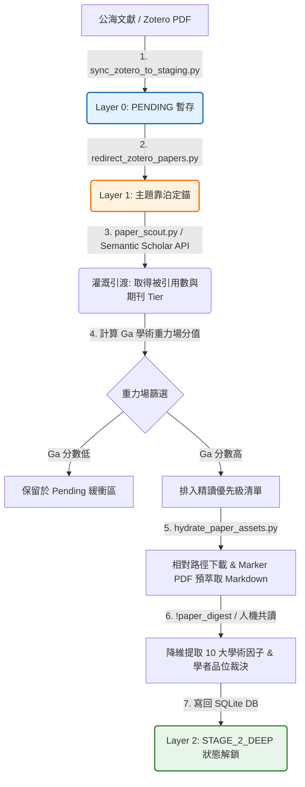

# 📐 methodology_81: 學術研究導航員 (Academic Research Navigator Skill Specification)

本手冊詳盡定義了主權科研大腦中 **`academic-research-navigator` (學術研究導航員)** 技能的設計目的、核心職責、運作工序，以及其底層核心演算規則與驅動腳本。

---

## 🧬 1. Skill 設計目標與角色定位

在文獻探勘的初期，研究者常面臨「公海資料垃圾氾濫」、「盲目亂讀無系統」以及「經典經典源流斷代」等痛點。

**`academic-research-navigator`** 即是為了解決這些痛點而生。它扮演研究流程的「學術過濾網」與「理論尋根針」，其核心職責為：
1.  **文獻家譜追溯**：堅持「只讀有家譜的文獻」，拒絕孤立引用。
2.  **高引力文獻定位**：透過學術重力場算法，自動挑選最值得精讀的 Top-Tier 載體與高引用文獻。
3.  **穿透降維消化**：人機協同將數十頁的 PDF 論文，降維提取為結構化的 10 大核心學術因子，置入大腦資料庫。

---

## 🚀 2. 運作邏輯與三部曲

- **📢 直白一句話**：「*只讀有家譜的文獻，絕不盲目亂讀*」
- **運作邏輯三部曲**：
  1.  **Staging (找進來)**：同步 Zotero 本地 PDF 暫存區，自動將公式解析為 LaTeX Markdown，作為 Layer 0 (Pending)。
  2.  **Docking (擺對位)**：根據 projects 宣告的主題關鍵字契約，將文獻精準重定向靠泊至對應的循序主題 `topic_id` 下，完成 Layer 1 (Active) 定錨。
  3.  **Digesting (嚼進去)**：穿透文獻的血肉，直擊其理論骨架，降維提取 **10 大核心學術因子**寫入 `papers.meta_data` JSON 欄位，文獻狀態正式升級為頂級的 **`STAGE_2_DEEP`** (Layer 2)。

---

## 🚀 3. Navigator 專屬心流命令

以下為學術研究導航員所主控的核心命令：

| 命令名稱 | 實體工程動作 (Physical Action) | 驅動的底層 Python 腳本 | 讀寫 of 資料庫實體表 |
| :--- | :--- | :--- | :--- |
| **`!paper_scout [QUERY]`** | **公海文獻探採**：使用 Semantic Scholar API 根據關鍵字，在公海中探查潛在文獻。 | `scripts/paper_scout.py` | `exploration_tasks` (寫入) `papers` (寫入/靠泊) |
| **`!paper_hydrate [URL/ID]`** | **PDF 下載與預萃取**：根據學術重力 Ga 排定之優先級，下載 PDF 並使用 Marker 預萃取成純文字 Markdown。 | `scripts/hydrate_paper_assets.py` | `paper_urls` (寫入相對路徑) `papers` (更新狀態) |
| **`!paper_guide`** | **Pending 優先級指引**：計算 Pending 文獻的 Ga 重力，產出精讀建議清單。 | `scripts/hydrate_citations_and_gravity.py` | `papers` (唯讀重力分與狀態) |
| **`!paper_digest [paper_id]`** | **Stage 2 降維消化**：Agent 協同精讀，提取 10 大核心因子與學者品位裁決（Taste Verdict）寫入信封。 | `scripts/literature_deconstruct_and_save.py` | `papers` (變更狀態為 `STAGE_2_DEEP` 並更新 `meta_data` JSON) |
| **`!paper_tree [paper_id]`** | **經典家譜 BFS 探查**：以 BFS 探查文獻向後兩層之 `GROUNDED_ON` 依賴關係，審查理論根系是否健全。 | `scripts/verify_argument_provenance.py` | `papers` (唯讀) `paper_relations` (唯讀關係) |

---

## 📊 4. Stage 2 消化加工與 Ingestion 流水線

以下為 Navigator 將公海論文加工成「一等主權知識公民」的實體 Mermaid 流程圖：

---

## 🧬 5. 「根系浮空懲罰」底層核心演算規則

當研究生引用文獻 $A$ 時，Navigator 會透過 BFS 演算法向後探查兩層依賴關係（$A \rightarrow B \rightarrow C$，關係邊為 `GROUNDED_ON`）：

*   **根系斷裂判定**：如果理論地墊 $B$ 或奠基經典 $C$ 在資料庫中「不存在」或狀態「非 `STAGE_2_DEEP`」（即代表研究者根本沒有讀過其底層依賴的經典理论，純屬快餐引用）。
*   **懲罰機制**：大腦直接判定「理論根系斷裂」，剛性下修手稿的遞迴閱讀就位率，並扣減 MCI 指標總分，拉下合龍電閘。

---

## 🛠️ 6. 驅動之 Python 腳本與 DB 實體對照

| 運作階段 | 驅動的底層 Python 腳本 | 讀寫的資料庫實體表 |
| :--- | :--- | :--- |
| **文獻探勘與靠泊** | `scripts/sync_zotero_to_staging.py` `scripts/redirect_zotero_papers.py` `scripts/paper_scout.py` | `exploration_tasks` (寫入) `papers` (寫入/靠泊) |
| **重力場計算與下載** | `scripts/hydrate_citations_and_gravity.py` `scripts/hydrate_paper_assets.py` | `papers` (更新重力分) `paper_urls` (寫入相對路徑) |
| **Stage 2 穿透消化** | `scripts/harvest_flow_to_db.py` `scripts/literature_deconstruct_and_save.py` | `papers` (變更狀態為 `STAGE_2_DEEP` 並更新 `meta_data` JSON) |
