# 📐 methodology_82: 學術品質自審與審計防線 (Academic Advisor Auditor Skill Specification)

本手冊詳盡定義了主權科研大腦中 **`academic-advisor-auditor` (學術品質自審與審計防線)** 技能的設計目的、核心職責、對抗狀態機，以及底層防投機演算規則。

---

## 🧬 1. Skill 設計目標與角色定位

在撰寫論文的過程中，研究生極易產生自我感覺良好的認知偏差，或依賴 AI 代寫空洞的黑話文字，逃避邏輯檢驗。

**`academic-advisor-auditor`** 即是為了解決此痛點而設。它扮演嚴厲的「論文答辯口試委員」，其核心職責包含：
1.  **尋找學術漏洞 (Grill)**：主動偵測手稿中邏輯薄弱、未經論證或缺乏數據支援的核心主張 (Claims)。
2.  **合併阻斷鎖 (Verdict Lock)**：拉下電閘。若手稿存在漏洞，剛性鎖定編譯，拒絕生成 References 與合龍論文。
3.  **防投機稽核**：評估自審覆蓋率，防止研究者透過自審少數無關痛癢的文獻來虛報進度。

---

## 🚀 2. 運作邏輯與三部曲

- **📢 直白一句話**：「*扮演最刁鑽的論文口試委員，隨時對你的論文拉電閘（物理斷電）*」
- **運作邏輯三部曲**：
  1.  **抓漏洞 (Attack)**：擷取會議日誌或調用 `!paper_grill`，扮演紅軍對手稿最薄弱的 Claims 進行 Socratic 靈魂拷問，將質疑物理落庫至 `red_team_logs`。
  2.  **拉電閘 (Verdict Lock)**：只要 `red_team_logs` 中有任何一筆質疑被判定為 **`VULNERABLE`**，大腦自動剛性鎖定，阻斷論文合龍編譯。
  3.  **做答辯 (PASS)**：研究生去補齊實驗數據並修正手稿，在 `student_defense` 寫入答辯。當 Auditor 評估通過，手動將 Verdict 更新為 **`PASS`**，電閘重新推上，解鎖阻斷。

---

## 🚀 3. Auditor 專屬心流命令

以下為學術品質自審與審計防線所主控的核心命令：

| 命令名稱 | 實體工程動作 (Physical Action) | 驅動的底層 Python 腳本 | 讀寫 of 資料庫實體表 |
| :--- | :--- | :--- | :--- |
| **`!paper_grill [MS_CODE]`** | **紅軍 Socratic 拷問**：自動掃描手稿 Claims，對最薄弱的主張發起靈魂拷問並寫入日誌。 | `scripts/verify_manuscript_maturity.py` | `red_team_logs` (寫入質疑日誌) `my_manuscripts` (唯讀) |
| **`!paper_red [MS_CODE] [Loophole]`** | **手動寫入脆弱漏洞**：手動或自動在資料庫中標記某個 Claim 為 `VULNERABLE`，拉下 Verdict Lock 電閘。 | `scripts/add_red_team_logs.py` `scripts/hydrate_loopholes_redteam.py` | `red_team_logs` (寫入 `VULNERABLE` 狀態) |
| **`!paper_defense [MS_CODE] [Log_ID] [Defense_Text]`** | **學生提交現地證據答辯**：針對被質疑的紅軍日誌 ID 填寫答辯內容與實體 Evidence 連結。 | `scripts/verify_manuscript_maturity.py` | `red_team_logs` (寫入 `student_defense`) |
| **`!paper_pass [MS_CODE] [Log_ID]`** | **答辯審核通過解鎖**：審查答辯內容，判定脆弱點修復，將 Verdict 更新為 `PASS`，推上電閘。 | `scripts/verify_manuscript_maturity.py` | `red_team_logs` (更新狀態為 `PASS`) |

---

## 📊 4. Verdict Lock 狀態轉移與防禦流程圖

以下為 Auditor 剛性電閘與答辯解鎖的 Mermaid 狀態機轉移圖：

```mermaid
stateDiagram-v2
    [*] --> PASS : 系統初始狀態 (無安全警報)
    
    state "紅軍突擊 / !paper_grill" as Attack
    state "合併阻斷鎖啟用 (Verdict Lock)" as Lock
    state "研究生現地修復 & 答辯" as Defense
    
    PASS --> Attack : 偵測手稿 Claims / 執行審查
    Attack --> Lock : 判定存在漏洞 (verdict = 'VULNERABLE')
    
    note right of Lock
        剛性斷電！
        拒絕 references.bib 輸出
        阻斷手稿合龍與編譯
    end note
    
    Lock --> Defense : 補齊現地數據 / 修正論文代碼
    Defense --> PASS : 答辯審核通過 (verdict = 'PASS')
    
    Lock --> Lock : 答辯失敗 (依然脆弱)
```

---

## 🧬 5. 「紅軍防投機」計分規則

為了防止學生只對 1 篇無關緊要的文獻進行自審並獲得 PASS，就宣稱自審通過率 100%，系統在計算 MCI 指標時，引入防投機計分公式：

$$\text{紅軍自審得分} = (\text{自審文獻覆蓋率} \times 0.6) + (\text{自審 PASS 率} \times 0.4)$$

*   **覆蓋率高權重 (60%)**：覆蓋率 = `(已自審文獻數量 / 手稿引用文獻總數)`。如果自審覆蓋的文獻量不足，即便 PASS 率高達 100%，紅軍得分依然是低分，逼迫肉身擴大自審防線，死守思考手感。

---

## 🛠️ 6. 驅動之 Python 腳本與 DB 實體對照

| 運作階段 | 驅動的底層 Python 腳本 | 讀寫的資料庫實體表 |
| :--- | :--- | :--- |
| **紅軍 Socratic 拷問** | `scripts/verify_manuscript_maturity.py` (格網拷問引擎) | `red_team_logs` (寫入質疑日誌) `my_manuscripts` (唯讀) |
| **手動鎖定與吐槽** | `scripts/add_red_team_logs.py` `scripts/hydrate_loopholes_redteam.py` | `red_team_logs` (寫入 `VULNERABLE` 狀態) |
| **答辯審查與解鎖** | `scripts/verify_manuscript_maturity.py` (解鎖評估) | `red_team_logs` (更新為 `PASS` 狀態) `papers` (檢索 Taste Verdict) |
