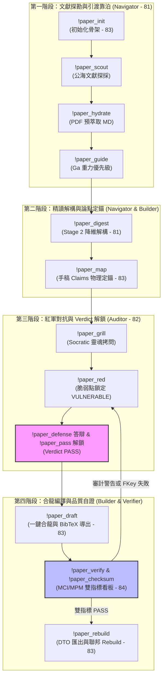

# 📐 methodology_83: 學術手稿建構師 (Academic Paper Builder Skill Specification)

本手冊詳盡定義了主權科研大腦中 **`academic-paper-builder` (學術手稿建構師)** 技能的設計目的、核心職責、專屬 SRCC 心流命令，以及與大腦資料庫進行物理合龍之運作機制。

---

## 🧬 1. Skill 設計目標與角色定位

在寫作過程中，研究者常面臨「AI 幻覺代寫」、「文獻未讀先引（根系懸空）」等痛點。

**`academic-paper-builder`** 技能扮演研究流程的「剛性合規裝配師」，其核心職責為：
1.  **意圖驅動寫作**：強制手稿 ToC 與 Claims 必須聲明人類的「寫作意圖」與「實體地基」，防範被 AI 散裝黑話掏空。
2.  **物理引文對合**：核對手稿中的每一篇引用，確保其存在於資料庫中，並自動拼裝 references.bib。
3.  **手稿一鍵合龍**：自動抓取 DTO，動態擴寫並將文獻、現地證據與手稿編譯為標準論文初稿。

---

## 🚀 2. Builder 專屬心流命令

以下為手稿建構師所主控的核心命令：

| 命令名稱 | 實體工程動作 (Physical Action) | 驅動的底層 Python 腳本 | 讀寫 of 資料庫實體表 |
| :--- | :--- | :--- | :--- |
| **`!paper_init [MS_CODE]`** | **一鍵建立手稿檔案骨架**：在大腦 `my_manuscripts` 註冊節點，建立符合命名契約的 8 大聯邦檔案骨架。 | `scripts/setup_research_db.py` | `my_manuscripts` (寫入) |
| **`!paper_map`** | **論點地圖物理定錨**：掃描手稿，將手稿 Claims 與已就位文獻或現地 Evidence 進行外鍵 JOIN 對合。 | `scripts/verify_argument_provenance.py` | `manuscript_citations` (寫入) |
| **`!paper_draft`** | **動態擴寫與一鍵合龍**：核對引文，自動從 DB 抓取條目並拼裝出 `references.bib`，合龍編譯手稿。 | `scripts/anchor_manuscript_citations.py` | `my_manuscripts` (編譯合龍) |
| **`!paper_rebuild`** | **一鍵匯出 DTO JSON 貢獻包**：將大腦文獻與關係匯出為純文字 JSON DTO，解決 Git 二進位衝突。 | `scripts/export_contributions.py` | 全庫十一張表 (匯出備份) |

> [!NOTE]
> **其他 Skills 命令指引**  
> 關於文獻探勘與 Stage 2 消化命令（`!paper_scout`, `!paper_hydrate`, `!paper_guide`, `!paper_digest`），請參閱 [81 Navigator 技能說明書](file:///Users/wuulong/github/bmad-pa/events/my_research/sovereign-research-methodology/methodology/methodology_81_academic_research_navigator_skill.md)。  
> 關於紅軍拷問與合併阻斷鎖命令（`!paper_grill`, `!paper_red`, `!paper_defense`, `!paper_pass`），請參閱 [82 Auditor 技能說明書](file:///Users/wuulong/github/bmad-pa/events/my_research/sovereign-research-methodology/methodology/methodology_82_academic_advisor_auditor_skill.md)。  
> 關於元自證與防偽檢驗命令（`!paper_verify`, `!paper_checksum`），請參閱 [84 Verifier 技能說明書](file:///Users/wuulong/github/bmad-pa/events/my_research/sovereign-research-methodology/methodology/methodology_84_sovereign_poc_verifier_skill.md)。

---

## 🌊 3. 心流命令協同運作流程 (SOP Flowchart)

在主權科研大腦的運作中，這 11 大心流命令跨星系協同，構成一個**「雙向螺旋演化探勘與寫作」**的控制環鏈：

---

## 🏛️ 4. 寫作意圖與資料庫的剛性對合機制

*   **ToC 寫作意圖約束**：手稿 `ToC` 的每個章節下方，必須以 `[寫作意圖]` 與 `[實體地基]` 標記其核心 Claims 與預計引用的資料庫 papers 外鍵。AI 在擴寫手稿時，若發現意圖與地基為空，將拒絕進行任何內容生成，死守人類思維主權。
*   **白箱 BibTeX 完璧裝配**：傳統寫作中常因手動拼裝引用而殘留「有引無文」的幽靈引文。Builder 在執行 `!paper_draft` 時，會實體比對手稿的 `cite_key` 是否完整存在於資料庫 `papers` 中，若有缺損即判斷為幽靈引文並發動扣分警告；若完整，則撈取資料庫文獻資訊，自動生成無損、100% 合致的標準 `references.bib`。
