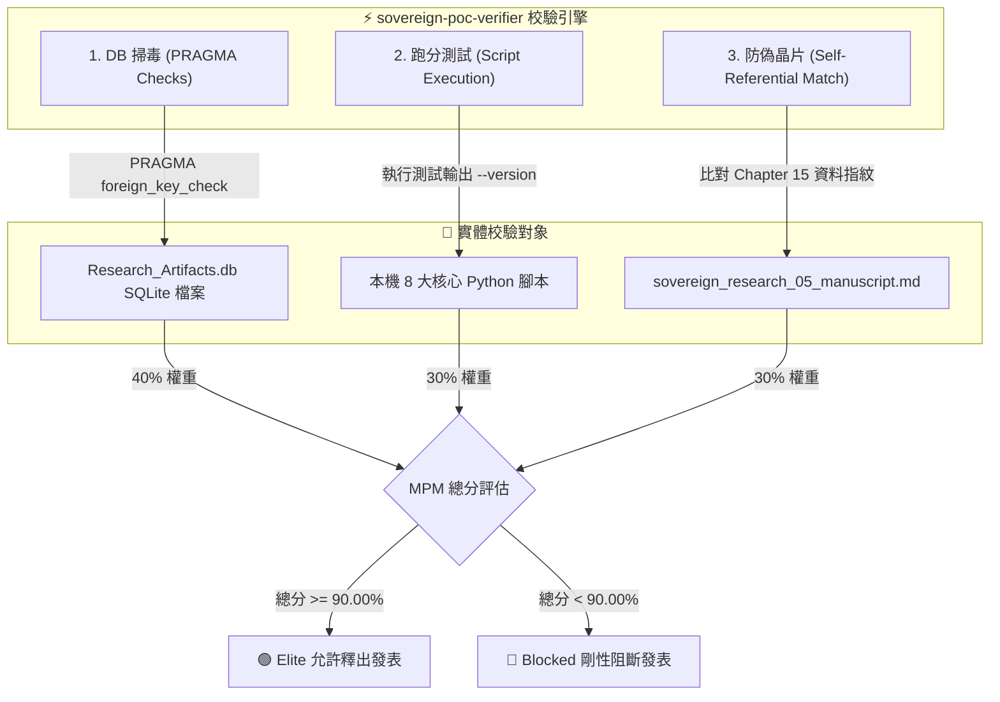

# 📐 methodology_84: 主權自證驗證器 (Sovereign PoC Verifier Skill Specification)

本手冊詳盡定義了主權科研大腦中 **`sovereign-poc-verifier` (主權自證驗證器)** 技能的設計目的、核心職責、校驗架構，以及底層成熟度演算規則。

---

## 🧬 1. Skill 設計目標與角色定位

學術研究常面臨「概念泡沫」、「移機即崩潰（工具鏈無法重現）」以及「資料與論文脫節」等痛點。

**`sovereign-poc-verifier`** 即是為了解決此痛點而生。它扮演研究成果的「硬核防偽驗證器」，其核心職責包含：
1.  **資料庫完整性檢測**：確保底層十一張表結構健全，外鍵對合無缺。
2.  **工具鏈可用性審計**：實體逐一執行測試本機工具腳本，確保「別人的電腦也能一鍵跑通」。
3.  **手稿自指合龍校驗**：驗證論文中是否確實嵌入了本次大腦 DTO 資料指紋，自證「行解合一」。

---

## 🚀 2. 運作邏輯與三部曲

- **📢 直白一句話**：「*論文的硬核防偽晶片與健康檢查器*」
- **運作邏輯三部曲**：
  1.  **DB 掃毒 (資料庫完整度檢測)**：執行 `PRAGMA foreign_key_check` 與 `PRAGMA integrity_check`，自證底層 SQLite 完美對合，無任何外鍵斷線與資料毀損。
  2.  **跑分測試 (本機工具可用檢測)**：實體掃描並逐個測試本機 8 大 Python 支援腳本（如 `brain_cli.py` 等）的可執行性，確保跨平台可用。
  3.  **防偽晶片 (手稿元自指檢測)**：實體掃描手稿內是否確實嵌入了本次資料庫 DTO JSON 的純文字資料指紋，自證「論文是由此資料庫 100% 物理長出來的」。

---

## 📊 3. MPM 三維自證校驗架構圖

以下為 Verifier 執行 MPM 指標審查時的三維剛性校驗架構圖：

---

## 🧬 4. 「MPM 元自證成熟度」剛性演算法

為了保證方法論作為科研典範的物理可用性，MPM 指標採用極其剛性的三維加權計算：

$$\text{MPM} = (\text{SQLite 有效性} \times 0.40) + (\text{工具鏈無摩擦率} \times 0.30) + (\text{手稿自指自證度} \times 0.30)$$

-   **SQLite 有效性 (40%)**：外鍵合規性與 Topics 三位一體合龍率。
-   **工具鏈無摩擦率 (30%)**：測試本機 8 大核心支援 Python 腳本的存在率與無錯編譯可用性。
-   **手稿自指自證度 (30%)**：盲檢手稿論點地圖中是否包含 `Research_Artifacts.db` 的純文字 DTO 資料指紋（Checksum）。

---

## 🛠️ 5. 驅動之 Python 腳本與 DB 實體對照

| 運作階段 | 驅動的底層 Python 腳本 | 讀寫的資料庫實體表 |
| :--- | :--- | :--- |
| **資料庫完整性稽核** | `scripts/verify_poc_completeness.py` `scripts/audit_brain_compliance.py` | 全庫十一張表 (唯讀校驗) |
| **工具鏈可用性檢測** | `scripts/verify_poc_completeness.py` | 無 (物理執行測試本機 `scripts/*.py` 檔案) |
| **自指自證與算分** | `scripts/verify_poc_completeness.py` | `my_manuscripts` (比對手稿 Checksum) |
