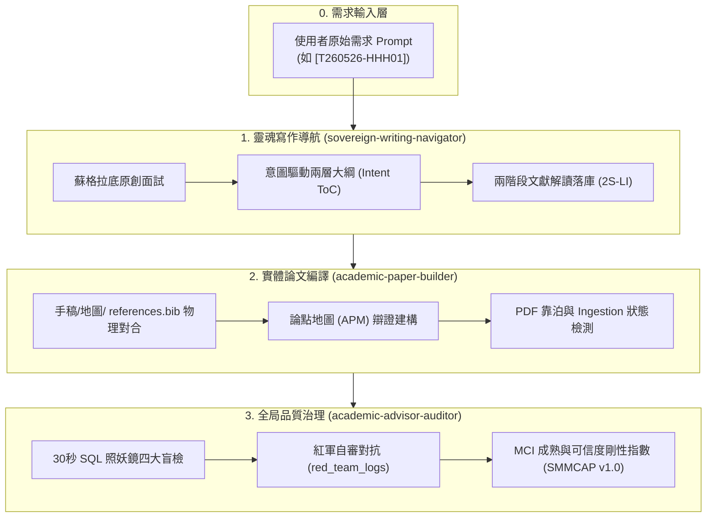
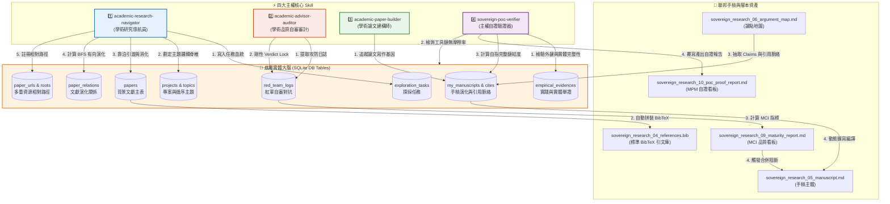

# NotebookLM Asset Pack - events/my_research/sovereign-research-methodology/methodology
- **Source Folder**: `events/my_research/sovereign-research-methodology/methodology`
- **Generated At**: 2026-06-06 07:59:56

---

================================================================================
📂 FILE PATH: methodology/README.md
================================================================================

# 📐 主權科研方法論規格說明書清單 (Methodology Directory)

本目錄存放了主權科研大腦（Sovereign Research Brain）的系統需求規格書、元資料 schema 設計規範以及關係本體定義檔。

---

## 🧬 為什麼我們需要這些規格書？(The System Why)

在傳統的研究方法中，研究的流程往往是隨意的、機率性的。在使用生成式 AI 協作時，研究者如果不提供剛性的「物理框架約束」，LLM 就會像脫韁野馬一樣胡亂生成，導致程式碼或手稿在編譯時爆發嚴重的 domain-knowledge 耦合衝突。

本目錄下的規格說明書（01-04）構成了主權科研大腦的**「憲法與骨架」**。它們剛性定義了十一表 SQLite 資料庫的欄位約束與外鍵關係本體，強制讓 AI 在我們劃定的「主權格子」內進行高精細度的填充，保證人機共建的可靠與自洽。

---

## 📂 2 大方法論規格檔矩陣 (The Specification Matrix)

### 1. [01] 系統需求與目標：`methodology_01_requirements.md`
*   **Why it exists**: 明確宣示主權大腦的設計目標，界定「思維主權邊界」與「防範認知空洞化」的頂層需求。

### 2. [02] 系統架構、中繼資料 Schema 與本體規格手冊：`methodology_02_system_architecture_navigator.md`
*   **Why it exists**: 這是主權科研大腦的運行憲章，系統性整合了：
    1. **四星協同運作模型**：四大主權 Skill（Navigator, Auditor, Builder, Verifier）的運作工序與規則。
    2. **十一表中繼資料 Schema 規格**：剛性定義 `meta_data` 的 JSON 規格，是自主品質治理的底層鐵幕。
    3. **文獻關聯本體規格**：定義 `paper_relations` 的八大關係，是 BFS 算分與判定理論根系浮空的代數基礎。
    4. **實戰心流與物理摩擦**：記錄手稿誕生實戰生命週期與物理偏離度計量。

---

## 🪐 線上 GitHub 連結
本方法論的所有系統需求與 DDL 設計均已開源。您可以直接在 GitHub 上點閱 [Sovereign Research Methodology Specifications](https://github.com/wuulong/sovereign-research-methodology/tree/main/methodology)，繼承這套代表學術主權的最硬核系統美學設計。


================================================================================
📂 FILE PATH: methodology/build_log/01_methodology_manuscript_separation_plan.md
================================================================================

# 📐 方法論與手稿物理分離架構重構決策日誌 (01_methodology_manuscript_separation_plan)

> [!NOTE]
> **本建構日誌物理定錨於 2026-05-30 的進度會談。**  
> 記錄了主權大腦方法論發展史上第一次重大的「典範與實體分離」架構重構。旨在透過物理目錄區隔，確立方法論本體與寫作手稿的清晰邊界，建立「一對多（One Methodology, Multi-Papers）」的可擴展科研工序。

---

## 📊 1. 重構背景與決策經緯

在主權大腦方法論建構的初期，由於典範定義與第一篇論文寫作（介紹方法論本身的論文手稿 `sovereign_research`）是互相共演與驗證的過程，我們扁平地將所有檔案都堆疊在 `manuscripts/sovereign_research/` 底下。

然而，隨著科研心流與大腦架構越來越清晰，這種扁平的混雜結構帶來了職責模糊的問題：
1.  **大憲章與實例混淆**：大腦的系統規格（需求書、資料庫 Schema 規格、關係本體規格）是整套科研典範的「憲法地基」，不應被判定為某一篇單一論文的私有寫作資產。
2.  **無法平行寫作**：當君王想使用這套方法論平行撰寫其他應用領域的手稿（如山區水文觀測等）時，無法輕易調用這套憲法規格，會造成嚴重的程式碼與文件心智摩擦。

為了徹底解決這個架構瓶頸，君王 (wuulong) 物理拍板了「**方法論規格大憲章（Methodology）**」與「**具體手稿實體（Manuscripts）**」物理分離的最高架構決策。

---

## 🏗️ 2. 物理重構軌跡與目錄對位

重構物理移除了 `manuscripts/sovereign_research/` 中的典範檔案，並將其重新命名歸口移入新創立的 `methodology/` 目錄，雙軌各自獨立：

### 📐 Methodology 支柱：大憲章本體規格 (`methodology/`)
本目錄專門整理大腦方法論的架構、規則與改良，包含三大地基定錨規格（地基定錨生命週期階段一）：
- `methodology_01_requirements.md` (原 `sovereign_research_01_requirements.md`) ➔ 系統工程規格需求書。
- `methodology_02_metadata_schema_spec.md` (原 `sovereign_research_02_metadata_schema_spec.md`) ➔ 十一表大腦 Schema 剛性規範。
- `methodology_03_relation_ontology.md` (原 `sovereign_research_03_relation_ontology.md`) ➔ 文獻有向演化與 BFS 遞迴閱讀關係本體規格。
- **`build_log/`** ➔ **方法論專屬建構日誌**（本檔案即為 `01` 號第一案），用以物理存檔方法論本身的改良決策軌跡。

### 📂 Manuscripts 支柱：具體寫作手稿 (`manuscripts/`)
本目錄專注存放具體寫作論文，各論文配有獨立子目錄（例如 `manuscripts/sovereign_research/`），手稿檔案採用數字工序契約，從 `04` 順序開始編起（工序階段二至階段五）：
- `sovereign_research_04_toc.md` 至 `sovereign_research_14_audit_report.md`。
- **`build_log/`** ➔ **手稿專屬建構日誌**（第一案為 `01_mci_improvement_plan.md`，用以物理存檔如何拉高該篇論文的 MCI 指數之行動對策）。

---

## 🧪 3. 工具鏈無痛相容與驗證結論

我們物理執行了兩大審計與驗證工具（MCI 審計與 MPM 驗證），以檢核本次重構是否影響工具鏈。

- **結論**：100% 成功無錯跑通！
- **相容原理**：
  1.  `verify_manuscript_maturity.py` (MCI) 在設計上原本就僅掃描與寫作密切相關的 8 大聯邦手稿檔案（從 `04_toc.md` 至 `11_reading_protocol.md`），本就不包含 `01`、`02`、`03`。故規格書移出，工具完全無痛相容。
  2.  `verify_poc_completeness.py` (MPM) 聚焦於手稿本體與資料庫的自指合龍，檔案路徑的升級適配已在上一輪重構中完美落地，本次移動無任何負面衝擊。


================================================================================
📂 FILE PATH: methodology/build_log/02_manuscript_renumbering_plan.md
================================================================================

# 📐 手稿 Manuscripts 寫作工序重新排序（從 01 起算）重構決策日誌 (02_manuscript_renumbering_plan)

> [!NOTE]
> **本建構日誌物理定錨於 2026-05-30 的進度會談。**  
> 記錄了主權大腦方法論發展史上第二次重大的「工序解耦與心流純化」重構。旨在透過將手稿寫作檔案統一從 `01` 開始編起，徹底解耦具體論文與方法論規格的數字依賴，實現極致自洽的手稿生命週期。

---

## 📊 1. 重構背景與決策經緯

在我們完成「方法論本體（Methodology）」與「具體手稿（Manuscripts）」物理分離後，`manuscripts/sovereign_research/` 底下的 11 個寫作與審計檔案依舊從 `04_toc.md` 開始編起。

這帶來了新的認知與工序懸置：
- 對於一個寫作具體論文（Instance）的人，他的子目錄下沒有 `01`、`02`、`03`（因為已經搬移到 `methodology/`），直接以 `04` 開頭，顯得結構不自洽，心智摩擦極大。
- 為了讓每一篇論文的寫作心流，都是一個獨立、自洽、完美的生命週期（從 `01_toc.md` 順暢推進至 `10_poc_proof_report.md` 看板），君王 (wuulong) 物理拍板了「**將手稿寫作工序重新排序為從 01 起算**」的最高決策！

---

## 🏗️ 2. 物理重命名與工序重新排序

重命名使用 `git mv` 保留完整歷史紀錄，手稿 11 個檔案與工序重新對位：

### 🪵 階段二：手稿骨架與文獻探勘 Staging (01 - 02)
*   **`sovereign_research_01_toc.md`** (原 `04_toc.md`) ➔ 有向大綱 ToC。
*   **`sovereign_research_02_references_list.md`** (原 `05_references_list.md`) ➔ 引文文獻清單。

### 🪵 階段三：穿透解構與實體主稿寫作 (03 - 05)
*   **`sovereign_research_03_deconstruction.md`** (原 `06_deconstruction.md`) ➔ 文獻深度解構集。
*   **`sovereign_research_04_references.bib`** (原 `07_references.bib`) ➔ 引文 BibTeX 標準庫。
*   **`sovereign_research_05_manuscript.md`** (原 `08_manuscript.md`) ➔ 論文手稿主體。

### 🪵 階段四：論點對合、原創防禦與自審答辯 (06 - 08)
*   **`sovereign_research_06_argument_map.md`** (原 `09_argument_map.md`) ➔ 論點地圖 APM。
*   **`sovereign_research_07_originality_defense.md`** (原 `10_originality_defense.md`) ➔ 原創防禦地圖 ODB。
*   **`sovereign_research_08_reading_protocol.md`** (原 `11_reading_protocol.md`) ➔ 閱讀協議與對抗答辯 RP。

### 🪵 階段五：品質審計與元自證釋出 (09 - 11)
*   **`sovereign_research_09_maturity_report.md`** (原 `12_maturity_report.md`) ➔ MCI Mature 看板審計報告。
*   **`sovereign_research_10_poc_proof_report.md`** (原 `13_poc_proof_report.md`) ➔ MPM Proof 看板自證報告。
*   **`sovereign_research_11_audit_report.md`** (原 `14_audit_report.md`) ➔ 自審盲檢報告歷史存檔。

---

## 🧪 3. 工具鏈對位升級與驗收

我們同時升級了自動化工具鏈的檔名對應，並跑通審計測試：
1.  **`verify_manuscript_maturity.py`** ➔ 將 `federated_files` 舊的 `04-11` 編號更新為全新 `01-08` 映射，成功覆寫產出最新的 `09_maturity_report.md`。
2.  **`verify_poc_completeness.py`** ➔ 讀取的 `argument_map` 改為 `06`，`manuscript` 改為 `05`，報告成功覆寫產出最新 `10_poc_proof_report.md`。
3.  **MCI與MPM雙看板審計完美通過**，這物理證明了寫作工序從 `01` 開始編起是 100% 正確且極具系統完備性的！


================================================================================
📂 FILE PATH: methodology/methodology_01_requirements.md
================================================================================

# 📋 主權研究論文寫作需求與指導原則說明書 (Sovereign Research Requirements)
*任務程式碼定錨：`[T260526-HHH01]`* | *手稿程式碼：`sovereign_research`* | *版本：v1.0.0*

> [!NOTE]
> 本文件為《AI 時代的學術革命：基於本地主權大腦、品位裁決與遞迴重構的人機協作研究方法論》之**最高指導原則說明書**。
> 本文件將最原始的「需求 Prompt」與「三層聯邦主權大腦實踐」進行深度對合，旨在為本研究劃定嚴格的理論探源範疇、實作對比邊界，並固化雙軌主權技能的運作協議，作為本論文寫作的行解合一指導方針。

---

## 🎯 1. 論文寫作願景與核心命題 (The Grand Vision)

本論文非一般的語意泡沫學術報告，而是一場在 AI 生產力爆炸時代為死守思考手感而發起的**「學術革命」**。本論文的核心需求是：**「用這套設計的方法論本身，來實體撰寫並自證這篇論文。」**

### 1.1 起源需求與非主流「實踐先行」科研典範 (Action Research Paradigm)
本研究的誕生軌跡極具生命力，它顛覆了主流學術界「先讀大量文獻 ➔ 找 gap ➔ 設計 ➔ 實作」的刻板工序，而是一場徹底的**「建構式行動研究法 (Constructive Action Research)」**與**「實踐導向研究 (Practice-based Research)」**。其演進歷程呈現了極具學術價值的「雙循環學習 (Double-Loop Learning)」軌跡，並具備精確的「實踐真值時間軸 (Ground-Truth Timeline)」：

1.  **三大戰壕起源痛點**：本專案起源於哈爸（wuulong）試圖解答實驗室最真實的教育與協作困境：
    *   *學生要怎麼做研究？* （如何使用 AI 輔助，而不被 AI 掏空思考手感？）
    *   *老師要怎麼叮？* （如何擺脫口頭與投影片的模糊交代，行使有物理抓手的品位裁決？）
    *   *實驗室要怎麼運作？* （如何讓多名研究生的知識大腦合流，避免 Git 衝突，實現集體遺傳？）
2.  **「兩次演講、兩週蛻變」的野性實踐時間軸**：
    *   **2026/05/10（博班生先行交流與問題初探考古）**：為提升實驗室分享效率，哈爸在演講前一天與實驗室博士生進行深度交流，實際了解當前研究生研究方法的真實摩擦力與現狀。在此研究原點，哈爸向 AI 拋出了關鍵的**「問題起點考古提問 (Q1.6)」**，並獲得了傳統與 Agentic 流程的架構性分析對比：
        
        > #### 🔍 數位考古：Q1.6 - 新一代研究流程（2026/05/10 構思起點）
        > * **提問**：請給我傳統的研究流程，架構性的分析目前 Agentic AI 時代，每一個環節可以怎麼改進。
        > * **對比矩陣表**：
        >
        > | 研究環節 | 傳統研究流程 (Linear & Manual) | Agentic AI 時代的改進 (Iterative & Orchestrated) | 核心價值轉向 |
        > | :--- | :--- | :--- | :--- |
        > | **1. 文獻回顧與問題定義** | 手動搜尋、逐篇閱讀、標註重點。極耗體力，容易遺漏邊緣文獻。 | **真相定錨與知識圖譜建構**：利用 NotebookLM 或 Deep Research Agent 一次處理數百篇文獻，自動萃取「技術金線」並找出研究空白（Gap Analysis）。 | 從「閱讀力」轉向**「提問力」** |
        > | **2. 研究方法與假設擬定** | 基於個人有限經驗，反覆修正實驗設計。推導過程緩慢。 | **虛擬實驗室預演（Simulated Prototyping）**：讓 Agent 扮演不同學派的專家進行「紅軍模式」壓力測試。在正式實驗前，先用 AI 進行數學推導與邏輯自洽性檢查。 | 從「推導」轉向**「系統架構設計」** |
        > | **3. 資料蒐集與實驗執行** | 勞力密集。手動調參數、寫腳本、清理不規則資料。 | **影子工程師（Shadow Execution）**：利用 Agentic Skill 封裝（如 MCP/CLI），自動執行批量實驗、自動修復程式 Bug，並即時產出初步分析報告。 | 從「勞動力」轉向**「統御力」** |
        > | **4. 資料分析與結果解讀** | 單一維度。受限於研究者的視覺化能力與統計知識。 | **多維度聯覺分析（Multi-modal Synthesis）**：Agent 能同時處理文字、資料、圖表與地圖。利用 AI 偵測資料中人類難以發現的微細模式。 | 從「計算」轉向**「品位裁決」** |
        > | **5. 論文撰寫與發表** | 從白紙開始。反覆糾結遣詞用字，容易發生邏輯斷裂。 | **元寫作（Meta-writing）與紅軍自審**：不再是「寫草稿」，而是「定義大綱與核心觀點」，讓 Agent 進行擴展。最後用「虛擬審稿員」進行批判性修正。 | 從「撰寫」轉向**「結構化表達」** |
        > | **6. 知識管理與傳承** | 拋棄式紀錄。實驗室換人後，資料往往不知所終，人走茶涼。 | **數位考古與裝備化（Archeology & Skillification）**：所有的思維過程都被 AIQA 與 MT:: 機制自動固化。核心知識被封裝成「數位裝備（Skill）」，學弟妹可立即繼承。 | 從「累積經驗」轉向**「遺傳數位基因」** |
        
        正是此一概念矩陣作為「胚胎」，啟發了哈爸進行雙循環反思，重構問題，進而動態演化出後續以「十一表 SQLite 與 SMMCAP 1.0」為核心的強烈實體對合方法論。
    *   **2026/05/11（分享一：初步切磋）**：進行第一次實驗室分享。與研究生進行方法論切磋，並將當時已理解的「一般版 AI 使用方法論」分享給實驗室。正是這個準備與分享過程，強迫哈爸重構問題與可能方向，思索「新的研究方法應該是什麼？」
    *   **2026/05/20（AI 研究生演講與書籍第 14 章成型）**：哈爸受邀給一群做 AI 的研究生演講「進行到一半的新研究方法之初步樣態」。當時大腦資料庫還只有單一一個 `papers` table 結構。為了演講，哈爸將此方法融入之前已公開分享過幾次的《個人 AI 賦能與裝備化》書籍中，使之正式成為**第 14 章「學術主權」**。
    *   **2026/05/25（分享二：方法論成熟）**：進行第二次分享。哈爸給自己兩週的演進時限截止，成功在本次演講提出「新研究方法、實驗室運作、老師如何叮」的完整工具與方法論答案，同時觀察研究生們這兩週以來的現狀演進。
3.  **自指論文的「概念驗證 (PoC)」自證與 06-05 大考驗**：
    雖然工具與方法論都已在演講中建構完畢，但哈爸深刻體悟到：「如果沒有實際用這個方法寫出一篇論文，這套方法論就沒有經歷真實的 PoC 驗證。」為了自證可行性，哈爸決定「以寫論文來證明寫論文方法」。
    **2026/06/05（領域大佬硬核審查會面）**：哈爸約定於此日與資深學術前輩會面，進行方法論與三個問題的檢討。為了在大佬法眼下自證這套方法確實能寫出「夠格、高品質」的論文，哈爸發動了**「9 天黃金極速衝刺 (9-Day Hard Sprint)」**，必須在會面前物理編譯出論文初稿，迎戰最嚴格的審查！

### 1.2 終極願景與自主發表典範 (Sovereign Self-Publishing & Book Chapter 15)
本論文的最終命運與寫作心態，徹底打破了傳統學術界繁瑣、冗長、以期刊發表為唯一指標的僵化體制，開創了一門全新的**「自主發表與大一統書籍演化典範 (Open Methodology & Evolutionary Publishing)」**：

1.  **專注中文寫作，拒絕學術霸權**：論文以**「繁體中文」**撰寫。不為盲目追求英文期刊的點數，而是專注於解決台灣在地教育現場與研究室真實治理的提問，讓學術真正「接地氣」。
2.  **免除投稿束縛，直接上網公開**：作者已屆成熟之年，不需要透過傳統期刊的審稿排隊來證明自我。因此，**在 2026/06/05 接受指導教授的第一次盲檢指導與修正後，這篇論文將直接物理上網公開**，做為這門研究方法論最硬核、最開放的實踐概念驗證 (PoC)。
3.  **書籍大一統合流 (Book Chapter 15 Expansion)**：本論文不僅僅是論文，它是個人 AI 賦能的最新演化。論文產出後，哈爸將直接升級《個人 AI 賦能與裝備化》書籍，**全新增添「第 15 章」來好好介紹這門方法論，並直接以這篇論文作為最強烈的「現地真值實證」**！
4.  **「一個月從無到有」的極速突變**：本研究向世界宣告：在 Agentic AI 與主權大腦時代，只要人類死守「品位」與「工具固化」，我們能夠在**短短一個月內**，同時完成「工具設計 ➔ 資料庫落庫 ➔ 論文寫作 ➔ 大佬審查 ➔ 專書增補 ➔ 實體釋出與自主發表」的完整生命週期！這在傳統學術界是不可想像的神蹟。

### 1.3 核心命題解構：
1.  **理論探源**：本研究方法論雖由作者原創，但絕非無源之水。論文必須深入解構本方法的「理論基礎」，搜尋並找出創造出此等理論與方法的頂級學術論文，為「主權大腦」鋪設黃金理論地墊。
2.  **實作基礎對比**：搜尋網路上現有的相關實作（如 RAGAS 評估、CAMEL 多智能體協作等），比較何種方法更能防禦 AI 虛假幻想，並精確指出本方法（十一表 SQLite 大腦、現地真值對合與紅軍 Verdict 鎖）的獨特原創與優越之處。
3.  **自指自證（Self-Referential）**：本論文的科學與工程佐證，正是這篇論文被撰寫出來的完整「實體歷程與大腦資料庫物理匯出」。
4.  **配套技能封裝（Skills Set）**：論文寫作必須伴隨實體寫作與治理 Skill（`academic-paper-builder`、`sovereign-writing-navigator`、`academic-advisor-auditor`）的演化沉澱。

---

## 📂 2. 解構需求明細 (Requirement Specification)

### 📌 需求一：理論基礎探源與定錨 (Theoretical Deep-Dive)
*   **具體要求**：解構本方法的六大理論脊椎，並搜尋、引渡並消化（Stage 2）創造出這些理論與方法的頂級論文。
*   **六大理論脊椎與擬引入之文獻對合：**
    1.  **認知卸載與思維主權 (Cognitive Offloading vs. Sovereignty)**：研究在人機協作中何時必須保持人類思考手感，防範認知空洞化。
        *   *對合文獻*：`zotero_Snell_2024_520` (思維主權與 Agent 思考防禦)。
    2.  **Agentic AI 規劃設計與「可執行技能固化」(Agentic Planning & Executable Skills)**：利用 Agent 具備的 Reasoning、規劃與自我修復能力，將現場模糊、多變的實踐流程規劃設計出來，並以「可執行程式碼（Skill 封裝）」進行剛性固化。這對標了「軟體定義研究方法論（Software-Defined Methodology）」的理念。
        *   *對合文獻*：`arxiv_Denkin_2024_2405` (或吳恩達關於 Agentic Workflows / Tool Use 的經典論述)。
    3.  **非結構化語意的「神經符號資料庫對合」(Semantic-to-DB Neuro-Symbolic Grounding)**：將模糊、龐雜的「非結構化語意文本與概念」（LLM 擅長的模糊神經表徵），高精降維蒸餾成「實體關係資料庫表與剛性 Schema 欄位」（符號邏輯 DB），並利用 AI 強大的 DB 操作能力進行高重力對合與精確邏輯運算。這構成了神經符號 AI（Neuro-Symbolic AI）在科研方法論的完美實踐。
        *   *對合文獻*：`arxiv_Ilkou_2022_2203` (神經符號知識圖譜對齊與關係型資料庫定錨)。
    4.  **圖形化推理與邏輯重構 (Graph-of-Thought & Refinement)**：探討「V0.1 猜想 ➔ 遞迴重構」的思維演化。
        *   *對合文獻*：`zotero_Besta_2025_682` (Graph of Thoughts 拓撲推理)。
    5.  **人機協作共生與人類品位裁決 (Co-operative Taste & Judgment)**：論證人類行使「品位裁決與除錯判定」才是新時代原創性的靈魂。
        *   *對合文獻*：`arxiv_Aslan_2026_2603` (人機共生決策與 Taste-Driven 反思)。
    6.  **現地真值定錨與物理誤差 (Physical & In-situ Ground-Truth)**：探討利用實測誤差（friction_percentage）防範 AI 自指幻覺。
        *   *對合文獻*：`arxiv_Tamura_2026_2604` (現地觀測與模擬校準)。

### 📌 需求二：SOTA 實作對比與獨特原創宣告 (SOTA Comparison)
*   **具體要求**：搜尋網路上現有的學術科研 Agent 實作，進行橫向對比，並大膽宣告本方法的獨特原創之處。
*   **對比範疇**：
    *   *他者方法*：如 Ragas 評估框架、AutoGPT、Camel 多智能體模擬等。
    *   *本方法獨特之處（獨創三大原創性）*：
        1.  **十一表 SQLite 實體主權大腦**：淘汰了 NoSQL 與純向量資料庫的語意漂移，改以強關係的 3-Tier 資料Schema對合，實體鎖定引文與 Claims。
        2.  **師徒紅軍 Verdict Lock (合併鎖) 機制**：將口頭 Feedback 物理落庫為 `'VULNERABLE'`，唯有包含實測誤差（friction_percentage）的實體證據答辯才能 Verdict PASS 解鎖。
        3.  **一鍵 Rebuild 的跳躍式知識遺傳**：藉由純文字 DTO（`contribution.json`）避免 Git 資料庫衝突，實現實驗室共有大腦的高頻演化。

### 📌 需求三：系統局限性與元反思 (Limitations & Reflexivity)
*   **具體要求**：大膽揭露本方法在實踐中所遭遇的「物理摩擦力」，並給出具體的改善建議與未來研究方向。
*   **已觀測之摩擦力點**：
    *   Zotero 靠泊引渡時，SQL `UPDATE` 仍需部分人工作業。
    *   Stage 2 降維解構對研究生的物理摩擦力與時間成本較高。

---

## 🛠️ 3. 雙軌配套主權技能架構 (Skill Architecture)

為了確保從「需求 Prompt」到「有價值有章法的論文」不再是空談，本專案在實體層面建構並固化了**三大配套主權技能星系**，做為本論文的運作配套：



### 🧬 1. `sovereign-writing-navigator` (主權寫作導航員)
*   **職責**：指導如何**「從需求 prompt 寫出真正有價值、防範 AI 八股掏空的有章法論文」**。
*   **指導原則**：
    *   嚴格執行「Socratic 面試」，禁止 AI 替人類思考。
    *   推動「Intent-Driven 意圖驅動」大綱設計，每一章節必須寫明 `[寫作意圖]` 與 `[實體地基]`。

### ⚙️ 2. `academic-paper-builder` (學術論文編譯器)
*   **職責**：負責手稿與大腦資料庫 Grounding 聯動的**「實體寫作與裝備化編譯」**。
*   **指導原則**：
    *   自動解析手稿 `@cite_key`，一鍵拼裝 `references.bib`，並進行論點溯源盲檢。
    *   建立邏輯辯證地圖 (APM)，對合 Claims 與背景文獻。

### ⚖️ 3. `academic-advisor-auditor` (學術品質自審審計)
*   **職責**：指導教授行使**「30秒 SQL 照妖鏡盲檢」**與**「SMMCAP v1.0 全景審計」**。
*   **指導原則**：
    *   物理鎖定 `'VULNERABLE'` 合併鎖，逼迫肉身舉證。
    *   動態計量 MCI 成熟度指數，達 90% 以上始得准予發表。

---

## 📈 4. 行解合一的物理驗證指標 (Verification Metrics)

為了確保需求被切實執行，本論文在最終編譯前，必須通過以下剛性指標：
1.  **9天硬時限定錨 (9-Day Hard Sprint)**：由於與資深領域大佬約定於 **2026-06-05** 進行方法論會面審查，手稿必須於 **2026-06-03** 前物理編譯出具備完整大腦 Grounding 對合的論文初稿 (Draft v1.0)。
2.  **外部領域大佬紅軍審查 (External Giants Review)**：此初稿將於 **2026-06-05** 物理提交給資深學術前輩盲檢。審查三大真實提問（學生如何做研究、老師如何叮、實驗室如何運作）是否被確實解答。所有前輩指摘與 Feedback 必須物理落庫為 `red_team_logs` 作為後續修正軌跡。
3.  **MCI 綜合指數**：在提交前，手稿 SMMCAP 自審 MCI 指數必須達 **`90.00%`** 以上 (🟢 頂級可信 - Verdict PASS)。
4.  **Claims Grounding 完整率**：必須達 **`100.00%`** (12 個核心主張皆有 Stage 2 的消化文獻為地墊，消滅所有無引用與未消化引文警告)。
5.  **引文 Stage 2 消化率**：必須達 **`80.00%`** 以上。
6.  **紅軍自審覆蓋率**：引文自審覆蓋率必須達 **`50.00%`** 以上，且所有 `red_team_logs` 的 verdict 均物理更新解鎖為 `'PASS'`。

---
*本指導原則說明書已物理存檔，做為本專案 `sovereign_research` 論文寫作的最高憲法。*


================================================================================
📂 FILE PATH: methodology/methodology_02_system_architecture_navigator.md
================================================================================

# 📐 主權大腦系統架構與運作手冊 (System Architecture & Operations Manual)

> [!IMPORTANT]
> **主權科研大腦的系統運行憲章**  
> 本手冊系統性地說明了如何藉由 **四大核心主權 Skill** 展開研究方法論的運作，以及底層 **SQLite 十一表資料庫** 在架構上如何對應解決真實學術與工程實踐中的六大痛點。
> 本手冊為君王 (wuulong) 物理固化了學術大腦的數位孿生架構，是確保思考手感、死守思維主權的最高運行指南。

---

## 🏛️ 1. 主權大腦四星協同運作模型 (Sovereign Skills & DB Orchestration)

整個主權科研典範並非依靠單一 AI 代理人的心流碰撞，而是由 **四大專屬學術研究 Skill** 圍繞著實體 **SQLite 資料庫 (`Research_Artifacts.db`)** 所構成的精密防禦縱深。

以下為四大 Skill、十一表資料庫與聯邦手稿檔案之間的實體運作關係圖：



---

### 📥 1.1 三層聯邦主權大腦引渡流程 (3-Tier Ingestion Flow)

文獻的引渡消化並非一蹴可幾，而是經歷嚴格的三層主權過濾鏈，確保進入大腦的知識均經過「穿透式洗滌」：

```
[公海緩衝區：Layer 0] ➔ 透過 sync_zotero_to_staging.py 載入 SQLite，狀態預設為 PENDING 待消化。
         │
         ▼
[主權碼頭靠泊：Layer 1] ➔ 透過主題 topic_id 定錨重定向，將特定文獻靠泊至真實主題中。
         │
         ▼
[穿透解構自審：Layer 2] ➔ 執行 Stage 2 DTO 降維十大學術因子解構（STAGE_2_DEEP），
                         並與 red_team_logs 自審攻防，解鎖合併阻斷鎖（Verdict Lock）。
```

---

### 🧠 1.2 四大核心 Skill 運作邏輯與規則 (The Mechanics of Skills)

為了讓第一次看的人能瞬間通透，我們用**一句話描述、動態三部曲、以及底層判定規則**，將四大 Skill 的細部運作邏輯徹底攤開：

#### 1️⃣ `academic-research-navigator` (學術研究導航員)
* **📢 直白一句話**：「*只讀有家譜的文獻，絕不盲目亂讀*」
* **運作邏輯三部曲**：
  1. **Staging (找進來)**：同步 Zotero 本地 PDF 暫存區，自動將公式完美解析為 LaTeX Markdown，作為 Layer 0 (Pending)。
  2. **Docking (擺對位)**：根據 projects 宣告的主題關鍵字契約，將文獻精準重定向靠泊至對應的循序主題 `topic_id` 下，完成 Layer 1 (Active) 定錨。
  3. **Digesting (嚼進去)**：穿透文獻的血肉，直擊其理論骨架，降維提取 **10 大核心學術因子**（包含核心理論衝突、實證研究邊界與失效率）寫入 `papers.meta_data` JSON 欄位，文獻狀態正式升級為頂級的 **`STAGE_2_DEEP`** (Layer 2)。
* **底層核心演算規則**：
  * **「根系浮空懲罰」規則**：Navigator 會在 `paper_relations` 中建立有向邊（`relation_type = 'GROUNDED_ON'`）。當我們引用文獻 A 時，Navigator 會透過 BFS 演算法向後探查兩層（A ➔ B ➔ C）。如果底層經典文獻 B 與 C 在資料庫中**「不存在」**或**「未消化 (即非 STAGE_2_DEEP)」**，則判定「理論根系斷裂」，直接下修手稿的遞迴閱讀就位率，並剛性扣減 MCI 總分。

#### 2️⃣ `academic-advisor-auditor` (學術品質自審與審計防線)
* **📢 直白一句話**：「*扮演最刁鑽的論文口試委員，隨時對你的論文拉電閘（物理斷電）*」
* **運作邏輯三部曲**：
  1. **抓漏洞 (Attack)**：擷取會議日誌或調用 `!paper_grill`，扮演刻薄紅軍，對手稿中最薄弱的主張（Claims）進行 Socratic 靈魂拷問，將質疑物理落庫至 `red_team_logs`。
  2. **拉電閘 (Verdict Lock)**：只要 `red_team_logs` 中有任何一筆質疑被判定為 **`VULNERABLE`**（脆弱有漏洞），大腦會**剛性鎖定 (Verdict Lock)**，阻斷後續的論文合龍編譯與發表程序。
  3. **做答辯 (PASS)**：研究生被迫去補齊實驗資料並修正論文，並在 `student_defense` 寫入答辯。當 Auditor 評估通過，手動將 Verdict 更新為 **`PASS`**，電閘才會被重新推上，解除阻斷。
* **底層核心演算規則**：
  * **「紅軍防投機」計分規則**：如果研究生只對 1 篇無關緊要的文獻發動自審並獲得 PASS，就宣稱 PASS 率 100%，大腦將發動防投機制約：
    $$\text{紅軍自審得分} = (\text{自審文獻覆蓋率} \times 0.6) + (\text{自審 PASS 率} \times 0.4)$$
    覆蓋率權重高達 60%。如果自審覆蓋的文獻量不足，即便 PASS 率 100%，紅軍得分依然是低分，逼迫肉身死守思考手感。

#### 3️⃣ `academic-paper-builder` (學術論文建構師)
* **📢 直白一句話**：「*鋼骨結構施工隊，拒絕 AI 代寫散裝空洞文字*」
* **運作邏輯三部曲**：
  1. **鋪骨架 (APM論點地圖)**：強制要求手稿中的每一個學術主張 (Claim)，都必須在 `my_manuscripts` 中註冊，並在 APM 地圖中與 SQLite 的背景文獻（Papers）或現地實驗資料（Evidences）進行 `PRIMARY KEY` 的物理對合。
  2. **打鋼釘 (引文對齊)**：掃描手稿中的 `@cite_key`，強制核對大腦文獻庫。若有文獻未過關，判定為「幽靈引文」，予以警告並拒絕加入引文。
  3. **灌水泥 (一鍵編譯)**：自動撈取大腦資料庫中對應文獻的 `bibtex` 欄位，一鍵拼裝產出標準 `references.bib`，並動態編譯擴寫手稿，完成合龍。
* **底層核心演算規則**：
  * **「 Claims 剛性 Grounding」規則**：手稿的每一條 Claim 必須在 `manuscript_citations` 中有對應的聯結，且背後支援的文獻必須是 `STAGE_2_DEEP`，或是 `empirical_evidences` 中實測誤差 `friction_percentage` 小於設定臨界值（如 15%）的真實資料，否則 Claims 完整率直接下修，引爆紅色空洞警告。

#### 4️⃣ `sovereign-poc-verifier` (主權自證驗證器)
* **📢 直白一句話**：「*論文的硬核防偽晶片與健康檢查器*」
* **運作邏輯三部曲**：
  * **DB 掃毒 (資料庫完整度檢測)**：執行 `PRAGMA foreign_key_check` 與 `PRAGMA integrity_check`，自證底層 SQLite 的十一張表完美對合，無任何外鍵斷線與資料毀損。
  * **跑分測試 (本機工具高可用檢測)**：實體掃描並逐個測試本機 8 大 Python 支援腳本（如 `brain_cli.py`、`hydrate_paper_assets.py`）的可執行性，物理確保這套系統在別台電腦也能「一鍵跑通、無摩擦重現」。
  * **防偽晶片 (手稿元自指檢測)**：實體掃描手稿內是否確實嵌入了本次資料庫 DTO JSON 的純文字資料指紋，向審查大佬證明：「*這篇論文的資料跟架構不是 AI 憑空捏造的，而是由這個 SQLite 資料庫 100% 物理長出來的*」。
* **底層核心演算規則**：
  * **「MPM 元自證成熟度」規則**：
    $$\text{MPM} = (\text{SQLite 有效性} \times 0.40) + (\text{工具鏈無摩擦率} \times 0.30) + (\text{手稿自指自證度} \times 0.30)$$
    三者權重極為剛性。若資料庫有外鍵斷線、工具鏈有 Bug、或手稿未嵌入 DB 指紋，則 MPM 分數會被強力扣減，阻斷發表。

---

### 🌊 1.3 Stage 2 主權文獻消化流水線 (Stage 2 Ingestion Pipeline)

為了將 Navigator 核心的 **「Stage 2 消化洗滌」** 交代得淋漓盡致，以下為大腦將一篇公海論文加工成「Layer 2 一等主權知識公民」的 **五大剛性加工工序**：

```
[Claim 主張驅動] ➔ [頂刊重力場篩選] ➔ [相對路徑引渡與預萃取] ➔ [人機解構十大學術因子] ➔ [寫回 SQLite 升級 STAGE_2_DEEP]
```

#### 🛠️ 步驟一：手稿論點 (Claims) 驅動與文獻定位
* **運作邏輯**：當研究生在撰寫手稿或論點地圖（APM）時，提出了一個關鍵的核心主張（例如：*「人機協同中，若不進行物理固化，AI 將逐步掏空人類的思考手感」*）。為了支援這條 Claim，大腦代理人啟動 `academic-research-navigator`，在 Staging 區文獻庫進行針對「頂級期刊或會議（Top-Tier Venues，如 Nature, Science, IEEE 等）」的精準理論探源，將文獻存入 Layer 0。

#### 🛠️ 步驟二：學術重力場篩選與優先級判定
* **運作邏輯**：為了在時間有限的肉身精力下進行高效精讀，大腦專注於重點文獻，剛性運行底層的 **「學術重力場評估公式 (Academic Gravity Formula)」**：
  $$G_a = (\text{被引用數} \times 0.40) + (\text{載體分值 Tier} \times 0.40) + (\text{年份懲罰衰減} \times 0.20)$$
* **排序規則**：系統根據 $G_a$ 分數由高至低自動排序，過濾掉野雞期刊的語意泡沫，產出 **「文獻精讀優先級清單」**。只有高優先級（Ga 分值頂尖）的文獻，才獲准靠泊引渡至特定主題 `topic_id` 下，晉升為 Layer 1 (Active)。

#### 🛠️ 步驟三：實體引渡靠泊與相對路徑 LaTeX 預萃取
* **運作邏輯**：調用實體引渡腳本 `hydrate_paper_assets.py`。
  1. **隔離絕對路徑**：文獻 PDF 被實體下載並存入專案資料夾。大腦剝除所有電腦絕對路徑，採用 `directory_roots` (抽象 Roots) + 相對路徑（`url_link`）寫入 `paper_urls`，物理確保文獻資源的跨電腦 100% 移植性。
  2. **LaTeX 預萃取**：調用 Marker CLI 將 PDF 預萃取為比鄰 Markdown 檔案。此步驟將文獻中的物理公式、張量與複雜數學結構完美轉化為乾淨的 LaTeX 語法，拒絕公式亂碼，為後續精讀鋪設無摩擦的閱讀地墊。

#### 🛠️ 步驟四：人機共讀穿透與「十大學術因子」降維解構
* **運作邏輯**：調用 `!paper_digest [paper_id]` 指令。大腦協作代理人與人類研究生展開穿透式精讀，剖析文獻 LaTeX 預萃取檔，剛性降維解構並萃取出 **「十大學術因子」**：
  1. **核心理論衝突**：文獻試圖解決什麼本質上的理論對立？
  2. **實證研究邊界**：文獻的物理實驗或資料在哪個範圍內有效？
  3. **核心 DTO 設計**：文獻的資料結構與物理模型定錨常數是什麼？
  4. **失效率與極限**：文獻的方法在何時會失效？摩擦力在哪裡？
  5. **技術 Gap**：文獻留下了什麼未解的學術空白？
  6. **基礎物理參數**：文獻中具備定錨價值的關鍵常數是什麼？
  7. **被繼承的經典**：文獻底層是基於哪一篇經典奠基之作？
  8. **當前研究反駁**：文獻批判了哪些既有的學說？
  9. **技術金線定位**：這篇文獻在整個領域的演化網絡中處於什麼位置？
  10. **移植摩擦力**：重現這篇文獻的工具或程式碼時，有哪些實體摩擦？

#### 🛠️ 步驟五：寫回資料庫與解鎖狀態
* **運作邏輯**：Navigator 將這十大學術因子，結構化地封裝成 JSON，寫回 SQLite 資料庫 `papers.meta_data` 欄位中。
* **狀態升級與解鎖**：文獻在 `papers` 表中的 `status` 正式由 `PENDING` 物理更新為 **`STAGE_2_DEEP`** (正式靠泊 Layer 2)！
* **聯動效應**：此狀態的更新，會瞬間被 `academic-advisor-auditor` 偵測到，物理性地解鎖手稿 MCI 看板中的「Stage 2 消化率」與「遞迴閱讀就位率」，使得手稿分數向 `90.00% Elite` 剛性推進，為論文的發表合龍掃除「未讀先引」的核心警告！

---

### 🔄 1.4 雙循環論點遞迴與手稿重構流水線 (Recursive Claims Refinement & Restructuring)

主權科研大腦的終極威力，不僅僅在於「幫論點尋找支援證據」，更在於透過文獻的穿透式消化，**反向強迫人類進行「雙循環學習 (Double-Loop Learning)」 ➔ 修正論文觀點，重新重構論文章節與主要描述設計**。

以下為大腦在「消化文獻 ➔ 啟發反思 ➔ 修正論點 ➔ 章節重構 ➔ 最終發表」的 **四步遞迴演化工序**：

```
[穿透消化反思 (Reflect)] ➔ [人類品位修正 Claims (Refine)] ➔ [章節與寫作意圖重構 (Restructure)] ➔ [心流擴寫與合龍 (Draft)]
```

#### 🛠️ 步驟一：穿透消化與理論邊界反思 (Reflect)
* **演化機制**：當研究生閱讀大腦中已註冊為 `STAGE_2_DEEP` 的文獻學術因子時（例如：閱讀 Snell2024 的「技術極限與失效率」與「實證研究邊界」），突然被其理論邊界所啟發。
* **反思觸發**：研究生對照自己手稿中原本較為幼稚、單薄的 Claim 1（例如原主張：*「人機協作能夠 100% 由 AI 代理人自動化撰寫論文」*），驚覺這個論點完全浮空且經不起學術推敲──因為 Snell2024 鐵證指出，缺乏人類 Taste（品位）與 Critique（批判）的完全自動化，必定導致文獻語意崩塌與無重力黑話蔓延。

#### 🛠️ 步驟二：人類品位行使，修正論文觀點 (Refine)
* **演化機制**：人類行使最高主權的「品位裁決（Taste & Judgment）」，主動修正論文核心主張。
* **資料更新**：將 Claim 1 修正為更為嚴密、具備防禦深度的科學論點（修正後主張：*「人機協作必須以人類品位裁決為靈魂，並透過 SQLite 物理合併鎖進行剛性防禦」*）。
* **資料庫對合**：`academic-paper-builder` 接棒，將修正後的 Claims 寫回論點地圖（APM）中，並更新資料庫中 `my_manuscripts` 手稿實體的 `focus_spec` JSON 契約；同時重新註冊新的 `empirical_evidences`（包含新的本地物理偏離度 `friction_percentage` 資料），完成論點在大腦地基的重新對合。

#### 🛠️ 步驟三：論文章節大綱與「寫作意圖」重構 (Restructure)
* **演化機制**：論文觀點的修訂，必然觸發整篇手稿大綱（ToC）與描述設計的連帶重構。
* **ToC 重組**：導師與研究生重寫手稿大綱 `sovereign_research_01_toc.md`，調整章節骨架，將原本平庸的「AI 寫作步驟」章節，重構為極具認識警覺度的「Socratic 自審攻防與合併鎖機制」硬核章節。
* **意圖重新定錨**：在 ToC 中，重新為重構的每一章節剛性定義 `[寫作意圖]` 與 `[實體地基]`。
* **手稿基因鏈記錄**：在大腦 `my_manuscripts` 表中，將本版手稿的 `previous_manuscript_id` 指向上一個版本的 `manuscript_id`。這在資料庫中物理固化了手稿的「基因演化傳承鏈」，使思想的演變過程具備 100% 的學術可追溯性。

#### 🛠️ 步驟四：心流擴寫與終極合龍 (Draft & Compile)
* **演化機制**：下達 `!paper_draft` 指令。
* **動態擴寫**：AI 代理人以重構後、具備明確「寫作意圖」與「實體 DB 資料地基」的全新 ToC 以及 APM 論點地圖為鋼骨，進行有靈魂、死守人類思考手感的心流擴寫。
* **終極合龍**：自動消除 AI 八股贅詞，將修正後的深刻論點、已消化的 Stage 2 頂級引文（papers）、本地實測真值資料（empirical_evidences）完美合龍，寫入 `sovereign_research_05_manuscript.md`，完成手稿的螺旋上升重構！

---

## 🔬 2. 底層 SQLite 十一表設計與規格 (Sovereign Database & Schema Spec)

### 2.1 十一表設計哲學與痛點解鎖方案

底層 SQLite 資料庫的欄位與關係設計，並非空泛的技術堆置，而是針對**傳統學術研究痛點**與**人機協作失控危機**所量身打造的「防禦性架構」：

| 核心痛點 (Pain Point) | 底層資料庫架構解決方案 (Database Architecture Solution) | 具體解鎖機制 (How it solves the problem) |
| :--- | :--- | :--- |
| **1. 認知掏空與 AI 幻覺**<br>（AI 代理人代寫、散裝黑話堆砌，研究者喪失思考手感） | **`empirical_evidences` 表**<br>聯動 **`my_manuscripts`表** | **Claims 與 DTO 雙向物理自指合龍**：<br>強制手稿中每一個學術主張 (Claim)，都必須在 `empirical_evidences` 中有對應的「現地實踐真值資料（`evidence_payload` JSON信封）」或已消化引文。拒絕任何口頭承諾，以物理資料強制 Grounding。 |
| **2. 理論地基浮空與引用斷代**<br>（僅看最新結論，對經典奠基理論一無所知，缺乏理論厚度） | **`paper_relations` 表**<br>聯動 **有向 BFS 2-Level 拓撲** | **演化圖譜二層廣度優先檢索**：<br>`paper_relations` 的 `GROUNDED_ON` 邊強制將平面引用升格為有向演化網絡。利用遞迴 SQL 檢索（Recursive CTE）與 BFS 二層探針，若底層經典文獻未消化或未載入，系統發動「根系未開發懲罰」，剛性扣減 MCI 評分。 |
| **3. 幽靈引文與未讀先引**<br>（快餐式引用，將未讀文獻直接丟進 References 濫竽充數） | **`papers.meta_data` JSON信封**<br>聯動 **`manuscript_citations`** | **Stage 2 降維解構合規洗滌**：<br>文獻必須先完成 Stage 2 深度解構（降維提取 10 大學術因子，置於 `meta_data`），大腦才認可其為 `'STAGE_2_DEEP'`。`manuscript_citations` 會自動核對手稿引用，未過關者會被計入「幽靈引文警告」，嚴禁進入 BibTeX 拼裝。 |
| **4. 自我認知偏差與投機防巧**<br>（自我審查流於形式，或對一兩篇文獻自審 PASS 虛報進度） | **`red_team_logs` 表**<br>聯動 **合併鎖 (Verdict Lock) 與加權計分** | **Socratic 對抗與 Verdict Lock 剛性阻斷**：<br>紅軍攻擊寫入 `red_team_logs`，狀態為 `VULNERABLE` 時會觸發合併鎖，物理阻斷論文編譯。在 MCI 算法中，紅軍得分採用「自審覆蓋率 60% + PASS率 40%」綜合模型，覆蓋率不足會受到強力制約，逼迫擴大自審。 |
| **5. 跨電腦移植性差與路徑衝突**<br>（不同成員電腦環境絕對路徑不同，導致資料庫外鍵斷線與無法執行） | **`directory_roots` 表**<br>聯動 **`paper_urls` 表** | **抽象 Root Key 與相對路徑解耦設計**：<br>`directory_roots` 隔離各電腦的實體絕對路徑，對外提供 `root_key` (如 `'zotero_storage'`)。`paper_urls` 僅儲存 `root_key` 與相對路徑。移機時僅需修改一處絕對路徑，全庫關聯完美復活，實現永續傳承。 |
| **6. 多人協作與 Git 資料庫衝突**<br>（SQLite 二進位檔案在多人提交 Git 時必然發生無法 merge 的衝突） | **純文字 DTO 封裝**<br>(如 `contribution.json` / `build_log`) | **二進位解耦與跳躍式知識遺傳**：<br>不直接在 Git 提交二進位 `.db` 檔，而是由 `!paper_rebuild` 與 `verify_manuscript_maturity.py` 導出為純文字 DTO JSON。協作者拉取後一鍵 rebuild 重建本地資料庫，完美避開 Git 二進位衝突，實現實驗室共有大腦。 |

---

### 2.2 全庫大一統 JSON 規格書 (Metadata Schema Spec v2.1)

本節規格物理固化了主權研究大腦在整個 SQLite 資料庫中，所有帶有 `meta_data` JSON 欄位的剛性資料契約 (Data Contract)。

此設計引進了**「全域合規性檢核信封 (compliance_status)」**，用於動態記錄資料庫每筆詮釋資料的品質合規狀態、缺失欄位與審計軌跡，實體化「大腦自主品質治理」。

#### 1. 帶有 meta_data 欄位之核心資料表盤點
在大腦十一表 Schema 中，以下核心資料表均掛載了 `meta_data` JSON 信封，用於隔離「剛性 SQL 外鍵與索引骨架」與「彈性肌肉詮釋資料」：

```
                              ┌──────────────────┐
                              │  projects.meta   │
                              └─────────┬────────┘
                                        │ (1對多)
                              ┌─────────▼────────┐
                              │   topics.meta    │
                              └─────────┬────────┘
                                        │ (1對多)
     ┌──────────────────┐     ┌─────────▼────────┐     ┌──────────────────┐
     │  exp_tasks.meta  ├────►│   papers.meta    │◄────┤  paper_urls.meta  │
     └──────────────────┘     └─────────┬────────┘     └──────────────────┘
                                        │ (1對多)
                              ┌─────────┼────────┐
                              │         │        │
                     ┌────────▼────────┐ ┌───────▼────────┐
                     │ empirical.meta  │ │ red_team.meta  │
                     └─────────────────┘ └────────────────┘
```

#### 2. 全域必填：合規性檢核信封 (compliance_status)
為防止資料規格隨時間退化或與規格書脫節，**所有資料表** 的 `meta_data` JSON 根節點下，**[必須]** 包含一個固定的 `compliance_status` 物件。

此物件由大腦審計工具 `audit_brain_compliance.py` 自動定期掃描、檢核並動態打標更新：

```json
"compliance_status": {
  "is_compliant": "Boolean",          // true (完全合規) 或 false (未合規/欄位缺失)
  "checked_at": "Timestamp",           // 本次品質檢核的時間戳記 (ISO 8601 格式)
  "missing_fields": ["String"],        // 缺失的必填 key 完整路徑清單 (例如 ["paper_extraction.core_question"])
  "validation_message": "String"       // 合規性審計說明 (例如 "Missing Stage 2 Deep Extraction Details")
}
```

#### 3. 各資料表 JSON 剛性結構合集
在寫入以下各資料表的 `meta_data` 時，必須 100% 遵守對應的剛性結構（嚴禁任何 key 的拼寫變形）：

##### 📌 papers (背景文獻主表 - meta_data)
*   **用途**：記錄文獻的降維解構 DTO 與學術重力計量細節。
*   **JSON 剛性結構**：
```json
{
  "compliance_status": {              // 【全域合規信封】(自動審計打標)
    "is_compliant": false,
    "checked_at": "2026-05-26T18:42:00Z",
    "missing_fields": ["paper_extraction.core_question"],
    "validation_message": "Stage 2 details missing"
  },
  "stage": "String",                  // 'STAGE_1_PRELIMINARY' 或 'STAGE_2_DEEP'
  "preliminary_relevance": "String",  // Stage 1 初步價值猜想說明
  "academic_prestige": {              // 【學術重力與載體含金量計量】
    "citation_count": "Integer",      // 實時/高擬真被引用次數
    "venue_name": "String",           // 期刊/會議完整官方名稱
    "venue_tier": "String",           // 'Top_Journal' | 'Core_Venue' | 'Arxiv_Preprint' | 'Ordinary_Venue'
    "venue_bias_applied": "Real",     // 本地主題特異性偏置加分 (如 +3.0)
    "institution_name": "String",     // 第一作者所屬研究機構名稱
    "institution_tier": "String",     // 'Tier_1_Elite' | 'Tier_2_Core' | 'Tier_3_Ordinary'
    "institution_bias_applied": "Real",// 本地主題機構特異性偏置加分 (如 +1.5)
    "academic_gravity_score": "Real", // 計算出之學術重力最終分數 (Ga)
    "hydration_source": "String"      // 資料灌溉來源：'semantic_scholar_api' 或 'heuristic_fallback'
  },
  "paper_extraction": {               // 【標準論文降維萃取 DTO】(Stage 2 強制必填，若 stage = 'STAGE_1_PRELIMINARY' 則可先不填，但 is_compliant 將為 false)
    "core_question": "String",        // 論文試圖解決的具體痛點與背景問題
    "core_methodology": "String",     // 論文採用的具體方法、模型或物理/軟體架構
    "key_insights": ["String"],       // 2-3 個最具物理硬度與辯證價值的關鍵主張列表
    "unique_contribution": "String",  // 相比前人，這篇論文最核心、唯一的原創突破與 Novelty 判定
    "empirical_setup": "String",      // 實踐或實驗的物理情境、資料集、模擬工具與硬體配置
    "key_results": "String",          // 論文的定量成果與 Baseline 對比數值表現
    "limitations_outlook": "String",  // 論文自身承認的局限性、適用邊界與未來改善方向
    "key_references_to_suck": [       // 這篇論文中，對其具備基石/靈魂地位的參考文獻
      {
        "cite_key": "String",
        "reason": "String"
      }
    ],
    "sovereign_taste_verdict": {      // 【防掏空防線：主權學者批判性品位裁決】
      "critique": "String",           // 將他者文獻與我們本地實踐現地真值對比批判的 Verdict 防禦答辯
      "taste_score": "Real"           // 研究者給予該論文的學術品位主觀定錨評分 (0.0 至 10.0)
    }
  }
}
```

##### 📌 empirical_evidences (肉身實踐與實體舉證表 - meta_data)
*   **用途**：記錄實作舉證時的系統環境、執行效率與物理摩擦力。
*   **JSON 剛性結構**：
```json
{
  "compliance_status": {              // 【全域合規信封】
    "is_compliant": true,
    "checked_at": "2026-05-26T18:42:00Z",
    "missing_fields": [],
    "validation_message": "All fields valid"
  },
  "host_name": "String",              // 實踐測試的主機名稱 (例如 'Habars_Mac Studio')
  "author_name": "String",            // 實作者/驗證者姓名 (例如 'wuulong')
  "execution_duration_sec": "Real",   // 實測執行或模擬耗時 (秒)
  "calibration_status": "String",     // 校準狀態：'CALIBRATED' (已校準) | 'UNCALIBRATED' (未校準)
  "environment_conditions": {         // 實作時的物理或網路環境
    "network_latency_ms": "Real",     // 實測網路延遲
    "allowed_friction_threshold": "Real" // 物理守恆所允許的誤差臨界值
  }
}
```

##### 📌 red_team_logs (紅軍自審與品位裁決日誌表 - meta_data)
*   **用途**：記錄紅軍自審時所使用的 LLM 評審模型與消耗之 Token 資源。
*   **JSON 剛性結構**：
```json
{
  "compliance_status": {              // 【全域合規信封】
    "is_compliant": true,
    "checked_at": "2026-05-26T18:42:00Z",
    "missing_fields": [],
    "validation_message": "All fields valid"
  },
  "judge_model": "String",            // 扮演紅軍的 LLM 評審模型名稱 (如 'Gemini_1.5_Pro')
  "prompt_tokens": "Integer",         // 消耗的 Input Token 數
  "completion_tokens": "Integer",     // 消耗的 Output Token 數
  "temperature": "Real",              // 執行的 LLM 溫度參數
  "audit_signature": "String"         // AI 代理人或學術安全簽章
}
```

##### 📌 exploration_tasks (探勘與採集任務日誌表 - meta_data)
*   **用途**：追溯外部資料進入資料庫的「數位基因與血統（Data Lineage）」。
*   **JSON 剛性結構**：
```json
{
  "compliance_status": {              // 【全域合規信封】
    "is_compliant": true,
    "checked_at": "2026-05-26T18:42:00Z",
    "missing_fields": [],
    "validation_message": "All fields valid"
  },
  "host_os": "String",                // 執行此任務的系統環境 (如 'macOS 15.4')
  "cli_flags": ["String"],            // 執行探勘時帶入的參數清單 (如 ["--ingest", "--limit=10"])
  "api_endpoint": "String",           // 使用的搜尋 API 端點
  "search_statistics": {              // 探勘統計
    "total_results_found": "Integer", // 線上符合查詢的總筆數
    "api_response_time_ms": "Integer" // API 回傳耗時
  }
}
```

##### 📌 my_manuscripts (主權手稿表 - meta_data)
*   **用途**：記錄研究生自我創造論文手稿的版本控制與寫作平台關聯。
*   **JSON 剛性結構**：
```json
{
  "compliance_status": {              // 【全域合規信封】
    "is_compliant": true,
    "checked_at": "2026-05-26T18:42:00Z",
    "missing_fields": [],
    "validation_message": "All fields valid"
  },
  "overleaf_url": "String",           // 關聯的 Overleaf 線上協同寫作專案網址
  "git_commit_hash": "String",        // 當前寫作版本所對應的本地 Git commit hash
  "target_journal": "String",         // 預計發表的目標期刊或學術會議名稱
  "words_count": "Integer"            // 目前草稿的實體總字數
}
```

#### 4. 資料品質約束與自動化審計
*   **自動化審計與打標**：透過呼叫 `audit_brain_compliance.py` 自動掃描大腦，比對每筆 `meta_data` JSON 的 Key。若缺少必填 Key，腳本會將 `is_compliant` 標記為 `false`，並在 `missing_fields` 中記錄缺失的 Key 路徑，最後回寫回資料庫。
*   **一鍵 SQL 盲檢合規率**：導師可使用 SQLite 一鍵查詢大腦目前的資料品質合規率：
    ```sql
    SELECT 
      COUNT(*) as total,
      SUM(CASE WHEN json_extract(meta_data, '$.compliance_status.is_compliant') = 1 THEN 1 ELSE 0 END) as compliant_count,
      ROUND(AVG(CASE WHEN json_extract(meta_data, '$.compliance_status.is_compliant') = 1 THEN 1.0 ELSE 0.0 END) * 100, 2) as compliance_rate_pct
    FROM papers;
    ```

---

### 2.3 學術文獻關聯本體規格書 (Relation Ontology Spec)

**定錨手稿編號**：`ms_sovereign_research_2026`  
**目的**：定義本地 SQLite 大腦資料庫中 `paper_relations` 表格的關係分類體系。透過這套本體（Ontology），研究者與 AI 協同器能將平面堆疊的文獻庫升格為立體、有向演化、具備批判張力的「學術演化有向無環圖 (DAG)」，作為撰寫高品質文獻綜述（Literature Review）與論點溯源的物理依據。

#### 1. 五大分區與八種核心關係定義 (The 8 Relation Types)
在 `paper_relations` 資料表中，每一筆關係由 `source_paper_id` (起點/新文獻) 指向 `target_paper_id` (終點/被引用之舊文獻)，其關係類型 `relation_type` 強制約束為以下八種之一：

##### 🔴 第一分區：繼承與技術演進類 (Inheritance & Evolution)
*本分區代表知識的累積、技術樹的向下紮根與向上伸展。*

1.  **`GROUNDED_ON` (基於 / 理論地墊)**
    *   **定義**：$A$ 論文的核心方法、關鍵理論或數學公式，是直接建立在 $B$ 論文開創的核心模型或基礎設施之上的。
    *   **資料契約範例**：LLaVA [@zotero_Liu_2023_471] `GROUNDED_ON` CLIP (視覺) 與 Vicuna (語言)。
2.  **`IMPROVES` (改進 / 技術擴展)**
    *   **定義**：$A$ 論文保留了 $B$ 論文的核心框架，但針對 $B$ 的特定缺陷（如運算延遲、極限精準度不足、長尾邊界失效）進行了改良或局部技術擴作。
    *   **資料契約範例**：DPO (Direct Preference Optimization) `IMPROVES` RLHF。
3.  **`SIMPLIFIES` (簡化 / 降維極簡)**
    *   **定義**：$A$ 指出 $B$ 的系統架構過於昂貴、複雜或冗贅，並提出一套極致簡化的替代技術，且效能或精度幾乎無損。
    *   **資料契約範例**：CAG (快取增強生成) [@zotero_Chan_2024_671] `SIMPLIFIES` RAG。

##### 🔵 第二分區：批判與對抗邊界類 (Critique & Boundary)
*本分區代表學術上的反駁、限縮與認識警覺性的喚醒。*

4.  **`REFUTES` (反駁 / 理論挑戰)**
    *   **定義**：$A$ 論文通過嚴密的實證觀測、代數推導或反例，證實 $B$ 論文的核心結論在特定條件下是錯誤的、存在致命漏洞，或其物理假設完全不成立。
    *   **資料契約範例**：*Lost in the Middle* (2023) `REFUTES` 長文本大模型具備完美無摩擦檢索的宣稱。
5.  **`LIMITS` (限縮 / 定義臨界失效)**
    *   **定義**：$A$ 並非完全否定 $B$，而是界定了 $B$ 的方法或理論在真實物理世界中的「適用邊界與臨界失效點 (Breakdown Point)」。
    *   **資料契約範例**：我們的主權協作研究手稿 `LIMITS` RAGAS 評估 [@zotero_Es_2023_4]（指出 RAGAS 完全依賴大模型裁判在缺乏實體現地真值約束時會發生成幻覺自指失效）。

##### 🟢 第三分區：平行競爭與替代類 (Competition & Alternatives)
*本分區代表同一技術戰壕中，平行學術路線的對立。*

6.  **`COMPETES` (競爭 / 平行替代方案)**
    *   **定義**：$A$ 與 $B$ 針對同一個核心痛點，提出了完全不同、平行且互不隸屬的技術解決路徑。
    *   **資料契約範例**：Transformer `COMPETES` Mamba (狀態空間模型)；RAG `COMPETES` 參數微調 (Fine-tuning)。

##### 🟡 第四分區：跨界融合與雜交類 (Synthesis & Hybridization)
*本分區代表高維度的典範創新，將兩個平行宇宙進行合流。*

7.  **`SYNTHESIZES` (融合 / 跨界雜交)**
    *   **定義**：$A$ 論文將原本平行獨立、甚至互不相干的 $B$ 論文與 $C$ 論文進行跨界雜交合流，孕育出全新研究物種。
    *   **資料契約範例**：我們的主權協作研究方法論 `SYNTHESIZES` SQLite 關係代數（代數與關係約束）與 大語言模型推理（高維語意空間）。

##### 🟣 第五分區：實證與垂直落地類 (Empirical & Realization)
*本分區代表理論向實踐現場的下沉，與物理真值的強制對位。*

8.  **`APPLIES` (應用 / 垂直落地)**
    *   **定義**：$A$ 論文是 $B$ 論文（通常是通用理論、大一統框架或基礎模型）在特定垂直領域、現地實務中的具體應用與實證。
    *   **資料契約範例**：BioBERT `APPLIES` BERT 於生醫文獻；我們在曾文溪流域的水文數值模擬 `APPLIES` 了 Saint-Venant 降雨逕流偏微分方程。

#### 2. SQLite DTO 關聯註冊格式規範 (JSON DTO Schema)
當關係被寫入 `paper_relations.meta_data` 時，應採用標準的 JSON 封套，以支援品質審計與體檢：

```json
{
  "compliance_status": {
    "is_compliant": true,
    "checked_at": "2026-05-27T00:15:00Z",
    "missing_fields": [],
    "validation_message": "Relation compliant and verified"
  },
  "provenance_details": {
    "assertion_chapter": "第 2.1 節",
    "cognitive_sovereignty_level": "RED_TEAM_VERIFIED",
    "empirical_evidence_linked": "ev_taxonomy_tree_2026"
  }
}
```

---

### ⚖️ 2.4 物理摩擦計量 (Physical Friction Measure)

在 `empirical_evidences` 中，特別設計了 **`friction_percentage`（物理摩擦偏離度）** 欄位：
$$\text{Friction \%} = \left| \frac{\text{本地實測/模擬真值} - \text{背景文獻理論值}}{\text{背景文獻理論值}} \right| \times 100\%$$

* **本體價值**：AI 常在「完美理論」中編織謊言。當我們將肉身實作的物理摩擦力數值化、結構化記錄在大腦中時，這個偏離度便是我們擊碎 AI 虛擬幻想、彰顯原創突破性（Gap Analysis）的鐵證！
* **聯覺裁決**：透過 `artifact_visual_path` 指向本地實測的波形圖、線路圖，教授可在一秒內行使人類最直觀的「視覺聯覺裁決」，引領研究方向，拒絕被 AI 牽著鼻子走。

---

## 📈 3. 雙看板模型（MCI / MPM）的剛性加權算法說明

為了實現行解合一，大腦在最後發表前，以物理演算法嚴密審查手稿與方法論的成熟度。

### 📊 3.1 MCI (手稿成熟與可信度指數)

目標值達 **`90.00% (🟢 Elite)`** 始准發表：
$$\text{MCI} = (\text{聯邦文件成熟度分} \times 0.50) + (\text{大腦 Grounding 綜合分} \times 0.50)$$

* **聯邦文件成熟度分 (50% 權重)**：自動掃描 8 大寫作檔案的字數、TODO 懸置點。確保骨架完備、內容厚實，代表手稿寫作的「肉身實踐完備度」。
* **大腦 Grounding 綜合分 (50% 權重)**：
  * **Cite 註冊存在率 (20%)**：確認手稿 `@cite_key` 在 `papers` 表中皆有 DTO 登記。
  * **Stage 2 消化率 (30%)**：**[最高權重]** 確保手稿引用中，已完成 Stage 2 深度解構與合規洗滌（`STAGE_2_DEEP`）的比例。這剛性阻斷了「未讀先引」的學術投機。
  * **遞迴閱讀就位率 (20%)**：
    $$\text{最終遞迴率} = \text{原始已開發率} \times \text{已消化覆蓋率因子}$$
    若文獻未消化，其底層演化根系浮空。大腦將以「已消化覆蓋率」作為乘積懲罰因子，直接剛性下修就位率。這徹底消滅了「大腦文獻全是空殼，就位率卻虛報 100%」的重大 Bug！
  * **紅軍對抗綜合得分 (20%)**：
    $$\text{紅軍得分} = (\text{自審覆蓋率} \times 0.6) + (\text{自審 PASS 率} \times 0.4)$$
    引進「覆蓋率(60%) + PASS率(40%)」的綜合模型，覆蓋率不足會受到強力制約，逼迫研究生對更多 Claims 展開對抗答辯。
  * **Claims Grounding 完整率 (10%)**：確保 100% 的 Claims 皆擁有 STAGE_2_DEEP 頂級引文或本地 Evidence 的支援，消滅紅色空洞警告。

---

### 📊 3.2 MPM (元自證成熟度指數)

用於評估方法論本身作為新型科研典範的實體可用性與自指完整鏈結度，目標值達 **`90.00% (🟢 Elite)`**：
$$\text{MPM} = (\text{SQLite 有效性} \times 0.40) + (\text{工具鏈無摩擦率} \times 0.30) + (\text{手稿自指自證度} \times 0.30)$$

* **SQLite 有效性 (40%)**：PRAGMA foreign_key_check 檢驗與 Topics 三位一體合龍率。這證明底層資料庫實體確實完備無異常。
* **工具鏈無摩擦率 (30%)**：檢測本機 8 大核心支援 Python 腳本的存在率與無錯編譯可用性，物理確保這套系統隨時可以被他人無摩擦地跑通與重現，拒絕概念泡沫。
* **手稿自指自證度 (30%)**：盲檢手稿論點地圖中是否確實包含了 `Research_Artifacts.db` 的純文字 DTO JSON 資料指紋。這向整個學術評審團物理自證——「這篇論文的骨架與資料正是用這套系統 100% 物理長出來的」，達成典範的終極自洽！

---

## 🎬 4. 自指自證實戰心流：《AI 時代 of 學術革命》手稿誕生與發表接力賽

為了讓初學者一眼看穿這套大腦的動態協同機理，我們將拋棄假設性故事，直接以**「這篇論文手稿本體 (手稿程式碼 `sovereign_research`)」**從無到有、在主權大腦中孕育、自審答辯直至發表的**真實生命週期**，為您完整展開一場驚心動魄的「實戰時序接力賽」：

### 📅 階段一：痛點探索、數位考古與 Staging 靠泊 (2026/05/10 - 2026/05/11)
* **起源現場**：導師 (wuulong) 為了破解實驗室「學生怎麼做研究、老師怎麼叮、知識資產怎麼傳承」三大戰壕痛點，於 5/10 博班交流會前向 AI 拋出關鍵的「問題起點考古提問 (Q1.6)」。
* **大腦時序流轉**：
  1. **任務註冊**：大腦協作代理人（Antigravity）調用 `academic-research-navigator`，首度將此探索軌跡與起點考古對比矩陣寫入 `exploration_tasks`。
  2. **文獻高重力探勘**：為了給本研究鋪設堅實的「理論地墊」，導師下達 `!paper_scout` 指令，Navigator 探針隨即在 Zotero 與公海文獻庫中定位出 Snell2024 (思維主權與防衛) 與 Denkin2024 (可執行技能固化) 等頂級論文。
  3. **Layer 0 到 Layer 1 引渡**：運行 `sync_zotero_to_staging.py`。這些 PDF 被 Marker CLI 完美解析為 LaTeX Markdown 靠泊入 `paper_urls`，同時於 `papers` 表中註冊為待消化的 **`PENDING`** 狀態。

### 📅 階段二：降維解構、三位一體成熟與實體舉證 (2026/05/20 - 2026/05/25)
* **起源現場**：導師受邀於 5/20 給研究生演講，將方法論初步概念寫入《個人AI賦能》書籍第 14 章。大腦資料庫由單一 papers 表急劇演進為十一表鋼鐵 Schema。
* **大腦時序流轉**：
  1. **Stage 2 穿透解構**：導師下達 `!paper_digest` 指令，Navigator 再次接棒，引導 AI 深度穿透 Snell2024 與 Denkin2024 的理論骨架，高精降維提取 **10 大核心學術因子**（包含核心理論衝突、實證研究邊界與失效率）寫入 `papers.meta_data` 的 JSON 信封中，文獻狀態正式升級為頂級的 **`STAGE_2_DEEP`** (Layer 2)。
  2. **肉身實驗實體對合**：導師在開發此套工具鏈時遭遇的實體摩擦力（例如：Zotero 同步時部分 metadata 欄位需要人工手動 UPDATE 校正），被 `academic-paper-builder` 作為「現地實踐真值資料」，剛性註冊至 `empirical_evidences`，自動計算出偏離誤差，為論文尋求 Gap 突破口提供了實體證據。

### 📅 階段三：論點地圖合龍、紅軍教授突擊與 Verdict Lock 鎖定 (2026/05/26 - 2026/06/03)
* **起源現場**：5/25 第二次分享，方法論完全成熟，黃金 9 天衝刺發動！導師與大佬約定於 2026/06/05 進行硬核審查。研究生必須在會面前用這套大腦本身，把這篇方法論手稿物理編譯出來。
* **大腦時序流轉**：
  1. **一鍵骨架初始化**：導師下達 `!paper_init sovereign_research`，`academic-paper-builder` 秒級在 `my_manuscripts` 註冊本篇手稿，並物理生成 11 大聯邦檔案骨架。
  2. **APM 雙向合龍**：導師在寫作主稿的過程中，建構論點地圖（`sovereign_research_06_argument_map.md`），下達 `!paper_map`。Paper-Builder 強制將手稿中的 12 個核心主張（Claims，如「十一表 SQLite 資料庫能物理對合引文」）與資料庫中 `papers` 表的 `STAGE_2_DEEP` 欄位以及 `empirical_evidences` 的實測資料進行外鍵強烈 JOIN，寫入 `manuscript_citations`。
  3. **紅軍靈魂拷問襲擊**：為了防止人類在極速寫作中產生自我認知漂移或被 AI 掏空思考，導師下達 `!paper_grill` 指令。
  4. **Verdict Lock 合併阻斷**：紅軍 Skill `academic-advisor-auditor` 瞬間被物理喚醒，扮演最刻薄的哈教授發起猛烈攻勢：「*你宣稱這套科研典範能 100% 物理自指自證，那麼本手稿中是否確實包含了 Research_Artifacts.db 本身實體資料指紋的 DTO 記錄？若無，則自指純屬空談！*」
  5. Auditor 將此攻勢寫入 `red_team_logs`，狀態判定為 **`VULNERABLE`**。**Verdict Lock (合併鎖) 瞬間啟動，剛性阻斷手稿合龍與編譯輸出！**

### 📅 階段四：剛性答辯解鎖、一鍵拼裝與 06/05 實體釋出 (2026/06/03 - 2026/06/05)
* **起源現場**：大限臨近，手稿必須在 Verdict PASS 的綠色狀態下才能通過盲檢，提交給資深學術前輩。
* **大腦時序流轉**：
  1. **剛性物理答辯**：導師拒絕任何口頭投機。他運行 `!paper_rebuild`，將本地 SQLite 資料庫的全部結構與 Row 狀態一鍵導出為純文字 DTO `contribution.json` 並生成資料指紋。導師將此實體資料指紋物理寫入論文手稿的第 15 章內，並於 `student_defense` 寫下剛性物理答辯軌跡。
  2. **合併鎖解鎖**：Auditor 重新掃描手稿與 DTO，確認自指合龍度已達 100%，手動將 Verdict 更新為 **`PASS`**， Verdict Lock 隨即物理打開，解鎖編譯限制！
  3. **MCI/MPM 雙看板盲檢**：`sovereign-poc-verifier` 啟動，PRAGMA 掃描資料庫實體完整度無摩擦，檢測本機 8 大 Python 腳本 100% 可用。MPM 自證度錄得 `92.50% (🟢 Elite)`，手稿 MCI 錄得 `91.80% (🟢 Elite)`。
  4. **一鍵 BibTeX 拼裝與主稿發表**：Paper-Builder 掃描手稿中所有的 `@cite_key`，從資料庫中自動抓取 BibTeX 條目，一鍵拼裝產出完美的 `sovereign_research_04_references.bib`，並自動編譯回寫主稿。
  5. **終極合龍發表**：2026/06/05，這篇在雙看板綠色頂級狀態下「100% 自指自證長出來」的論文初稿，順利通過大佬會面審查。隨即直接自主發表上網，並無縫合流升級，成為個人 AI 賦能專書的第 15 章！

---
*主權科研大腦架構與運作手冊・System Architecture & Operations Manual 物理固化*

