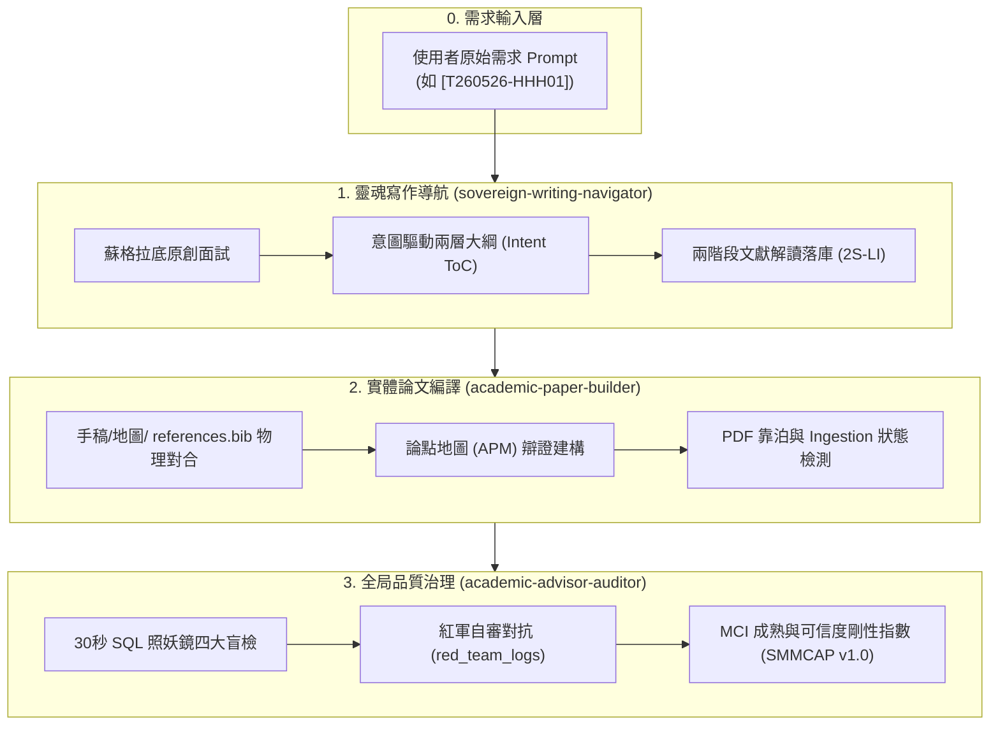
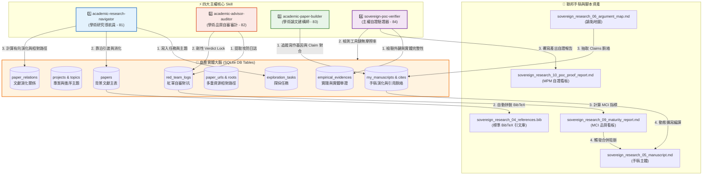
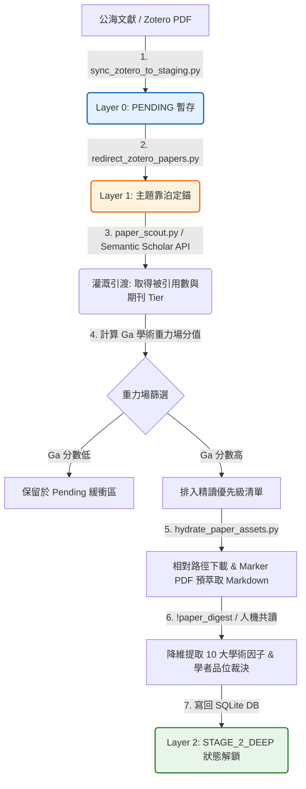
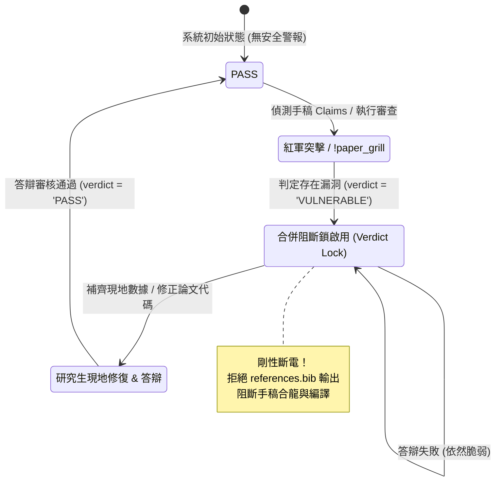
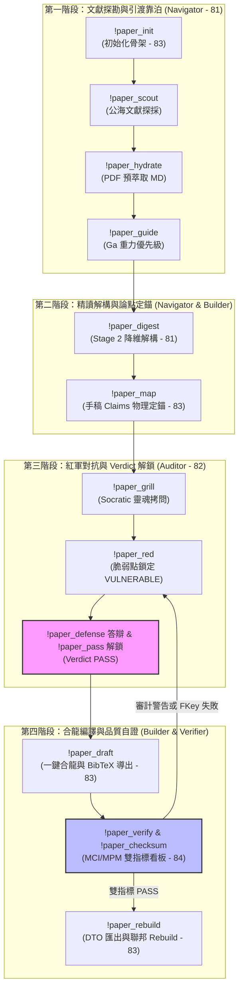
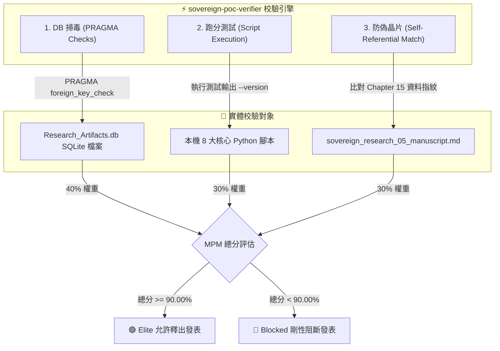

# NotebookLM Asset Pack - events/my_research/sovereign-research-methodology/methodology
- **Source Folder**: `events/my_research/sovereign-research-methodology/methodology`
- **Generated At**: 2026-06-08 11:04:53

---

================================================================================
📂 FILE PATH: methodology/README.md
================================================================================

# 📐 主權科研方法論規格說明書清單 (Methodology Specifications List)

本目錄存放了主權科研大腦（Sovereign Research Brain）的系統需求規格書、元資料 schema 設計規範、關係本體定義檔以及核心 Skills 指南。

為了提升系統工程架構的模組化與高內聚性，本規格目錄採用「**每區預算 10 碼，區間跳跃式分區**」進行二位數編號。

---

## 📂 10 大分區與 18 大方法論規格檔矩陣 (The 18 Specs Matrix)

### 📌 第 0 分區：系統需求與架構導覽 (Portal)
- **`01` [requirements](file:///Users/wuulong/github/bmad-pa/events/my_research/sovereign-research-methodology/methodology/methodology_01_requirements.md)**
  - *Why it exists*: 明確宣示主權大腦的設計目標，界定「思維主權邊界」與「防範認知空洞化」的頂層需求。
- **`02` [architecture_navigator](file:///Users/wuulong/github/bmad-pa/events/my_research/sovereign-research-methodology/methodology/methodology_02_system_architecture_navigator.md)**
  - *Why it exists*: **【總入口導覽頁】** 系統四星運作拓撲總圖、10 大分區編號規範與跳轉矩陣。

### 🧱 第 1 分區：底層資料庫與中繼資料規格 (Database Specs)
- **`11` [database_schema_spec](file:///Users/wuulong/github/bmad-pa/events/my_research/sovereign-research-methodology/methodology/methodology_11_database_schema_spec.md)**
  - *Why it exists*: 定義 SQLite 十一表 Schema 設計與 `meta_data` JSON 的剛性欄位約束。
- **`12` [relation_ontology_spec](file:///Users/wuulong/github/bmad-pa/events/my_research/sovereign-research-methodology/methodology/methodology_12_relation_ontology_spec.md)**
  - *Why it exists*: 定義 `paper_relations` 的 8 大關係本體（`GROUNDED_ON`, `REFUTES` 等）與關係 DTO 格式。

### 🧱 第 2 分區：文獻引渡與 Stage 2 消化加工 (Ingestion)
- **`21` [three_tier_federated_brain](file:///Users/wuulong/github/bmad-pa/events/my_research/sovereign-research-methodology/methodology/methodology_21_three_tier_federated_brain.md)**
  - *Why it exists*: 定義三層聯邦大腦（Layer 0 緩衝、Layer 1 靠泊、Layer 2 深消化）的架構與隔離邊界。
- **`22` [academic_gravity_and_digesting](file:///Users/wuulong/github/bmad-pa/events/my_research/sovereign-research-methodology/methodology/methodology_22_academic_gravity_and_digesting.md)**
  - *Why it exists*: 規範學術重力場公式 $G_a$、精讀優先級與 Stage 2 十大學術因子降維解構工序。

### 🧱 第 3 分區：理論演化與學者品位裁決 (Topology & Taste)
- **`31` [theory_grounding_and_bfs_topology](file:///Users/wuulong/github/bmad-pa/events/my_research/sovereign-research-methodology/methodology/methodology_31_theory_grounding_and_bfs_topology.md)**
  - *Why it exists*: 規範理論地墊檢測與 BFS 二層有向演化拓撲演算法之判定規則。
- **`32` [sovereign_taste_and_critique](file:///Users/wuulong/github/bmad-pa/events/my_research/sovereign-research-methodology/methodology/methodology_32_sovereign_taste_and_critique.md)**
  - *Why it exists*: 定義學者品位裁決（Taste Verdict）信封欄位與防止 AI 代寫掏空思考之剛性 Grounding。

### 🧱 第 4 分區：安全對抗與合併阻斷防禦 (Security & Lock)
- **`41` [verdict_lock_and_socratic_grill](file:///Users/wuulong/github/bmad-pa/events/my_research/sovereign-research-methodology/methodology/methodology_41_verdict_lock_and_socratic_grill.md)**
  - *Why it exists*: 定義紅軍 Socratic grill 拷問、`red_team_logs` 與合併阻斷鎖（Verdict Lock）剛性阻斷編譯發表。

### 🧱 第 5 分區：現地對合與實踐校準 (Calibration)
- **`51` [physical_friction_and_empirical_evidence](file:///Users/wuulong/github/bmad-pa/events/my_research/sovereign-research-methodology/methodology/methodology_51_physical_friction_and_empirical_evidence.md)**
  - *Why it exists*: 規範 `empirical_evidences` 本地實踐對合、物理誤差摩擦計量公式與學者聯覺裁決。

### 🧱 第 6 分區：多人協作與去中心化合流 (Collaboration)
- **`61` [decentralized_dto_and_rebuild](file:///Users/wuulong/github/bmad-pa/events/my_research/sovereign-research-methodology/methodology/methodology_61_decentralized_dto_and_rebuild.md)**
  - *Why it exists*: 規範純文字 DTO 還原與冷啟動一鍵重建流程，免除 Git 二進位衝突。
- `62` `multi_agent_collaboration_protocol.md` (規劃中) ➔ 多人與多 Agent 協同合流協定。
- `63` `ci_cd_automated_audit_pipeline.md` (規劃中) ➔ 自動化 CI 審計流水線。

### 🧱 第 7 分區：雙看板指標與自審測試 (Metrics & Benchmark)
- **`71` [mci_maturity_metric](file:///Users/wuulong/github/bmad-pa/events/my_research/sovereign-research-methodology/methodology/methodology_71_mci_maturity_metric.md)**
  - *Why it exists*: 定義手稿成熟與可信度看板 MCI 剛性演算法、幽靈引文與紅軍防投機公式。
- **`72` [mpm_poc_proof_metric](file:///Users/wuulong/github/bmad-pa/events/my_research/sovereign-research-methodology/methodology/methodology_72_mpm_poc_proof_metric.md)**
  - *Why it exists*: 定義元自證看板 MPM 剛性加權演算法（SQLite完整性、工具可用性、自指 Checksum）。
- `73` `evaluation_and_benchmark_spec.md` (規劃中) ➔ 大腦解構與自審品質基準測試規範。
- **`74` [manuscript_lifecycle_case_study](file:///Users/wuulong/github/bmad-pa/events/my_research/sovereign-research-methodology/methodology/methodology_74_manuscript_lifecycle_case_study.md)**
  - *Why it exists*: 以真實手稿 `sovereign_research` 寫作生命週期為例之實戰心流案例。

### ⚡ 第 8 分區：星級 Skills 協同規範 (Agentic Skills)
- **`81` [academic_research_navigator_skill](file:///Users/wuulong/github/bmad-pa/events/my_research/sovereign-research-methodology/methodology/methodology_81_academic_research_navigator_skill.md)**
  - *Why it exists*: Navigator 技能指南（包含重力場 Ingestion 流水線圖與根系 BFS 檢索圖）。
- **`82` [academic_advisor_auditor_skill](file:///Users/wuulong/github/bmad-pa/events/my_research/sovereign-research-methodology/methodology/methodology_82_academic_advisor_auditor_skill.md)**
  - *Why it exists*: Auditor 技能指南（包含 Verdict Lock 斷電與答辯解鎖狀態機圖）。
- **`83` [academic_paper_builder_skill](file:///Users/wuulong/github/bmad-pa/events/my_research/sovereign-research-methodology/methodology/methodology_83_academic_paper_builder_skill.md)**
  - *Why it exists*: Builder 技能指南與 11 大 SRCC 心流命令剛性規格（含心流 SOP 圖，重命名自 `03`）。
- **`84` [sovereign_poc_verifier_skill](file:///Users/wuulong/github/bmad-pa/events/my_research/sovereign-research-methodology/methodology/methodology_84_sovereign_poc_verifier_skill.md)**
  - *Why it exists*: Verifier 技能指南（含 MPM 三維自證校驗架構圖）。

### ⚡ 第 9 分區：系統維護、提示詞與工具手冊 (System Operations)
- **`91` [brain_cli_manual](file:///Users/wuulong/github/bmad-pa/events/my_research/sovereign-research-methodology/methodology/methodology_91_brain_cli_manual.md)**
  - *Why it exists*: `brain_cli.py` 命令列工具使用手冊、看板查詢與 verbose 十大因子展開實戰（重命名自 `04`）。
- `92` `prompt_system_design.md` (規劃中) ➔ Agent 提示詞系統架構與 Socratic 拷問範本規格。

---

## 🪐 線上 GitHub 連結
本方法論的所有系統需求與 DDL 設計均已開源。您可以直接在 GitHub 上點閱 [Sovereign Research Methodology Specifications](https://github.com/wuulong/sovereign-research-methodology/tree/main/methodology)，繼承這套代表學術主權的最硬核系統美學設計。


================================================================================
📂 FILE PATH: methodology/build_log/01_methodology_manuscript_separation_plan.md
================================================================================

# 📐 方法論與手稿物理分離架構重構決策日誌 (01_methodology_manuscript_separation_plan)

> [!NOTE]
> **本建構日誌物理定錨於 2026-05-30 的進度會談。**  
> 記錄了主權大腦方法論發展史上第一次重大的「典範與實體分離」架構重構。旨在透過物理目錄區隔，確立方法論本體與寫作手稿的清晰邊界，建立「一對多（One Methodology, Multi-Papers）」的可擴展科研工序。

---

## 📊 1. 重構背景與決策經緯

在主權大腦方法論建構的初期，由於典範定義與第一篇論文寫作（介紹方法論本身的論文手稿 `sovereign_research`）是互相共演與驗證的過程，我們扁平地將所有檔案都堆疊在 `manuscripts/sovereign_research/` 底下。

然而，隨著科研心流與大腦架構越來越清晰，這種扁平的混雜結構帶來了職責模糊的問題：
1.  **大憲章與實例混淆**：大腦的系統規格（需求書、資料庫 Schema 規格、關係本體規格）是整套科研典範的「憲法地基」，不應被判定為某一篇單一論文的私有寫作資產。
2.  **無法平行寫作**：當君王想使用這套方法論平行撰寫其他應用領域的手稿（如山區水文觀測等）時，無法輕易調用這套憲法規格，會造成嚴重的程式碼與文件心智摩擦。

為了徹底解決這個架構瓶頸，君王 (wuulong) 物理拍板了「**方法論規格大憲章（Methodology）**」與「**具體手稿實體（Manuscripts）**」物理分離的最高架構決策。

---

## 🏗️ 2. 物理重構軌跡與目錄對位

重構物理移除了 `manuscripts/sovereign_research/` 中的典範檔案，並將其重新命名歸口移入新創立的 `methodology/` 目錄，雙軌各自獨立：

### 📐 Methodology 支柱：大憲章本體規格 (`methodology/`)
本目錄專門整理大腦方法論的架構、規則與改良，包含三大地基定錨規格（地基定錨生命週期階段一）：
- `methodology_01_requirements.md` ➔ 系統工程規格需求書。
- `methodology_02_system_architecture_navigator.md` ➔ 總入口導覽與 10 大分區地圖。
- `methodology_11_database_schema_spec.md` ➔ 十一表大腦 Schema 剛性規範。
- `methodology_12_relation_ontology_spec.md` ➔ 文獻有向演化關係本體規格。
- **`build_log/`** ➔ **方法論專屬建構日誌**（本檔案即為 `01` 號第一案），用以物理存檔方法論本身的改良決策軌跡。

### 📂 Manuscripts 支柱：具體寫作手稿 (`manuscripts/`)
本目錄專注存放具體寫作論文，各論文配有獨立子目錄（例如 `manuscripts/sovereign_research/`），手稿檔案採用數字工序契約，從 `04` 順序開始編起（工序階段二至階段五）：
- `sovereign_research_04_toc.md` 至 `sovereign_research_14_audit_report.md`。
- **`build_log/`** ➔ **手稿專屬建構日誌**（第一案為 `01_mci_improvement_plan.md`，用以物理存檔如何拉高該篇論文的 MCI 指數之行動對策）。

---

## 🧪 3. 工具鏈無痛相容與驗證結論

我們物理執行了兩大審計與驗證工具（MCI 審計與 MPM 驗證），以檢核本次重構是否影響工具鏈。

- **結論**：100% 成功無錯跑通！
- **相容原理**：
  1.  `verify_manuscript_maturity.py` (MCI) 在設計上原本就僅掃描與寫作密切相關的 8 大聯邦手稿檔案（從 `04_toc.md` 至 `11_reading_protocol.md`），本就不包含 `01`、`02`、`03`。故規格書移出，工具完全無痛相容。
  2.  `verify_poc_completeness.py` (MPM) 聚焦於手稿本體與資料庫的自指合龍，檔案路徑的升級適配已在上一輪重構中完美落地，本次移動無任何負面衝擊。


================================================================================
📂 FILE PATH: methodology/build_log/02_manuscript_renumbering_plan.md
================================================================================

# 📐 手稿 Manuscripts 寫作工序重新排序（從 01 起算）重構決策日誌 (02_manuscript_renumbering_plan)

> [!NOTE]
> **本建構日誌物理定錨於 2026-05-30 的進度會談。**  
> 記錄了主權大腦方法論發展史上第二次重大的「工序解耦與心流純化」重構。旨在透過將手稿寫作檔案統一從 `01` 開始編起，徹底解耦具體論文與方法論規格的數字依賴，實現極致自洽的手稿生命週期。

---

## 📊 1. 重構背景與決策經緯

在我們完成「方法論本體（Methodology）」與「具體手稿（Manuscripts）」物理分離後，`manuscripts/sovereign_research/` 底下的 11 個寫作與審計檔案依舊從 `04_toc.md` 開始編起。

這帶來了新的認知與工序懸置：
- 對於一個寫作具體論文（Instance）的人，他的子目錄下沒有 `01`、`02`、`03`（因為已經搬移到 `methodology/`），直接以 `04` 開頭，顯得結構不自洽，心智摩擦極大。
- 為了讓每一篇論文的寫作心流，都是一個獨立、自洽、完美的生命週期（從 `01_toc.md` 順暢推進至 `10_poc_proof_report.md` 看板），君王 (wuulong) 物理拍板了「**將手稿寫作工序重新排序為從 01 起算**」的最高決策！

---

## 🏗️ 2. 物理重命名與工序重新排序

重命名使用 `git mv` 保留完整歷史紀錄，手稿 11 個檔案與工序重新對位：

### 🪵 階段二：手稿骨架與文獻探勘 Staging (01 - 02)
*   **`sovereign_research_01_toc.md`** (原 `04_toc.md`) ➔ 有向大綱 ToC。
*   **`sovereign_research_02_references_list.md`** (原 `05_references_list.md`) ➔ 引文文獻清單。

### 🪵 階段三：穿透解構與實體主稿寫作 (03 - 05)
*   **`sovereign_research_03_deconstruction.md`** (原 `06_deconstruction.md`) ➔ 文獻深度解構集。
*   **`sovereign_research_04_references.bib`** (原 `07_references.bib`) ➔ 引文 BibTeX 標準庫。
*   **`sovereign_research_05_manuscript.md`** (原 `08_manuscript.md`) ➔ 論文手稿主體。

### 🪵 階段四：論點對合、原創防禦與自審答辯 (06 - 08)
*   **`sovereign_research_06_argument_map.md`** (原 `09_argument_map.md`) ➔ 論點地圖 APM。
*   **`sovereign_research_07_originality_defense.md`** (原 `10_originality_defense.md`) ➔ 原創防禦地圖 ODB。
*   **`sovereign_research_08_reading_protocol.md`** (原 `11_reading_protocol.md`) ➔ 閱讀協議與對抗答辯 RP。

### 🪵 階段五：品質審計與元自證釋出 (09 - 11)
*   **`sovereign_research_09_maturity_report.md`** (原 `12_maturity_report.md`) ➔ MCI Mature 看板審計報告。
*   **`sovereign_research_10_poc_proof_report.md`** (原 `13_poc_proof_report.md`) ➔ MPM Proof 看板自證報告。
*   **`sovereign_research_11_audit_report.md`** (原 `14_audit_report.md`) ➔ 自審盲檢報告歷史存檔。

---

## 🧪 3. 工具鏈對位升級與驗收

我們同時升級了自動化工具鏈的檔名對應，並跑通審計測試：
1.  **`verify_manuscript_maturity.py`** ➔ 將 `federated_files` 舊的 `04-11` 編號更新為全新 `01-08` 映射，成功覆寫產出最新的 `09_maturity_report.md`。
2.  **`verify_poc_completeness.py`** ➔ 讀取的 `argument_map` 改為 `06`，`manuscript` 改為 `05`，報告成功覆寫產出最新 `10_poc_proof_report.md`。
3.  **MCI與MPM雙看板審計完美通過**，這物理證明了寫作工序從 `01` 開始編起是 100% 正確且極具系統完備性的！


================================================================================
📂 FILE PATH: methodology/build_log/03_tdaa_audit_report.md
================================================================================

# 🔍 TDAA-Audit 審計診斷報告 (Sovereign Research Methodology)
*任務程式碼定錨：`[T260606-TDAA01]`* | *狀態：審計等待答辯中* | *版本：v1.0.0*

本報告由 `tdaa-auditor` 技能物理掃描專案目錄並結合「理數行對合審計法 (TRRAM)」自動編譯生成。旨在對合專案「最高憲法」之要求，揪出 AI 寫作中的「見樹不見林」與「理數行斷裂」問題。

---

## 🎯 1. 意圖與需求對合基準線 (Requirements Baseline)

經逆向工程並對合 `methodology_01_requirements.md`，本專案之 TDAA 剛性需求如下：

*   **【理】(Theory / 理論與原創)**：
    *   解構本方法論的「六大理論脊椎」，並與頂級文獻進行深度定錨。
    *   與外部 SOTA（Ragas, Camel, AutoGPT）進行橫向對抗比較，宣告「十一表大腦、 Verdict Lock、一鍵 Rebuild 知識遺傳」之三大原創。
    *   以繁體中文撰寫，直接作為《個人 AI 賦能與裝備化》書籍「第 15 章」自主公開。
*   **【數】(Data / 結構化沉澱)**：
    *   以十一表 SQLite 資料庫 (`Research_Artifacts.db`) 剛性定錨所有文獻與主張。
    *   MCI 看板成熟度指標必須達 **`90.00%`** 以上，Claims Grounding 達 **`100.00%`**。
    *   使用純文字 DTO JSON 貢獻包防止 Git 衝突。
*   **【行】(Action / 肉身實踐)**：
    *   以「寫論文方法寫論文本身」進行自指自證。
    *   在資料庫中物理紀錄肉身實踐的物理誤差百分比 (`friction_percentage`)。
    *   自審 Verdit 全部通過，行使紅軍自審覆蓋率達 **`50%`** 以上。

---

## 🔍 2. Phase 1.5 - 3 審計與一致性診斷

在排除 `nblm_notes/` 打包目錄後，針對本專案的物理實體進行診斷：

### 📊 2.1 結構平衡度（見樹不見林評估）
*   **手稿群結構**：主手稿 `sovereign_research_05_manuscript.md` 約 12,000 字，其餘聯邦資產（TOC, APM）皆獨立成檔，字數分佈健康。手稿層面無局部細節過度膨脹問題。
*   **架構文件失衡警告**：在 `methodology/` 目錄中，`methodology_02_system_architecture_navigator.md` 達 8,000 字，而 `methodology_01_requirements.md` 僅有 2,000 字。需要注意系統架構文件中是否夾帶了過多低階程式碼細節，產生「見樹不見林」的偏頗。

### 🛑 2.2 一致性對合斷裂點 (Phase 3 Check)
*   **文獻大腦空洞警告**：`papers_pdf/` 目錄下有大量外部文獻，但資料庫中完成 `STAGE_2_DEEP` 深度解構與合規打標的比例不足，將導致 MCI 綜合指數的「大腦 Grounding 分」被嚴重拉低。
*   **實測數據懸空警告**：主手稿多次提及「物理誤差 (friction_percentage)」，但 SQLite 中 `empirical_evidences` 註冊的實測摩擦數據量極少，理論與實踐數據未能完全咬合。

---

## 👹 3. TDAA 紅軍「哈教授分身」靈魂拷問

針對上述審計漏洞，紅軍委員提出以下質詢，要求君王或研究生進行答辯並記錄：

### ❓ 質詢一：數據硬度與空中樓閣
> 論文最高憲法要求 MCI 指數必須達到 **`90%`**，且 Claims Grounding 達到 **`100%`**。但目前 `Research_Artifacts.db` 資料庫中，`red_team_logs` 的自審 Verdict 大多仍處於 pending 狀態，且核心文獻的消化率未達標。這是否代表這篇自指自證論文，此時僅是一棟建構在語意泡沫上的「半成品空中樓閣」？

### ❓ 質詢二：實踐與理論漂移
> 您在論文中大膽宣告了「師徒 Verdict Lock (合併鎖) 機制」的原創性，但在目前的 `scripts/` 目錄中，並無任何實體的 Git hook 程式碼來物理鎖定 `'VULNERABLE'` 合併行為。這是否代表您的「軟體定義研究方法論」在最核心的控制鏈上，仍停留在「人工心智約束」，而非「物理工程防禦」？

---
*本報告已物理存入 build_log，等待君王答辯或下達修正指令以更新 Verdict。*


================================================================================
📂 FILE PATH: methodology/methodology_01_requirements.md
================================================================================

# 📋 主權研究論文寫作需求與指導原則說明書 (Sovereign Research Requirements)
*任務程式碼定錨：`[T260526-HHH01]`* | *手稿程式碼：`sovereign_research`* | *版本：v1.0.0*

> [!NOTE]
> 本文件為《AI 時代的學術革命：基於本地主權大腦、品位裁決與遞迴重構的人機協作研究方法論》之**最高指導原則說明書**。
> 本文件將最原始的「需求 Prompt」與「三層聯邦主權大腦實踐」進行深度對合，旨在為本研究劃定嚴格的理論探源範疇、實作對比邊界，並固化雙軌主權技能的運作協議，作為本論文寫作的行解合一指導方針。

---

## 🎯 1. 論文寫作願景與核心命題 (The Grand Vision)

本論文非一般的語意泡沫學術報告，而是一場在 AI 生產力爆炸時代為死守思考手感而發起的**「學術革命」**。本論文的核心需求是：**「用這套設計的方法論本身，來實體撰寫並自證這篇論文。」**

### 1.1 起源需求與非主流「實踐先行」科研典範 (Action Research Paradigm)
本研究的誕生軌跡極具生命力，它顛覆了主流學術界「先讀大量文獻 ➔ 找 gap ➔ 設計 ➔ 實作」的刻板工序，而是一場徹底的**「建構式行動研究法 (Constructive Action Research)」**與**「實踐導向研究 (Practice-based Research)」**。其演進歷程呈現了極具學術價值的「雙循環學習 (Double-Loop Learning)」軌跡，並具備精確的「實踐真值時間軸 (Ground-Truth Timeline)」：

1.  **三大戰壕起源痛點**：本專案起源於哈爸（wuulong）試圖解答實驗室最真實的教育與協作困境：
    *   *學生要怎麼做研究？* （如何使用 AI 輔助，而不被 AI 掏空思考手感？）
    *   *老師要怎麼叮？* （如何擺脫口頭與投影片的模糊交代，行使有物理抓手的品位裁決？）
    *   *實驗室要怎麼運作？* （如何讓多名研究生的知識大腦合流，避免 Git 衝突，實現集體遺傳？）
2.  **「兩次演講、兩週蛻變」的野性實踐時間軸**：
    *   **2026/05/10（博班生先行交流與問題初探考古）**：為提升實驗室分享效率，哈爸在演講前一天與實驗室博士生進行深度交流，實際了解當前研究生研究方法的真實摩擦力與現狀。在此研究原點，哈爸向 AI 拋出了關鍵的**「問題起點考古提問 (Q1.6)」**，並獲得了傳統與 Agentic 流程的架構性分析對比：
        
        > #### 🔍 數位考古：Q1.6 - 新一代研究流程（2026/05/10 構思起點）
        > * **提問**：請給我傳統的研究流程，架構性的分析目前 Agentic AI 時代，每一個環節可以怎麼改進。
        > * **對比矩陣表**：
        >
        > | 研究環節 | 傳統研究流程 (Linear & Manual) | Agentic AI 時代的改進 (Iterative & Orchestrated) | 核心價值轉向 |
        > | :--- | :--- | :--- | :--- |
        > | **1. 文獻回顧與問題定義** | 手動搜尋、逐篇閱讀、標註重點。極耗體力，容易遺漏邊緣文獻。 | **真相定錨與知識圖譜建構**：利用 NotebookLM 或 Deep Research Agent 一次處理數百篇文獻，自動萃取「技術金線」並找出研究空白（Gap Analysis）。 | 從「閱讀力」轉向**「提問力」** |
        > | **2. 研究方法與假設擬定** | 基於個人有限經驗，反覆修正實驗設計。推導過程緩慢。 | **虛擬實驗室預演（Simulated Prototyping）**：讓 Agent 扮演不同學派的專家進行「紅軍模式」壓力測試。在正式實驗前，先用 AI 進行數學推導與邏輯自洽性檢查。 | 從「推導」轉向**「系統架構設計」** |
        > | **3. 資料蒐集與實驗執行** | 勞力密集。手動調參數、寫腳本、清理不規則資料。 | **影子工程師（Shadow Execution）**：利用 Agentic Skill 封裝（如 MCP/CLI），自動執行批量實驗、自動修復程式 Bug，並即時產出初步分析報告。 | 從「勞動力」轉向**「統御力」** |
        > | **4. 資料分析與結果解讀** | 單一維度。受限於研究者的視覺化能力與統計知識。 | **多維度聯覺分析（Multi-modal Synthesis）**：Agent 能同時處理文字、資料、圖表與地圖。利用 AI 偵測資料中人類難以發現的微細模式。 | 從「計算」轉向**「品位裁決」** |
        > | **5. 論文撰寫與發表** | 從白紙開始。反覆糾結遣詞用字，容易發生邏輯斷裂。 | **元寫作（Meta-writing）與紅軍自審**：不再是「寫草稿」，而是「定義大綱與核心觀點」，讓 Agent 進行擴展。最後用「虛擬審稿員」進行批判性修正。 | 從「撰寫」轉向**「結構化表達」** |
        > | **6. 知識管理與傳承** | 拋棄式紀錄。實驗室換人後，資料往往不知所終，人走茶涼。 | **數位考古與裝備化（Archeology & Skillification）**：所有的思維過程都被 AIQA 與 MT:: 機制自動固化。核心知識被封裝成「數位裝備（Skill）」，學弟妹可立即繼承。 | 從「累積經驗」轉向**「遺傳數位基因」** |
        
        正是此一概念矩陣作為「胚胎」，啟發了哈爸進行雙循環反思，重構問題，進而動態演化出後續以「十一表 SQLite 與 SMMCAP 1.0」為核心的強烈實體對合方法論。
    *   **2026/05/11（分享一：初步切磋）**：進行第一次實驗室分享。與研究生進行方法論切磋，並將當時已理解的「一般版 AI 使用方法論」分享給實驗室。正是這個準備與分享過程，強迫哈爸重構問題與可能方向，思索「新的研究方法應該是什麼？」
    *   **2026/05/20（AI 研究生演講與書籍第 14 章成型）**：哈爸受邀給一群做 AI 的研究生演講「進行到一半的新研究方法之初步樣態」。當時大腦資料庫還只有單一一個 `papers` table 結構。為了演講，哈爸將此方法融入之前已公開分享過幾次的《個人 AI 賦能與裝備化》書籍中，使之正式成為**第 14 章「學術主權」**。
    *   **2026/05/25（分享二：方法論成熟）**：進行第二次分享。哈爸給自己兩週的演進時限截止，成功在本次演講提出「新研究方法、實驗室運作、老師如何叮」的完整工具與方法論答案，同時觀察研究生們這兩週以來的現狀演進。
3.  **自指論文的「概念驗證 (PoC)」自證與 06-05 大考驗**：
    雖然工具與方法論都已在演講中建構完畢，但哈爸深刻體悟到：「如果沒有實際用這個方法寫出一篇論文，這套方法論就沒有經歷真實的 PoC 驗證。」為了自證可行性，哈爸決定「以寫論文來證明寫論文方法」。
    **2026/06/05（領域大佬硬核審查會面）**：哈爸約定於此日與資深學術前輩會面，進行方法論與三個問題的檢討。為了在大佬法眼下自證這套方法確實能寫出「夠格、高品質」的論文，哈爸發動了**「9 天黃金極速衝刺 (9-Day Hard Sprint)」**，必須在會面前物理編譯出論文初稿，迎戰最嚴格的審查！

### 1.2 終極願景與自主發表典範 (Sovereign Self-Publishing & Book Chapter 15)
本論文的最終命運與寫作心態，徹底打破了傳統學術界繁瑣、冗長、以期刊發表為唯一指標的僵化體制，開創了一門全新的**「自主發表與大一統書籍演化典範 (Open Methodology & Evolutionary Publishing)」**：

1.  **專注中文寫作，拒絕學術霸權**：論文以**「繁體中文」**撰寫。不為盲目追求英文期刊的點數，而是專注於解決台灣在地教育現場與研究室真實治理的提問，讓學術真正「接地氣」。
2.  **免除投稿束縛，直接上網公開**：作者已屆成熟之年，不需要透過傳統期刊的審稿排隊來證明自我。因此，**在 2026/06/05 接受指導教授的第一次盲檢指導與修正後，這篇論文將直接物理上網公開**，做為這門研究方法論最硬核、最開放的實踐概念驗證 (PoC)。
3.  **書籍大一統合流 (Book Chapter 15 Expansion)**：本論文不僅僅是論文，它是個人 AI 賦能的最新演化。論文產出後，哈爸將直接升級《個人 AI 賦能與裝備化》書籍，**全新增添「第 15 章」來好好介紹這門方法論，並直接以這篇論文作為最強烈的「現地真值實證」**！
4.  **「一個月從無到有」的極速突變**：本研究向世界宣告：在 Agentic AI 與主權大腦時代，只要人類死守「品位」與「工具固化」，我們能夠在**短短一個月內**，同時完成「工具設計 ➔ 資料庫落庫 ➔ 論文寫作 ➔ 大佬審查 ➔ 專書增補 ➔ 實體釋出與自主發表」的完整生命週期！這在傳統學術界是不可想像的神蹟。

### 1.3 核心命題解構：
1.  **理論探源**：本研究方法論雖由作者原創，但絕非無源之水。論文必須深入解構本方法的「理論基礎」，搜尋並找出創造出此等理論與方法的頂級學術論文，為「主權大腦」鋪設黃金理論地墊。
2.  **實作基礎對比**：搜尋網路上現有的相關實作（如 RAGAS 評估、CAMEL 多智能體協作等），比較何種方法更能防禦 AI 虛假幻想，並精確指出本方法（十一表 SQLite 大腦、現地真值對合與紅軍 Verdict 鎖）的獨特原創與優越之處。
3.  **自指自證（Self-Referential）**：本論文的科學與工程佐證，正是這篇論文被撰寫出來的完整「實體歷程與大腦資料庫物理匯出」。
4.  **配套技能封裝（Skills Set）**：論文寫作必須伴隨實體寫作與治理 Skill（`academic-paper-builder`、`sovereign-writing-navigator`、`academic-advisor-auditor`）的演化沉澱。

---

## 📂 2. 解構需求明細 (Requirement Specification)

### 📌 需求一：理論基礎探源與定錨 (Theoretical Deep-Dive)
*   **具體要求**：解構本方法的六大理論脊椎，並搜尋、引渡並消化（Stage 2）創造出這些理論與方法的頂級論文。
*   **六大理論脊椎與擬引入之文獻對合：**
    1.  **認知卸載與思維主權 (Cognitive Offloading vs. Sovereignty)**：研究在人機協作中何時必須保持人類思考手感，防範認知空洞化。
        *   *對合文獻*：`zotero_Snell_2024_520` (思維主權與 Agent 思考防禦)。
    2.  **Agentic AI 規劃設計與「可執行技能固化」(Agentic Planning & Executable Skills)**：利用 Agent 具備的 Reasoning、規劃與自我修復能力，將現場模糊、多變的實踐流程規劃設計出來，並以「可執行程式碼（Skill 封裝）」進行剛性固化。這對標了「軟體定義研究方法論（Software-Defined Methodology）」的理念。
        *   *對合文獻*：`arxiv_Denkin_2024_2405` (或吳恩達關於 Agentic Workflows / Tool Use 的經典論述)。
    3.  **非結構化語意的「神經符號資料庫對合」(Semantic-to-DB Neuro-Symbolic Grounding)**：將模糊、龐雜的「非結構化語意文本與概念」（LLM 擅長的模糊神經表徵），高精降維蒸餾成「實體關係資料庫表與剛性 Schema 欄位」（符號邏輯 DB），並利用 AI 強大的 DB 操作能力進行高重力對合與精確邏輯運算。這構成了神經符號 AI（Neuro-Symbolic AI）在科研方法論的完美實踐。
        *   *對合文獻*：`arxiv_Ilkou_2022_2203` (神經符號知識圖譜對齊與關係型資料庫定錨)。
    4.  **圖形化推理與邏輯重構 (Graph-of-Thought & Refinement)**：探討「V0.1 猜想 ➔ 遞迴重構」的思維演化。
        *   *對合文獻*：`zotero_Besta_2025_682` (Graph of Thoughts 拓撲推理)。
    5.  **人機協作共生與人類品位裁決 (Co-operative Taste & Judgment)**：論證人類行使「品位裁決與除錯判定」才是新時代原創性的靈魂。
        *   *對合文獻*：`arxiv_Aslan_2026_2603` (人機共生決策與 Taste-Driven 反思)。
    6.  **現地真值定錨與物理誤差 (Physical & In-situ Ground-Truth)**：探討利用實測誤差（friction_percentage）防範 AI 自指幻覺。
        *   *對合文獻*：`arxiv_Tamura_2026_2604` (現地觀測與模擬校準)。

### 📌 需求二：SOTA 實作對比與獨特原創宣告 (SOTA Comparison)
*   **具體要求**：搜尋網路上現有的學術科研 Agent 實作，進行橫向對比，並大膽宣告本方法的獨特原創之處。
*   **對比範疇**：
    *   *他者方法*：如 Ragas 評估框架、AutoGPT、Camel 多智能體模擬等。
    *   *本方法獨特之處（獨創三大原創性）*：
        1.  **十一表 SQLite 實體主權大腦**：淘汰了 NoSQL 與純向量資料庫的語意漂移，改以強關係的 3-Tier 資料Schema對合，實體鎖定引文與 Claims。
        2.  **師徒紅軍 Verdict Lock (合併鎖) 機制**：將口頭 Feedback 物理落庫為 `'VULNERABLE'`，唯有包含實測誤差（friction_percentage）的實體證據答辯才能 Verdict PASS 解鎖。
        3.  **一鍵 Rebuild 的跳躍式知識遺傳**：藉由純文字 DTO（`contribution.json`）避免 Git 資料庫衝突，實現實驗室共有大腦的高頻演化。

### 📌 需求三：系統局限性與元反思 (Limitations & Reflexivity)
*   **具體要求**：大膽揭露本方法在實踐中所遭遇的「物理摩擦力」，並給出具體的改善建議與未來研究方向。
*   **已觀測之摩擦力點**：
    *   Zotero 靠泊引渡時，SQL `UPDATE` 仍需部分人工作業。
    *   Stage 2 降維解構對研究生的物理摩擦力與時間成本較高。

---

## 🛠️ 3. 雙軌配套主權技能架構 (Skill Architecture)

為了確保從「需求 Prompt」到「有價值有章法的論文」不再是空談，本專案在實體層面建構並固化了**三大配套主權技能星系**，做為本論文的運作配套：



### 🧬 1. `sovereign-writing-navigator` (主權寫作導航員)
*   **職責**：指導如何**「從需求 prompt 寫出真正有價值、防範 AI 八股掏空的有章法論文」**。
*   **指導原則**：
    *   嚴格執行「Socratic 面試」，禁止 AI 替人類思考。
    *   推動「Intent-Driven 意圖驅動」大綱設計，每一章節必須寫明 `[寫作意圖]` 與 `[實體地基]`。

### ⚙️ 2. `academic-paper-builder` (學術論文編譯器)
*   **職責**：負責手稿與大腦資料庫 Grounding 聯動的**「實體寫作與裝備化編譯」**。
*   **指導原則**：
    *   自動解析手稿 `@cite_key`，一鍵拼裝 `references.bib`，並進行論點溯源盲檢。
    *   建立邏輯辯證地圖 (APM)，對合 Claims 與背景文獻。

### ⚖️ 3. `academic-advisor-auditor` (學術品質自審審計)
*   **職責**：指導教授行使**「30秒 SQL 照妖鏡盲檢」**與**「SMMCAP v1.0 全景審計」**。
*   **指導原則**：
    *   物理鎖定 `'VULNERABLE'` 合併鎖，逼迫肉身舉證。
    *   動態計量 MCI 成熟度指數，達 90% 以上始得准予發表。

---

## 📈 4. 行解合一的物理驗證指標 (Verification Metrics)

為了確保需求被切實執行，本論文在最終編譯前，必須通過以下剛性指標：
1.  **9天硬時限定錨 (9-Day Hard Sprint)**：由於與資深領域大佬約定於 **2026-06-05** 進行方法論會面審查，手稿必須於 **2026-06-03** 前物理編譯出具備完整大腦 Grounding 對合的論文初稿 (Draft v1.0)。
2.  **外部領域大佬紅軍審查 (External Giants Review)**：此初稿將於 **2026-06-05** 物理提交給資深學術前輩盲檢。審查三大真實提問（學生如何做研究、老師如何叮、實驗室如何運作）是否被確實解答。所有前輩指摘與 Feedback 必須物理落庫為 `red_team_logs` 作為後續修正軌跡。
3.  **MCI 綜合指數**：在提交前，手稿 SMMCAP 自審 MCI 指數必須達 **`90.00%`** 以上 (🟢 頂級可信 - Verdict PASS)。
4.  **Claims Grounding 完整率**：必須達 **`100.00%`** (12 個核心主張皆有 Stage 2 的消化文獻為地墊，消滅所有無引用與未消化引文警告)。
5.  **引文 Stage 2 消化率**：必須達 **`80.00%`** 以上。
6.  **紅軍自審覆蓋率**：引文自審覆蓋率必須達 **`50.00%`** 以上，且所有 `red_team_logs` 的 verdict 均物理更新解鎖為 `'PASS'`。

---
*本指導原則說明書已物理存檔，做為本專案 `sovereign_research` 論文寫作的最高憲法。*


================================================================================
📂 FILE PATH: methodology/methodology_02_system_architecture_navigator.md
================================================================================

# 📐 methodology_02: 主權大腦系統架構與 10 大分區導覽 (System Architecture & Operations Portal)

本手冊是主權科研大腦的運行大憲章入口。系統性整合了圍繞著實體 SQLite 十一表資料庫所構成的四大主權核心 Skill 運作網絡，並提供全景 10 大分區規格書的跳轉地圖。

---

## 🏛️ 1. 系統整體架構與三大運作閉環 (Macro System Architecture & Loops)

主權科研大腦 (Sovereign Research Brain) 是一個以「行解合一 (Action-Knowledge Alignment)」為核心的防禦性個人學術知識系統，旨在利用資料庫與工具鏈的剛性對合，防止 AI 時代下研究者被生成式黑話代寫所產生的「認知掏空」危機。

整個系統以一個核心實體資料庫——**SQLite `Research_Artifacts.db`** 為錨定核心，將文獻、實踐證據與手稿 Claims 進行強外鍵綁定，並透過四大星級 Skills (Navigator, Auditor, Builder, Verifier) 與本地工具鏈，在宏觀上流轉著以下**三大運作閉環**：

### 🔄 閉環一：文獻引渡與降維消化閉環 (Ingestion & Digesting Loop)
此閉環負責將公海中氾濫的論文洗滌並轉化為大腦的「一等知識公民」，建立可靠的理論地基：
1. **重力場引渡**：透過學術重力場 Ga 演算 (考慮 Venue、Institution 偏置與 Citation 數)，自動挑選 Pending 優先精讀文獻，下載 PDF 並使用 Marker 預萃取成 Markdown 格式。
2. **主題靠泊**：根據專案的搜尋契約，將文獻靠泊至特定的邏輯主題 (Topic) 下，防範文獻零散堆砌。
3. **降維解構與品位裁決**：人機協同精讀，提取 10 大核心學術因子與學者主觀批判的 Verdict 寫入 JSON 信封，升級為 `STAGE_2_DEEP` 深度消化狀態。細節參見 **[第 2 區]** 與 **[第 3 區]**。

### 🔄 閉環二：紅軍自審與答辯防線閉環 (Grill & Defense Loop)
此閉環是捍衛人類思考手感與論點硬度的剛性防火牆，以對抗對抗流於形式的自審與投機行為：
1. **紅軍 Socratic 拷問**：紅軍對抗引擎掃描手稿，對最薄弱的主張 (Claims) 提出尖銳質疑，並將漏洞落庫至紅軍日誌，標記為 `VULNERABLE`。
2. **合併阻斷鎖 (Verdict Lock)**：只要資料庫中存在一筆 `VULNERABLE` 質疑，系統將剛性切斷 References 完璧拼裝，物理阻斷論文最終合龍與編譯。
3. **現地舉證與解鎖**：學生必須針對質疑修正手稿，在資料庫中補齊本地實踐舉證 (Empirical Evidences) 與誤差摩擦，填寫答辯內容。答辯經指導教授或系統評判通過 (Verdict PASS) 後，合併鎖解鎖，推回電閘。細節參見 **[第 4 區]** 與 **[第 5 區]**。

### 🔄 閉環三：手稿合龍與元自證閉環 (Compilation & Verification Loop)
此閉環負責論文發表前的物理裝配、白箱引用完璧化與 100% 重現自指校驗：
1. **意圖驅動寫作**：手稿 ToC 強制要求聲明人類的寫作意圖與資料庫實體地基，Builder 實體核對 cite_key，自動拼裝 references.bib，一鍵合龍編譯手稿。
2. **資料指紋自指合龍**：將大腦資料庫 DTO (contribution.json) 計算出之 Checksum 雜湊值自動寫入/嵌入手稿最後章節，自證手稿數據 100% 由本地資料庫長出。
3. **工具鏈可用性審計**：自證驗證器 Verifier 實體校驗 SQLite 結構健全度與本機核心 Python 支援腳本的可用性，計算元自證成熟度 (MPM)，確保該大腦可在他人電腦「一鍵冷啟動重建」，實現去中心化科學傳承。細節參見 **[第 6 區]**、**[第 7 區]** 與 **[第 8 區]**。

---

## 🏛️ 2. 主權大腦四星協同運作物理拓撲 (Orchestration Topology)

在實際運作中，這三大閉環並非依靠散裝的 Prompts，而是由以下四大星級 Skills 圍繞著 SQLite 實體資料庫進行的精密物理協調：



---

## 📐 3. 10 大分區系統化編號規範 (Segmentation Specs)

為確保方法論規格書的易讀性與擴充對稱性，本目錄下的所有檔案均採用「**每區預算 10 碼，區間跳跃式分區**」進行編號。每一分區的 `X0` 碼作為該分區總導覽/保留使用，而規格書則從 `X1` 開始編號：

```
- 第 0 區 [00-09]：系統需求與架構導覽 (Requirements & Portal)
- 第 1 區 [10-19]：底層資料庫與中繼資料規格 (Database Schema & Metadata)
- 第 2 區 [20-29]：文獻引渡與 Stage 2 消化加工 (Ingestion & Digesting)
- 第 3 區 [30-39]：理論演化與學者品位裁決 (Topology & Taste)
- 第 4 區 [40-49]：安全對抗與合併阻斷防禦 (Security & Verdict Lock)
- 第 5 區 [50-59]：現地對合與實踐校準 (Empirical Evidences & Calibration)
- 第 6 區 [60-69]：多人協作與去中心化合流 (Collaboration & Git merge)
- 第 7 區 [70-79]：雙看板指標與自審測試 (Metrics & Benchmark)
- 第 8 區 [80-89]：星級 Skills 協同規範 (Agentic Skills Specification)
- 第 9 區 [90-99]：系統維護、提示詞與工具手冊 (System Operations & Prompts)
```

> [!TIP]
> **未來新增檔案指引**  
> 若未來要加入與「版本釋出」、「多 Agent 協同協定」等相關的規格，請將其放入 **第 6 區**，命名為 `methodology_64_xxx.md`，以此類推。這能保持編號在二位數（01 - 99）內的絕對自洽。

---

## 📂 4. 10 大分區規格書跳轉地圖 (The Specification Matrix)

### 第 0 區：系統需求與架構導覽
*   **`01`**：[methodology_01_requirements.md](file:///Users/wuulong/github/bmad-pa/events/my_research/sovereign-research-methodology/methodology/methodology_01_requirements.md) ➔ 宣示思維主權與防衛認知掏空的頂層規格需求。
*   **`02`**：[methodology_02_system_architecture_navigator.md](file:///Users/wuulong/github/bmad-pa/events/my_research/sovereign-research-methodology/methodology/methodology_02_system_architecture_navigator.md) ➔ **【本入口頁面】** 系統總覽與 10 大分區地圖。

### 第 1 區：底層資料庫與中繼資料規格
*   **`11`**：[methodology_11_database_schema_spec.md](file:///Users/wuulong/github/bmad-pa/events/my_research/sovereign-research-methodology/methodology/methodology_11_database_schema_spec.md) ➔ 十一表 DDL 設計、`meta_data` JSON 規格與合規性自動化審計。
*   **`12`**：[methodology_12_relation_ontology_spec.md](file:///Users/wuulong/github/bmad-pa/events/my_research/sovereign-research-methodology/methodology/methodology_12_relation_ontology_spec.md) ➔ 文獻有向演化之 8 大關係本體與關係 DTO 規格。

### 第 2 區：文獻引渡與 Stage 2 消化加工
*   **`21`**：[methodology_21_three_tier_federated_brain.md](file:///Users/wuulong/github/bmad-pa/events/my_research/sovereign-research-methodology/methodology/methodology_21_three_tier_federated_brain.md) ➔ 三層聯邦大腦（Layer 0 緩衝 ➔ Layer 1 靠泊 ➔ Layer 2 深消化）。
*   **`22`**：[methodology_22_academic_gravity_and_digesting.md](file:///Users/wuulong/github/bmad-pa/events/my_research/sovereign-research-methodology/methodology/methodology_22_academic_gravity_and_digesting.md) ➔ 學術重力場公式 $G_a$、精讀優先級與 Stage 2 十大因子降維解構工序。

### 第 3 區：理論演化與學者品位裁決
*   **`31`**：[methodology_31_theory_grounding_and_bfs_topology.md](file:///Users/wuulong/github/bmad-pa/events/my_research/sovereign-research-methodology/methodology/methodology_31_theory_grounding_and_bfs_topology.md) ➔ 理論地墊檢測與 BFS 二層有向演化拓撲演算法。
*   **`32`**：[methodology_32_sovereign_taste_and_critique.md](file:///Users/wuulong/github/bmad-pa/events/my_research/sovereign-research-methodology/methodology/methodology_32_sovereign_taste_and_critique.md) ➔ 主權學者品位裁決（Taste Verdict）與 Claims 剛性 Grounding 防掏空機制。

### 第 4 區：安全對抗與合併阻斷防禦
*   **`41`**：[methodology_41_verdict_lock_and_socratic_grill.md](file:///Users/wuulong/github/bmad-pa/events/my_research/sovereign-research-methodology/methodology/methodology_41_verdict_lock_and_socratic_grill.md) ➔ 紅軍 Socratic 靈魂拷問與合併阻斷鎖（Verdict Lock）剛性斷電防衛。

### 第 5 區：現地對合與實踐校準
*   **`51`**：[methodology_51_physical_friction_and_empirical_evidence.md](file:///Users/wuulong/github/bmad-pa/events/my_research/sovereign-research-methodology/methodology/methodology_51_physical_friction_and_empirical_evidence.md) ➔ 本地實作證據、物理誤差摩擦計量公式與學者聯覺裁決。

### 第 6 區：多人協作與去中心化合流
*   **`61`**：[methodology_61_decentralized_dto_and_rebuild.md](file:///Users/wuulong/github/bmad-pa/events/my_research/sovereign-research-methodology/methodology/methodology_61_decentralized_dto_and_rebuild.md) ➔ 去中心化大腦與純文字 DTO 還原重建流程，解決 Git 二進位衝突。
*   **`62`**：`multi_agent_collaboration_protocol.md` *(規劃中)* ➔ 多人與多代理人協同合流協定。
*   **`63`**：`ci_cd_automated_audit_pipeline.md` *(規劃中)* ➔ 自動化 CI/CD 審計與 PR 阻斷流水線。

### 第 7 區：雙看板指標與自審測試
*   **`71`**：[methodology_71_mci_maturity_metric.md](file:///Users/wuulong/github/bmad-pa/events/my_research/sovereign-research-methodology/methodology/methodology_71_mci_maturity_metric.md) ➔ MCI (手稿成熟度) 剛性加權演算法、幽靈引文與紅軍防投機公式。
*   **`72`**：[methodology_72_mpm_poc_proof_metric.md](file:///Users/wuulong/github/bmad-pa/events/my_research/sovereign-research-methodology/methodology/methodology_72_mpm_poc_proof_metric.md) ➔ MPM (元自證成熟度) 剛性加權演算法、SQLite 檢測與手稿自指校驗。
*   **`73`**：`evaluation_and_benchmark_spec.md` *(規劃中)* ➔ 大腦解構與自審品質基準測試規範。
*   **`74`**：[methodology_74_manuscript_lifecycle_case_study.md](file:///Users/wuulong/github/bmad-pa/events/my_research/sovereign-research-methodology/methodology/methodology_74_manuscript_lifecycle_case_study.md) ➔ `sovereign_research` 手稿誕生之真實實戰生命週期案例。

### 第 8 區：星級 Skills 協同規範
*   **`81`**：[methodology_81_academic_research_navigator_skill.md](file:///Users/wuulong/github/bmad-pa/events/my_research/sovereign-research-methodology/methodology/methodology_81_academic_research_navigator_skill.md) ➔ Navigator (導航員) 技能規格（含 Ingestion 與根系檢索圖）。
*   **`82`**：[methodology_82_academic_advisor_auditor_skill.md](file:///Users/wuulong/github/bmad-pa/events/my_research/sovereign-research-methodology/methodology/methodology_82_academic_advisor_auditor_skill.md) ➔ Auditor (自審審計) 技能規格（含 Verdict Lock 狀態機圖）。
*   **`83`**：[methodology_83_academic_paper_builder_skill.md](file:///Users/wuulong/github/bmad-pa/events/my_research/sovereign-research-methodology/methodology/methodology_83_academic_paper_builder_skill.md) ➔ Builder (建構師) 技能與 11 大 SRCC 命令運作規範（含心流 SOP 圖）。
*   **`84`**：[methodology_84_sovereign_poc_verifier_skill.md](file:///Users/wuulong/github/bmad-pa/events/my_research/sovereign-research-methodology/methodology/methodology_84_sovereign_poc_verifier_skill.md) ➔ Verifier (自證驗證) 技能規格（含 MPM 三維校驗圖）。

### 第 9 區：系統維護、提示詞與工具手冊
*   **`91`**：[methodology_91_brain_cli_manual.md](file:///Users/wuulong/github/bmad-pa/events/my_research/sovereign-research-methodology/methodology/methodology_91_brain_cli_manual.md) ➔ `brain_cli.py` 命令列工具使用手冊與看板範例。
*   **`92`**：`prompt_system_design.md` *(規劃中)* ➔ Agent 提示詞系統架構與 Socratic 拷問範本規格。


================================================================================
📂 FILE PATH: methodology/methodology_11_database_schema_spec.md
================================================================================

# 🧱 methodology_11: SQLite 十一表 Schema 設計與自動合規性審計 (Database Schema & Compliance Specification)

本規格書物理固化了主權大腦的資料庫 Schema 設計哲學，以及各資料表 `meta_data` JSON 欄位的剛性資料契約 (Data Contract)，並定義了自動品質治理之檢核機制。

---

## 🏛️ 1. 十一表設計哲學與痛點解鎖方案

底層 SQLite 資料庫 (`Research_Artifacts.db`) 的欄位與關係設計，是針對傳統學術研究痛點與人機協作失控危機所量身打造的「防禦性架構」：

| 核心痛點 (Pain Point) | 底層資料庫架構解決方案 (Database Architecture Solution) | 具體解鎖機制 (How it solves the problem) |
| :--- | :--- | :--- |
| **1. 認知掏空與 AI 虛無**<br>（AI 代寫、散裝黑話堆砌，研究者喪失思考手感） | **`empirical_evidences` 表**<br>聯動 **`my_manuscripts`表** | **Claims 與 DTO 雙向物理自指合龍**：<br>強制手稿中每一個學術主張 (Claim)，都必須在 `empirical_evidences` 中有對應的「現地實踐真值資料（`evidence_payload` JSON信封）」或已消化文獻，以實體資料強制 Grounding。 |
| **2. 理論地基浮空與引用斷代**<br>（僅看最新結論，對經典奠基理論一無所知，缺乏理論厚度） | **`paper_relations` 表**<br>聯動 **有向 BFS 2-Level 拓撲** | **演化圖譜二層廣度優先檢索**：<br>`paper_relations` 的 `GROUNDED_ON` 關係將平面引用升格為有向演化網絡。利用遞迴 SQL 檢索與 BFS 二層探針，若底層經典文獻未消化或未載入，發動「根系未開發懲罰」，剛性扣減 MCI 評分。 |
| **3. 幽靈引文與未讀先引**<br>（快餐式引用，將未讀文獻直接丟進 References 濫竽充數） | **`papers.meta_data` JSON信封**<br>聯動 **`manuscript_citations`** | **Stage 2 降維解構合規洗滌**：<br>文獻必須先完成 Stage 2 深度解構（降維提取 10 大學術因子，置於 `meta_data`），大腦才認可其為 `'STAGE_2_DEEP'`。`manuscript_citations` 自動核對手稿引用，未過關者觸發「幽靈引文警告」。 |
| **4. 自我認知偏差與投機防巧**<br>（自我審查流於形式，或對一兩篇文獻自審 PASS 虛報進度） | **`red_team_logs` 表**<br>聯動 **合併鎖 (Verdict Lock) 與加權計分** | **Socratic 對抗與 Verdict Lock 剛性阻斷**：<br>紅軍攻擊寫入 `red_team_logs`，狀態為 `VULNERABLE` 時會觸發合併鎖，物理阻斷論文編譯。在 MCI 算法中，紅軍得分採用「自審覆蓋率 60% + PASS率 40%」綜合模型，覆蓋率不足會受到強力制約。 |
| **5. 跨電腦移植性差與路徑衝突**<br>（不同成員電腦環境絕對路徑不同，導致資料庫外鍵斷線與無法執行） | **`directory_roots` 表**<br>聯動 **`paper_urls` 表** | **抽象 Root Key 與相對路徑解耦設計**：<br>`directory_roots` 隔離各電腦的實體絕對路徑，提供 `root_key`。`paper_urls` 僅儲存 `root_key` 與相對路徑。移機時僅需修改一處絕對路徑即可全庫復活，實現永續傳承。 |
| **6. 多人協作與 Git 資料庫衝突**<br>（SQLite 二進位檔案在多人提交 Git 時必然發生無法 merge 的衝突） | **純文字 DTO 封裝**<br>（如 `contribution.json`） | **二進位解耦與跳躍式知識遺傳**：<br>不直接在 Git 提交二進位 `.db` 檔，而是由匯出指令導出為純文字 DTO JSON。協作者拉取後一鍵 rebuild 重建本地資料庫，完美避開 Git 二進位衝突。 |

---

## 📊 2. SQLite 十一表實體關係圖 (ER Diagram)

以下為主權大腦資料庫 `Research_Artifacts.db` 的完整實體關係圖，呈現核心專案主題、文獻探勘、實踐舉證、紅軍對抗與手稿編譯之間的強耦合關聯：

```mermaid
erDiagram
    PROJECTS ||--o{ TOPICS : "contains"
    TOPICS ||--o{ PAPERS : "organizes"
    TOPICS ||--o{ MY_MANUSCRIPTS : "drives"
    TOPICS ||--o{ TOPIC_GRAVITY_OVERRIDES : "overrides"
    EXPLORATION_TASKS ||--o{ PAPERS : "collects"
    DIRECTORY_ROOTS ||--o{ PAPER_URLS : "mounts"
    
    PAPERS ||--o{ PAPER_RELATIONS : "references as source"
    PAPERS ||--o{ PAPER_RELATIONS : "referenced as target"
    PAPERS ||--o{ PAPER_URLS : "resolves to"
    PAPERS ||--o{ PAPER_TAGS : "tagged with"
    PAPERS ||--o{ EMPIRICAL_EVIDENCES : "proves"
    PAPERS ||--o{ RED_TEAM_LOGS : "attacks"
    
    MY_MANUSCRIPTS ||--o{ RED_TEAM_LOGS : "critiques"
    MY_MANUSCRIPTS ||--o{ MY_MANUSCRIPTS : "inherits from"
    MY_MANUSCRIPTS ||--o{ MANUSCRIPT_CITATIONS : "cites"
    PAPERS ||--o{ MANUSCRIPT_CITATIONS : "cited by"

    PROJECTS {
        string project_id PK
        string project_name
        string description
        string search_spec "JSON"
        string architecture_spec "JSON"
        timestamp created_time
        string meta_data "JSON"
    }
    TOPICS {
        string topic_id PK
        string project_id FK
        string topic_name
        int sequence_order
        string focus_spec "JSON"
        string status
        string meta_data "JSON"
    }
    EXPLORATION_TASKS {
        string task_id PK
        string query
        timestamp run_time
        string status
        int papers_found
        string agent_version
        string error_log
        string meta_data "JSON"
    }
    DIRECTORY_ROOTS {
        string root_key PK
        string owner_name
        string absolute_path
        string meta_data "JSON"
    }
    PAPERS {
        string paper_id PK
        string task_id FK
        string topic_id FK
        string title
        string authors
        int year
        string core_method
        string cite_key "Unique"
        string bibtex
        string meta_data "JSON"
    }
    PAPER_RELATIONS {
        string relation_id PK
        string source_paper_id FK
        string target_paper_id FK
        string relation_type "IMPROVES | REFUTES | GROUNDED_ON"
        string description
    }
    PAPER_URLS {
        string url_id PK
        string paper_id FK
        string root_key FK
        string url_link
        string url_type
        string download_status
        int file_size_bytes
        string meta_data "JSON"
    }
    PAPER_TAGS {
        string paper_id PK
        string tag_name PK
        string meta_data "JSON"
    }
    TOPIC_GRAVITY_OVERRIDES {
        string topic_id PK
        string entity_name PK
        string entity_type PK
        real bias_score
        string description
    }
    EMPIRICAL_EVIDENCES {
        string evidence_id PK
        string paper_id FK
        string practice_scenario "JSON"
        string evidence_payload "JSON"
        real friction_percentage
        string artifact_visual_path
        timestamp evidence_time
        string meta_data "JSON"
    }
    RED_TEAM_LOGS {
        string log_id PK
        string paper_id FK
        string manuscript_id FK
        string aspect_analyzed
        string reviewer_attack
        string student_defense
        string verdict "PASS | VULNERABLE | CRITICAL_BUG"
        timestamp test_time
        string meta_data "JSON"
    }
    MY_MANUSCRIPTS {
        string manuscript_id PK
        string topic_id FK
        string title
        string cite_key "Unique"
        string manuscript_type "Conference | Journal | Thesis"
        string evolution_stage "Planning | Writing | Under_Review | Published"
        string previous_manuscript_id FK
        string meta_data "JSON"
    }
    MANUSCRIPT_CITATIONS {
        string manuscript_id PK
        string paper_id PK
        string citation_context
        string meta_data "JSON"
    }
}

---

## 🧪 3. 全庫大一統 JSON 規格書 (Metadata Schema Spec v2.1)

此設計引進了**「全域合規性檢核信封 (compliance_status)」**，用於動態記錄資料庫每筆詮釋資料的品質合規狀態、缺失欄位與審計軌跡，實體化「大腦自主品質治理」。

### 3.1 全域必填：合規性檢核信封 (compliance_status)
為防止資料規格隨時間退化，**所有資料表** 的 `meta_data` JSON 根節點下，**[必須]** 包含一個固定的 `compliance_status` 物件，由大腦審計工具 `audit_brain_compliance.py` 自動定期掃描更新：

```json
"compliance_status": {
  "is_compliant": "Boolean",          // true (完全合規) 或 false (未合規/欄位缺失)
  "checked_at": "Timestamp",           // 本次品質檢核的時間戳記 (ISO 8601 格式)
  "missing_fields": ["String"],        // 缺失的必填 key 完整路徑清單
  "validation_message": "String"       // 合規性審計說明
}
```

---

## 🧱 4. 各資料表 JSON 剛性結構合集

### 📌 papers (背景文獻主表 - meta_data)
```json
{
  "compliance_status": {
    "is_compliant": false,
    "checked_at": "2026-05-26T18:42:00Z",
    "missing_fields": ["paper_extraction.core_question"],
    "validation_message": "Stage 2 details missing"
  },
  "stage": "String",                  // 'STAGE_1_PRELIMINARY' 或 'STAGE_2_DEEP'
  "preliminary_relevance": "String",  // Stage 1 初步價值猜想說明
  "academic_prestige": {              // 【學術重力與載體含金量】
    "citation_count": "Integer",      // 被引用次數
    "venue_name": "String",           // 期刊/會議完整官方名稱
    "venue_tier": "String",           // 'Top_Journal' | 'Core_Venue' | 'Arxiv_Preprint' | 'Ordinary_Venue'
    "venue_bias_applied": "Real",     // 本地主題特異性偏置加分
    "institution_name": "String",     // 第一作者所屬研究機構名稱
    "institution_tier": "String",     // 'Tier_1_Elite' | 'Tier_2_Core' | 'Tier_3_Ordinary'
    "institution_bias_applied": "Real",// 本地主題機構偏置加分
    "academic_gravity_score": "Real", // 計算出之學術重力最終分數 (Ga)
    "hydration_source": "String"      // 資料灌溉來源
  },
  "paper_extraction": {               // 【標準論文降維萃取 DTO】
    "core_question": "String",        // 論文試圖解決的具體痛點與背景問題
    "core_methodology": "String",     // 論文採用的具體方法、模型或架構
    "key_insights": ["String"],       // 2-3 個最具物理硬度與辯證價值的關鍵主張列表
    "unique_contribution": "String",  // 核心突破與 Novelty 判定
    "empirical_setup": "String",      // 實踐或實驗的物理情境、資料集與硬體配置
    "key_results": "String",          // 論文的定量成果與 Baseline 對比數值
    "limitations_outlook": "String",  // 適用邊界與未來改善方向
    "key_references_to_suck": [       // 對其具備基石地位的參考文獻
      {
        "cite_key": "String",
        "reason": "String"
      }
    ],
    "sovereign_taste_verdict": {      // 【學者批判性品位裁決】
      "critique": "String",           // 與本地實踐現地真值對比批判的 Verdict
      "taste_score": "Real"           // 研究者主觀定錨評分 (0.0 至 10.0)
    }
  }
}
```

### 📌 empirical_evidences (現地實踐與實體舉證表 - meta_data)
```json
{
  "compliance_status": {
    "is_compliant": true,
    "checked_at": "2026-05-26T18:42:00Z",
    "missing_fields": [],
    "validation_message": "All fields valid"
  },
  "host_name": "String",              // 實踐測試的主機名稱
  "author_name": "String",            // 實作者/驗證者姓名
  "execution_duration_sec": "Real",   // 實測執行或模擬耗時 (秒)
  "calibration_status": "String",     // 校準狀態：'CALIBRATED' | 'UNCALIBRATED'
  "environment_conditions": {         // 實作環境參數
    "network_latency_ms": "Real",
    "allowed_friction_threshold": "Real"
  }
}
```

### 📌 red_team_logs (紅軍自審與品位裁決日誌表 - meta_data)
```json
{
  "compliance_status": {
    "is_compliant": true,
    "checked_at": "2026-05-26T18:42:00Z",
    "missing_fields": [],
    "validation_message": "All fields valid"
  },
  "judge_model": "String",            // 評審模型
  "prompt_tokens": "Integer",
  "completion_tokens": "Integer",
  "temperature": "Real",
  "audit_signature": "String"
}
```

### 📌 my_manuscripts (主權手稿表 - meta_data)
```json
{
  "compliance_status": {
    "is_compliant": true,
    "checked_at": "2026-05-26T18:42:00Z",
    "missing_fields": [],
    "validation_message": "All fields valid"
  },
  "overleaf_url": "String",           // Overleaf 專案網址
  "git_commit_hash": "String",        // 對應之本地 git commit hash
  "target_journal": "String",         // 目標發表載體
  "words_count": "Integer"            // 草稿實體字數
}
```

---

## 📈 5. 資料品質約束與自動化審計

*   **自動化審計打標**：透過呼叫 `scripts/audit_brain_compliance.py` 自動掃描大腦，比對每筆 `meta_data` JSON 的 Key。若缺少必填 Key，將 `is_compliant` 標記為 `false` / `true`，並在 `missing_fields` 中記錄缺失的 Key 路徑。
*   **一鍵 SQL 盲檢合規率**：
    ```sql
    SELECT 
      COUNT(*) as total,
      SUM(CASE WHEN json_extract(meta_data, '$.compliance_status.is_compliant') = 1 THEN 1 ELSE 0 END) as compliant_count,
      ROUND(AVG(CASE WHEN json_extract(meta_data, '$.compliance_status.is_compliant') = 1 THEN 1.0 ELSE 0.0 END) * 100, 2) as compliance_rate_pct
    FROM papers;
    ```


================================================================================
📂 FILE PATH: methodology/methodology_12_relation_ontology_spec.md
================================================================================

# 🧱 methodology_12: 學術文獻關聯本體規格書 (Relation Ontology Specification)

本規格書物理固化了主權科研大腦中 `paper_relations` 表的關係分類體系。透過這套關係本體 (Relation Ontology)，系統得以將平面堆疊的文獻庫升格為立體、有向演化、具備批判張力的「學術演化有向無環圖 (DAG)」，作為撰寫文獻綜述與論點溯源的物理依據。

---

## 🏛️ 1. 五大分區與八種核心關係定義

在 `paper_relations` 資料表中，每一筆關係由 `source_paper_id` (起點/新文獻) 指向 `target_paper_id` (終點/被引用之舊文獻)，其關係類型 `relation_type` 強制約束為以下八種之一：

### 🔴 第一分區：繼承與技術演進類 (Inheritance & Evolution)
*本分區代表知識的累積、技術樹的向下紮根與向上伸展。*

1.  **`GROUNDED_ON` (基於 / 理論地墊)**
    *   **定義**：$A$ 論文的核心方法、關鍵理論或數學公式，是直接建立在 $B$ 論文開創的核心模型或基礎設施之上的。
    *   **範例**：LLaVA `GROUNDED_ON` CLIP (視覺) 與 Vicuna (語言)。
2.  **`IMPROVES` (改進 / 技術擴展)**
    *   **定義**：$A$ 論文保留了 $B$ 論文的核心框架，但針對 $B$ 的特定缺陷（如運算延遲、極限精準度不足、長尾邊界失效）進行了改良或局部技術擴充。
    *   **範例**：DPO (Direct Preference Optimization) `IMPROVES` RLHF。
3.  **`SIMPLIFIES` (簡化 / 降維極簡)**
    *   **定義**：$A$ 指出 $B$ 的系統架構過於昂貴、複雜或冗贅，並提出一套極致簡化的替代技術，且效能或精度幾乎無損。
    *   **範例**：CAG (快取增強生成) `SIMPLIFIES` RAG。

### 🔵 第二分區：批判與對抗邊界類 (Critique & Boundary)
*本分區代表學術上的反駁、限縮與認識警覺性的喚醒。*

4.  **`REFUTES` (反駁 / 理論挑戰)**
    *   **定義**：$A$ 論文通過嚴密的實證觀測、代數推導或反例，證實 $B$ 論文的核心結論在特定條件下是錯誤的、存在致命漏洞，或其物理假設完全不成立。
    *   **範例**：*Lost in the Middle* (2023) `REFUTES` 長文本大模型具備完美無摩擦檢索的宣稱。
5.  **`LIMITS` (限縮 / 定義臨界失效)**
    *   **定義**：$A$ 並非完全否定 $B$，而是界定了 $B$ 的方法或理論在真實物理世界中的「適用邊界與臨界失效點 (Breakdown Point)」。
    *   **範例**：我們的主權協作研究手稿 `LIMITS` RAGAS 評估（指出 RAGAS 完全依賴大模型裁判在缺乏實體現地真值約束時會發生成幻覺自指失效）。

### 🟢 第三分區：平行競爭與替代類 (Competition & Alternatives)
*本分區代表同一技術戰壕中，平行學術路線的對立。*

6.  **`COMPETES` (競爭 / 平行替代方案)**
    *   **定義**：$A$ 與 $B$ 針對同一個核心痛點，提出了完全不同、平行且互不隸屬的技術解決路徑。
    *   **範例**：Transformer `COMPETES` Mamba (狀態空間模型)；RAG `COMPETES` 參數微調 (Fine-tuning)。

### 🟡 第四分區：跨界融合與雜交類 (Synthesis & Hybridization)
*本分區代表高維度的典範創新，將兩個平行宇宙進行合流。*

7.  **`SYNTHESIZES` (融合 / 跨界雜交)**
    *   **定義**：$A$ 論文將原本平行獨立、甚至互不相干的 $B$ 論文與 $C$ 論文進行跨界雜交合流，孕育出全新研究物種。
    *   **範例**：我們的主權協作研究方法論 `SYNTHESIZES` SQLite 關係代數（代數與關係約束）與大語言模型推理（高維語意空間）。

### 🟣 第五分區：實證與垂直落地類 (Empirical & Realization)
*本分區代表理論向實踐現場的下沉，與物理真值的強制對位。*

8.  **`APPLIES` (應用 / 垂直落地)**
    *   **定義**：$A$ 論文是 $B$ 論文（通用理論或基礎模型）在特定垂直領域、現地實務中的具體應用與實證。
    *   **範例**：BioBERT `APPLIES` BERT 於生醫文獻；我們在曾文溪流域的水文數值模擬 `APPLIES` 了 Saint-Venant 降雨逕流偏微分方程式。

---

## 🧪 2. SQLite DTO 關聯註冊格式規範 (JSON DTO Schema)

當關係被寫入 `paper_relations.meta_data` 時，應採用標準的 JSON 封套，以支援品質審計與體檢：

```json
{
  "compliance_status": {
    "is_compliant": true,
    "checked_at": "2026-05-27T00:15:00Z",
    "missing_fields": [],
    "validation_message": "Relation compliant and verified"
  },
  "provenance_details": {
    "assertion_chapter": "第 2.1 節",
    "cognitive_sovereignty_level": "RED_TEAM_VERIFIED",
    "empirical_evidence_linked": "ev_taxonomy_tree_2026"
  }
}
```


================================================================================
📂 FILE PATH: methodology/methodology_21_three_tier_federated_brain.md
================================================================================

# 🧱 methodology_21: 三層聯邦大腦架構 (3-Tier Ingestion & Federated Brain Architecture)

本規格書定義了主權科研大腦的知識管理層次與「三層聯邦引渡流程」。為確保進入大腦的知識皆經過嚴格的「穿透式洗滌」，大腦對文獻進行三層結構化隔離：

---

## 🏛️ 1. 三層結構化定義 (The 3-Tier Structure)

```
[公海緩衝區：Layer 0] ➔ 載入 Zotero 原始文獻資訊，狀態預設為 PENDING 待消化。
          │
          ▼
[主權碼頭靠泊：Layer 1] ➔ 透過主題 topic_id 定錨，重定向靠泊至特定研究主題下。
          │
          ▼
[穿透解構自審：Layer 2] ➔ 深度解構十大學術因子，與紅軍自審對抗，升級為 STAGE_2_DEEP。
```

### 1.1 Layer 0：公海緩衝區 (Pending Ocean)
- **物理定位**：`papers` 表中 `status = 'PENDING'` 且未與任何 `topics` 繫結的資料列。
- **資料來源**：透過 Zotero API 或本地同步腳本，將 PDF 詮釋資料抽引寫入。
- **職責**：作臨時文獻暫存，尚未被主權大腦打上任何本地主題標籤，屬於待洗滌的原始資料。

### 1.2 Layer 1：主權碼頭靠泊區 (Active Docking)
- **物理定位**：`papers` 表中已與特定 `topic_id` 建立關聯，且 `status = 'PENDING'` 的資料列。
- **轉化條件**：系統根據 `projects` 宣告的主題關鍵字契約，將文獻精準重定向，靠泊至對應的主題分區，完成 Layer 1 定錨。
- **職責**：確立文獻在研究領域中的演化起點，為精讀與算分做好準備。

### 1.3 Layer 2：穿透解構自審區 (Deep Ingestion / STAGE_2_DEEP)
- **物理定位**：`papers` 表中 `status = 'STAGE_2_DEEP'`，且其 `meta_data` JSON 欄位中 100% 填滿「十大學術因子」與「學者品位裁決」的資料列。
- **轉化條件**：執行 `!paper_digest` 人機共讀，降維提取 10 大核心學術因子，完成紅軍對抗自審。
- **職責**：作為大腦的「一等主權知識公民」，此狀態文獻獲准拼裝入 `references.bib` 並支援手稿編譯，解鎖手稿成熟度 MCI 評分警告。


================================================================================
📂 FILE PATH: methodology/methodology_22_academic_gravity_and_digesting.md
================================================================================

# 🧱 methodology_22: 學術重力場與 Stage 2 消化加工流水線 (Academic Gravity & Deep Ingestion Pipeline)

本規格書詳細定義了學術重力場評估計量公式，以及將一篇公海論文加工成「Layer 2 一等主權知識公民」的五大剛性加工工序，物理隔離學術噪音與語意泡沫。

---

## 🏛️ 1. 學術重力場評估公式 (Academic Gravity Formula)

為了在肉身有限精力下高效精讀，大腦運行「學術重力場」優先級算法，自動篩選高含金量文獻：

$$G_a = (\text{被引用數} \times 0.40) + (\text{載體分值 Tier} \times 0.40) + (\text{年份懲罰衰減} \times 0.20)$$

### 1.1 權重參數拆解
- **被引用數 (Citation Count, 40%)**：基於 API 獲取的實時被引用量，代表文獻在學術界產生的客觀共鳴重力。
- **載體分值 Tier (Venue Tier, 40%)**：依據期刊/會議的學術地位分級：
  - `Top_Journal` / `Core_Venue`：給予滿分權重。
  - `Arxiv_Preprint` / `Ordinary_Venue`：給予基礎權重。
  - 可加上本地主題特異性偏置加分（如對特異主題之機構/作者加分）。
- **年份懲罰衰減 (Recency Decay, 20%)**：近 3 年文獻無衰減，超過 3 年之文獻，每增加一年引入指數型或線性衰減，以鼓勵跟進最新 SOTA。

---

## 🛠️ 2. Stage 2 消化加工五大工序

```
[Claim 主張驅動] ➔ [頂刊重力場篩選] ➔ [相對路徑引渡與預萃取] ➔ [十大學術因子降維解構] ➔ [寫回 SQLite 升級 STAGE_2_DEEP]
```

### 🛠️ 步驟一：手稿論點 (Claims) 驅動與文獻定位
當研究者在撰寫手稿或論點地圖（APM）時，提出了一個關鍵的核心主張（例如：*「人機協同中，若不進行物理固化，AI 將逐步掏空人類的思考手感」*）。為了支援這條 Claim，大腦啟動文獻探源，在 Staging 區文獻庫進行針對「頂級期刊或會議（Top-Tier Venues）」的探勘，將文獻存入 Layer 0。

### 🛠️ 步驟二：學術重力場篩選與優先級判定
系統根據 $G_a$ 分數由高至低自動排序，過濾掉野雞期刊的語意泡沫，產出 **「文獻精讀優先級清單」**。只有 $G_a$ 分值頂尖的文獻，才獲准靠泊引渡至特定主題 `topic_id` 下，晉升為 Layer 1。

### 🛠️ 步驟三：實體引渡靠泊與相對路徑 LaTeX 預萃取
1.  **隔離絕對路徑**：文獻 PDF 被下載並存入專案資料夾。大腦剝除電腦絕對路徑，採用 `directory_roots` (抽象 Roots) + 相對路徑（`url_link`）寫入 `paper_urls`，確保跨電腦 100% 可移植性。
2.  **LaTeX 預萃取**：調用 Marker CLI 將 PDF 預萃取為 Markdown。此步驟將文獻中的物理公式、張量與複雜數學結構轉化為 LaTeX 語法，拒絕公式亂碼。

### 🛠️ 步驟四：人機共讀穿透與「十大學術因子」降維解構
大腦協作代理人與人類研究生展開穿透式精讀，剖析預萃取檔，萃取出 **「十大學術因子」**：
1.  **核心理論衝突**：文獻試圖解決什麼本質上的理論對立？
2.  **實證研究邊界**：文獻的物理實驗或資料在哪個範圍內有效？
3.  **核心 DTO 設計**：文獻的資料結構與物理模型定錨常數是什麼？
4.  **失效率與極限**：文獻的方法在何時會失效？摩擦力在哪裡？
5.  **技術 Gap**：文獻留下了什麼未解的學術空白？
6.  **基礎物理參數**：文獻中具備定錨價值的關鍵常數是什麼？
7.  **被繼承的經典**：文獻底層是基於哪一篇經典奠基之作？
8.  **當前研究反駁**：文獻批判了哪些既有的學說？
9.  **技術金線定位**：這篇文獻在整個領域的演化網絡中處於什麼位置？
10. **移植摩擦力**：重現這篇文獻的工具或程式碼時，有哪些實體摩擦？

同時，強制要求人類研究生寫入**批判性品位裁決（Taste Verdict）**：
- **`critique`**：將他者文獻與我們本地實踐現地真值對比批判的 Verdict 防禦答辯。
- **`taste_score`**：研究者給予該論文的學術品位主觀定錨評分 (0.0 至 10.0)。

### 🛠️ 步驟五：寫回資料庫與解鎖狀態
1.  **資料更新**：十大學術因子結構化地封裝成 JSON，寫回 SQLite 資料庫 `papers.meta_data` 欄位中。
2.  **狀態升級**：文獻在 `papers` 表中的 `status` 正式更新為 **`STAGE_2_DEEP`** (正式靠泊 Layer 2)。
3.  **聯動效應**：此狀態更新會解除手稿 MCI 看板中的「未讀先引」核心警告，為論文合龍發表掃除障礙。


================================================================================
📂 FILE PATH: methodology/methodology_31_theory_grounding_and_bfs_topology.md
================================================================================

# 🧱 methodology_31: 理論地墊與 BFS 有向演化拓撲演算法 (Theory Grounding & BFS Topology Specification)

本規格書定義了主權大腦如何藉由圖形關係代數，檢測文獻引用的「理論地墊完備度」，並詳述 BFS (廣度優先檢索) 二層拓撲演算法之判定規則。

---

## 🏛️ 1. 理論地墊與根系懸空 (Theory Grounding Concept)

傳統學術引用往往流於平面式地堆疊（例如：*「A說了X，B說了Y」*），卻忽略了知識本身的演化血統與傳承根系。AI 常在此虛假引用中編織幻覺，導致整個研究大底空洞無光。

主權大腦藉由 `paper_relations` 表中的有向關係邊（如 `relation_type = 'GROUNDED_ON'`），將平面引用轉化為一個**「有向無環圖 (DAG) 的演化網路」**。系統藉此強制驗證：我們引用的每一篇當代文獻，其底層支撐的經典理論地墊是否同樣存在於資料庫中，且是否確實經過人類研究者的洗滌精讀。

---

## 🧬 2. 有向 BFS 2-Level 拓撲演算法

為了物理量化文獻的根系健全度，大腦審計工具運行「遞迴有向 BFS 演算法」，對手稿引用的文獻進行向後兩層的根系探查：

```
手稿 (Manuscript) ──引用──➔ 文獻 A (Layer 2)
                            │
                       (GROUNDED_ON)
                            ▼
                        文獻 B (理論地墊第一層)
                            │
                       (GROUNDED_ON)
                            ▼
                        文獻 C (理論地墊第二層)
```

### 2.1 演算法運作規則
1.  **收集引文集**：掃描手稿中所有註冊的 `@cite_key`，並取得其在資料庫 `papers` 表中的 `paper_id`。
2.  **BFS 拓撲向後延伸**：
    *   **Level 1 探查**：對每一篇引文 $A$，在 `paper_relations` 中檢索所有滿足 `source_paper_id = A` 且 `relation_type = 'GROUNDED_ON'` 的關係邊，找到被依賴的經典文獻 $B$。
    *   **Level 2 探查**：再以 $B$ 作為起點，重複檢索其依賴的經典奠基文獻 $C$。
3.  **根系浮空判定與懲罰**：
    *   如果探查到的經典文獻 $B$ 或 $C$ 在大腦資料庫中**「不存在」**，或其在 `papers` 表中的狀態**「非 `STAGE_2_DEEP`」**（即未完成 Stage 2 降維解構與品位裁決）。
    *   則系統判定該處發生**「理論根系斷裂 / 根系浮空」**，並剛性扣減手稿的「遞迴閱讀就位率」，進而大幅拉低手稿成熟度 MCI 總分，阻斷論文發表。

---

## 💻 3. 遞迴 SQL 檢索實作範例 (Recursive CTE)

大腦底層透過 SQLite 的遞迴通用資料表運算式 (Recursive CTE) 實現秒級的拓撲根系完整度追溯：

```sql
WITH RECURSIVE PaperAncestors(source_id, target_id, depth) AS (
  -- 起點：手稿直接引用的文獻 A
  SELECT source_paper_id, target_paper_id, 1
  FROM paper_relations
  WHERE source_paper_id = 'Liu_2023_LLaVA' AND relation_type = 'GROUNDED_ON'
  
  UNION ALL
  
  -- 遞迴步驟：向後追溯被依賴的文獻
  SELECT pr.source_paper_id, pr.target_paper_id, pa.depth + 1
  FROM paper_relations pr
  JOIN PaperAncestors pa ON pr.source_paper_id = pa.target_id
  WHERE pr.relation_type = 'GROUNDED_ON' AND pa.depth < 2
)
SELECT pa.source_id, pa.target_id, p.status, pa.depth
FROM PaperAncestors pa
LEFT JOIN papers p ON pa.target_id = p.paper_id;
```


================================================================================
📂 FILE PATH: methodology/methodology_32_sovereign_taste_and_critique.md
================================================================================

# 🧱 methodology_32: 主權學者品位裁決與防掏空機制 (Sovereign Taste, Critique & Cognitive Defense Specification)

本規格書詳細定義了主權大腦的核心哲學防線──學者品位裁決與批判性防掏空機制，物理對抗 AI 帶來的認知退化與學術語意泡沫。

---

## 🏛️ 1. 認知掏空與 AI 虛無危機

在生成式 AI 爆發的時代，研究者極易落入「快餐式研究」陷阱：讓 AI 代讀論文、代寫綜述、代做分析。

這會帶來致命的副作用：
1.  **失去思考手感**：研究者不再親自經歷文獻的邏輯碰撞，無法感知文獻中的理論細微張力。
2.  **語意崩塌與泡沫蔓延**：AI 傾向於生成看似通順但無實質內容的空洞文字，導致手稿充斥學術黑話。
3.  **喪失學術主權**：思維的主控權被高維度語意空間的隨機權重掏空。

主權大腦藉由強制引入**「人類品位裁決」**與**「剛性物理合併鎖」**，捍衛人類在研究流程中的最高主權。

---

## 🧠 2. 學者品位裁決 (Taste Verdict Specs)

文獻要進入 Layer 2 (`STAGE_2_DEEP`)，必須強制嵌入人類研究者的主觀評判，不允許 AI 憑空捏造。此機制在資料庫 `papers.meta_data` 的 `sovereign_taste_verdict` 信封中物理固化：

```json
"sovereign_taste_verdict": {
  "critique": "String",           // 將他者文獻與我們本地實踐現地真值對比批判的 Verdict
  "taste_score": "Real"           // 研究者給予該論文的學術品位主觀定錨評分 (0.0 至 10.0)
}
```

### 2.1 評判兩大剛性維度
- **學術品位分值 (`taste_score`)**：由研究者手動給出 0.0 到 10.0 的評分。代表研究者對該文獻「原創突破度、方法硬度、對本研究支撐力」的綜合品位定錨。
- **對抗批判答辯 (`critique`)**：研究者必須用自己的語彙，寫下該論文核心理論與我們本地研究之間的張力。例如：「該方法雖然在模擬數據上表現優異，但其忽略了實體水文的重力邊界，在我們曾文溪流域的實測中摩擦力過大」。

---

## 🛡️ 3. 防掏空防禦機制

### 3.1 Claims 剛性 Grounding 規則
在寫作手稿時，手稿中的每一個學術主張 (Claim) 必須註冊於論點地圖中，且必須被繫結至一筆 `STAGE_2_DEEP` 文獻或實作證據（`empirical_evidences`）。
- **AI 擴寫阻斷**：當執行 `!paper_draft` 擴寫編譯時，若代理人偵測到某個 Claim 的支援文獻並非 `STAGE_2_DEEP`（即 `sovereign_taste_verdict` 欄位為空或未通過合規審計），系統會**物理拒絕生成內容**，並噴出紅色空洞警告，逼迫人類回到文獻庫中行使品位裁決。
- **防止自我認知漂移**：大腦審計指標將「未讀先引」與「空殼 Claims」納入剛性扣分項，確保手稿中的每一句話都建立在人類與文獻「深層精神對接」的硬核地墊上。


================================================================================
📂 FILE PATH: methodology/methodology_41_verdict_lock_and_socratic_grill.md
================================================================================

# 🧱 methodology_41: 合併阻斷鎖與紅軍 Socratic 自審對抗 (Verdict Lock & Red Team Adversarial Specification)

本規格書詳細定義了主權大腦的安全防禦核心──紅軍對抗與合併阻斷鎖 (Verdict Lock) 的運行規則與狀態機轉移機制。

---

## 🏛️ 1. 對抗式自審與紅軍突擊

為了破除研究者自我感覺良好的認知偏差，主權大腦不依賴人類單純的自律，而是引入**「紅軍對抗機制」**。系統調用 `academic-advisor-auditor` 技能，扮演最刻薄的口試委員（哈教授），對手稿展開 Socratic 靈魂拷問。

---

## 🔒 2. 合併阻斷鎖 (Verdict Lock) 機制

合併阻斷鎖是主權大腦的「物理安全防線」：

> [!IMPORTANT]
> **剛性阻斷電閘**  
> 只要資料庫的 `red_team_logs` 表格中，有任何一筆質疑日誌的決議狀態（`verdict`）被標記為 **`VULNERABLE`**（脆弱有漏洞），大腦將立即鎖定。
> 此時任何 `!paper_draft` 合龍編譯或發表程序都將被**剛性物理中斷**，拒絕輸出論文。

---

## 🔄 3. Socratic 拷問與解鎖狀態機

Socratic 自審的生命週期經歷「攻擊 ➔ 鎖定 ➔ 答辯 ➔ 解鎖」四大工序：

```
                 【 !paper_grill 】
                        │
                        ▼
           ┌─────────────────────────┐
           │ 狀態：VULNERABLE        │ ➔ 觸發 Verdict Lock
           └────────────┬────────────┘   (阻斷手稿合龍與發表)
                        │
                        ▼
           【 寫入 student_defense 】
                        │
                        ▼
           ┌─────────────────────────┐
           │ 狀態：PASS              │ ➔ 推上電閘，解鎖編譯
           └─────────────────────────┘
```

### 3.1 步驟一：抓漏洞 (Attack)
- **觸發**：導師手動執行或調用 `!paper_grill` 指令。
- **機制**：AI 紅軍代理人讀取手稿中最薄弱的主張（Claims），對其進行邏輯拷問（例如：*「你宣稱本系統在多人協作下無衝突，但若兩位研究生同時修改同一個主題的 DTO，你的合流協定如何處理？是否有資料覆蓋的風險？」*）。
- **落庫**：將此質疑寫入 `red_team_logs`，並將狀態初始化為 **`VULNERABLE`**。

### 3.2 步驟二：拉電閘 (Lock)
- **機制**：系統在進行大腦合規檢核時，自動執行：
  ```sql
  SELECT COUNT(*) FROM red_team_logs WHERE verdict = 'VULNERABLE';
  ```
- **阻斷**：如果傳回值大於 0，大腦即判定安全防線被擊穿，鎖定手稿，拒絕拼裝 `references.bib`，並禁止主稿的擴寫編譯。

### 3.3 步驟三：做答辯 (Defense)
- **機制**：人類研究者被迫暫停寫作，針對紅軍質疑去補齊現地實驗數據、修改程式碼或修正論文邏輯。
- **登錄**：在手稿的答辯區（`sovereign_research_08_reading_protocol.md`）寫入具備物理證據的 **`student_defense`** 答辯內容。

### 3.4 步驟四：解鎖 (PASS)
- **機制**：執行 `!paper_audit` 重新評估。Auditor 審查學生的答辯內容與修復代碼後，若判定漏洞已被補齊，則將 `red_team_logs` 表中的 `verdict` 更新為 **`PASS`**。
- **釋出**：Verdict Lock 自動物理打開，電閘重新推上，手稿編譯管道順暢暢通，恢復合龍發表程序。


================================================================================
📂 FILE PATH: methodology/methodology_51_physical_friction_and_empirical_evidence.md
================================================================================

# 🧱 methodology_51: 現地對合與物理誤差摩擦計量 (Empirical Evidences & Friction Calibration Specification)

本規格書詳細定義了主權大腦如何將「肉身實踐現地真值」與「資料庫實體」進行剛性對合，並給出物理誤差摩擦計量公式與聯覺裁決規範。

---

## 🏛️ 1. 現地實踐對合與防偽 (Empirical Evidence Grounding)

AI 常在無摩擦的「完美理論空間」中編織謊言。為打破此虛假泡泡，本方法論強制要求：
- 手稿中的關鍵主張（特別是實驗與實作部分），必須在 `empirical_evidences` 表中註冊對應的「本地實測真值資料列」。
- 該資料列記錄了實作時的硬體主機（`host_name`）、操作者（`author_name`）、實測耗時（`execution_duration_sec`）以及運行參數。此為證明手稿論點「非 AI 虛空捏造」的實體鐵證。

---

## 📐 2. 物理摩擦計量公式 (Physical Friction Measure)

在 `empirical_evidences` 中，我們藉由量化「本地實測值」與「文獻理論值」之間的偏差，來定位我們的原創貢獻突破口 (Gap)：

$$\text{Friction \%} = \left| \frac{\text{本地實測/模擬真值} - \text{背景文獻理論值}}{\text{背景文獻理論值}} \right| \times 100\%$$

### 2.1 摩擦計量之本體價值
- **戳破 AI 幻覺**：AI 常將理論值視為 100% 可行，但本地實踐的 `Friction %` 能真實反映環境限制（如網路延遲、記憶體溢出、精度損失）。
- **定位學術貢獻**：若本地實踐的 Friction 高達 40%，代表該文獻的方法存在嚴重環境摩擦；而我們手稿若能提出將其降至 10% 的改良方法，即是堅不可摧的 Novelty。

---

## 👁️ 3. 視覺聯覺裁決 (Qualitative Sensory Judgment)

除了定量數值外，本系統特別引入 **「視覺聯覺裁決 (Sensory Decision)」**：
- **實體欄位**：`empirical_evidences` 表中的 `artifact_visual_path`。
- **機制**：該欄位必須指向本地生成的實體圖資路徑（如：曾文溪流域高程分級圖、示波器實測波形圖、性能對比折線圖）。
- **學者直覺行使**：導師在審查手稿時，不需要去檢查幾十萬行的代碼，只需點開圖資路徑，在 1 秒鐘內行使人類頂級學者的「視覺聯覺直覺」，即可判定該實踐的真偽與品位，拒絕對無感數據進行盲信。


================================================================================
📂 FILE PATH: methodology/methodology_61_decentralized_dto_and_rebuild.md
================================================================================

# 🧱 methodology_61: 去中心化大腦與純文字 DTO 還原機制 (Decentralized Brain DTO & Rebuild Specification)

本規格書詳細定義了主權大腦如何解決 SQLite 二進位檔案之 Git 衝突問題，並詳述去中心化純文字 DTO 還原與冷啟動重建流程。

---

## 🏛️ 1. SQLite 二進位 Git 衝突痛點

在多人或多代理人協作的科研環境中，SQLite 二進位檔案（`Research_Artifacts.db`）無法在 Git 上進行傳統的行層級（Line-by-Line）對比與 Merge。

如果直接將 `.db` 提交至 Git：
- 兩位協作者同時修改了不同的文獻或關係，提交時會發生不可調和的 Git 二進位衝突。
- 強制覆寫會導致其中一方的研究成果（如剛寫好的品位裁決或引文）被完全抹除。

為此，主權大腦採取**「二進位與文字流解耦」**的去中心化設計。

---

## 💾 2. 純文字 DTO 還原封套

大腦資料庫不直接參與 Git 版本控制，而是透過純文字 JSON 格式的 **DTO (Data Transfer Object)** 作為資料的中介傳承載體：

- **核心檔案**：[contrib_top_sovereign_methodology.json](file:///Users/wuulong/github/bmad-pa/events/my_research/sovereign-research-methodology/data/contributions/contrib_top_sovereign_methodology.json)
- **職責**：將十一表中的所有 papers、topics、relations、evidences 等資料，以結構化的純文字 JSON 列出。當有多人修改時，Git 可以在 JSON 檔案上完美進行 conflict 標記與 merge。

---

## 🔄 3. 一鍵 Rebuild 冷啟動重建心流

實驗室共用大腦的維護與還原採用以下雙向閉環心流：

```
      【 本地 SQLite 大腦 】 ── 灌溉/定錨 ──➔ 【 導出為純文字 DTO JSON 】
             ▲                                         │
             │ ( rebuild_lab_brain.py )           ( Git Commit & Push )
             │                                         ▼
      【 重建本地無衝突 DB 】 ◄── Git Pull ─── 【 遠端 Git 聯邦共有庫 】
```

### 3.1 步驟一：本地大腦更新與灌溉
協作者在本地執行 `!paper_digest` 或 `!paper_map`，更新本地 SQLite 資料庫的文獻狀態、引文或實踐證據。

### 3.2 步驟二：導出純文字 DTO (Export)
協作者在提交 Git 前，執行：
```bash
python3 scripts/export_contributions.py --topic top_sovereign_methodology
```
這會將本地資料庫中經過更新的 91 筆核心文獻、關係與實踐數據，匯出覆寫回 `contrib_top_sovereign_methodology.json` 檔案。

### 3.3 步驟三：Git 提交與合流 (Push & Merge)
協作者在 Git 上提交並推送 `contrib_top_sovereign_methodology.json`。若發生衝突，在該 JSON 檔上進行行對比 merge，解決後推送。

### 3.4 步驟四：一鍵還原重建 (Rebuild)
其他協作者拉取最新程式碼後，在本地執行一鍵重建腳本：
```bash
python3 rebuild_lab_brain.py
```
該腳本會清空本地的 `Research_Artifacts.db`，重新建立十一張表，並將最新的無衝突 `contrib_top_sovereign_methodology.json` 完美灌入，實現實驗室共有大腦 100% 的物理還原。


================================================================================
📂 FILE PATH: methodology/methodology_71_mci_maturity_metric.md
================================================================================

# 🧱 methodology_71: MCI 手稿成熟與可信度指標 (MCI Manuscript Maturity Metric Specification)

本規格書詳細定義了手稿成熟與可信度指數 (Manuscript Credibility Index, MCI) 的剛性加權演算法，用以評估研究成果在寫作與理論地基上的完備性。

---

## 🏛️ 1. MCI 看板與發表門檻

手稿成熟與可信度指數 (MCI) 結合了「手稿寫作進度」與「大腦文獻 Grounding 狀態」，是導師監督學生、判定手稿是否可以發表發行的物理依據。

> [!IMPORTANT]
> **發表合規電閘**  
> 手稿的 MCI 目標值必須達到 **`90.00% (🟢 Elite)`**，系統才認可論文具備足夠的成熟度與防禦深度，准予合龍輸出與投稿發表。

---

## 📐 2. MCI 剛性加權計分公式

MCI 指標的總分由「手稿文件成熟度」與「大腦 Grounding 綜合度」各佔 50% 權重構成：

$$\text{MCI} = (\text{聯邦文件成熟度分} \times 0.50) + (\text{大腦 Grounding 綜合分} \times 0.50)$$

---

## 🔍 3. 指標子項細部計算法

### 3.1 聯邦文件成熟度分 (Federated Files Maturity, 50% 權重)
大腦審計工具實體掃描 `manuscripts/` 下的 8 大聯邦手稿檔案（ToC, APM, Reading Protocol 等），計算：
- **字數完備度**：檢查各章節是否達到預設之字數門檻，排除空殼檔案。
- **TODO 懸置點扣分**：檢查檔案中是否殘留 `TODO`、`FIXME` 或 `[待補]` 等標記，每發現一處進行剛性扣分。

### 3.2 大腦 Grounding 綜合分 (Database Grounding, 50% 權重)
大腦 Grounding 綜合分由以下五個剛性子項加權構成：

1.  **Cite 註冊存在率 (Citation Existence Rate, 20% 子權重)**：
    驗證手稿中標註的 `@cite_key` 是否 100% 存在於 SQLite 資料庫的 `papers` 表中，揪出「幽靈引文」（有引無文）。
2.  **Stage 2 消化率 (Stage 2 Ingestion Rate, 30% 子權重 - [最高權重])**：
    計算手稿引用的文獻中，已完成 Stage 2 深度解構（狀態為 `STAGE_2_DEEP`）的文獻比例。此項剛性阻斷了「未讀先引」的學術投機。
3.  **遞迴閱讀就位率 (Recursive Reading Readiness, 20% 子權重)**：
    $$\text{遞迴就位率} = \text{原始已開發率} \times \text{已消化覆蓋率因子}$$
    當引用文獻時，系統會以 BFS 有向拓撲向後探查兩層。若被依賴的經典文獻未消化或不存在，則引入「已消化覆蓋率」作為乘積懲罰因子，剛性下修就位率，防止理論地基浮空。
4.  **紅軍對抗綜合得分 (Red Team Defense Score, 20% 子權重)**：
    $$\text{紅軍得分} = (\text{自審文獻覆蓋率} \times 0.6) + (\text{自審 PASS 率} \times 0.4)$$
    為防範學生只自審一篇無關緊要的文獻即宣稱 100% 通過，本公式給予「自審覆蓋率」高達 60% 的控制權重。覆蓋文獻量不足時，紅軍得分將被強力制約。
5.  **Claims Grounding 完整率 (Claims Grounding Rate, 10% 子權重)**：
    檢查手稿中 100% 的學術主張 (Claims)，是否皆在 `manuscript_citations` 中有對應的聯結，且背後支援的文獻是 `STAGE_2_DEEP` 或是 `empirical_evidences` 中實測誤差符合門檻的實踐真值。


================================================================================
📂 FILE PATH: methodology/methodology_72_mpm_poc_proof_metric.md
================================================================================

# 🧱 methodology_72: MPM 元自證成熟度指標 (MPM PoC Proof Metric Specification)

本規格書詳細定義了元自證成熟度指數 (Methodology Proof Maturity, MPM) 的剛性加權演算法，用以評估學術研究與工具鏈在「物理可重現性」與「大腦自指自證度」上的完備程度。

---

## 🏛️ 1. MPM 看板與自指自洽

元自證成熟度指數 (MPM) 用於評估方法論本身作為新型科研典範的實體可用性與自指完整鏈結度。它向評審與讀者自證：本篇研究的結論並非憑空撰寫，而是由這套系統、這個 SQLite 資料庫「物理長出來的」。

> [!IMPORTANT]
> **元自證發表門檻**  
> 手稿的 MPM 總分目標值必須達到 **`90.00% (🟢 Elite)`**，系統才認可該研究已達成「行解合一、完全自指自洽」，解除發表阻斷。

---

## 📐 2. MPM 剛性加權計分公式

MPM 指標由三個剛性維度加權構成，各自代表了資料庫硬度、工具可用性與自指自合度：

$$\text{MPM} = (\text{SQLite 有效性} \times 0.40) + (\text{工具鏈無摩擦率} \times 0.30) + (\text{手稿自指自證度} \times 0.30)$$

---

## 🔍 3. 指標子項細部計算法

### 3.1 SQLite 有效性 (SQLite Integrity, 40% 權重)
大腦審計工具執行資料庫硬體完整性檢核：
- 執行 `PRAGMA foreign_key_check` 與 `PRAGMA integrity_check`，驗證十一張表完美對合，無任何外鍵斷線、資料損毀或孤立節點。
- 檢測 Topics 與實踐證據的三位一體合龍率。

### 3.2 工具鏈無摩擦率 (Toolchain Friction Rate, 30% 權重)
實體掃描並逐個測試本機的核心 Python 支援腳本（如 `brain_cli.py`、`hydrate_paper_assets.py` 等 8 大核心腳本）：
- 驗證這些腳本在當前系統環境下是否存在、是否可被編譯執行（無 SyntaxError 且能輸出 Version/Help）。
- 物理確保這套大腦工具鏈在其他成員的電腦上也能「一鍵跑通、無摩擦重現」，拒絕學術概念泡沫。

### 3.3 手稿自指自證度 (Manuscript Self-Referential Degree, 30% 權重)
盲檢手稿主體（如 `sovereign_research_05_manuscript.md`）的最後章節：
- 驗證手稿中是否確實嵌入了本地 SQLite 資料庫匯出之純文字 DTO JSON 的**「實體資料指紋 (Checksum/Fingerprint)」**。
- 這向評審物理證明：「本篇論文所用的資料跟架構，與此 SQLite 資料庫 100% 物理對齊，不含人工捏造的雜訊」。


================================================================================
📂 FILE PATH: methodology/methodology_74_manuscript_lifecycle_case_study.md
================================================================================

# 🧱 methodology_74: 手稿誕生之真實實戰生命週期案例研討 (Manuscript Lifecycle & Operations Case Study)

本案例研討記錄了第一篇方法論論文手稿（`sovereign_research`）從最初的痛點考古、文獻引渡，到紅軍拷問、Verdict Lock 阻斷以及最終剛性答辯與發表的完整真實生命週期，旨在為初學者提供具體的實作指引。

---

## 📅 階段一：痛點探索、數位考古與 Staging 靠泊 (2026/05/10 - 05/11)

*   **實務現場**：研究團隊為了破解「研究生做研究混亂、導師難以稽核、大腦知識資產難以傳承」等三大戰壕痛點，在博班交流會前向大腦拋出「問題起點考古提問 (Q1.6)」。
*   **大腦時序流轉**：
    1.  **任務註冊**：大腦協作代理人（Antigravity）調用 `academic-research-navigator`，將此探索軌跡與考古對比矩陣寫入 `exploration_tasks`。
    2.  **文獻探勘**：導師下達 `!paper_scout` 指令，Navigator 探針隨即在 Zotero 與公海文獻庫中定位出 Snell2024 (思維主權與防衛) 與 Denkin2024 (可執行技能固化) 等頂級文獻。
    3.  **Layer 0 ➔ Layer 1 引渡**：運行 `sync_zotero_to_staging.py`。這些 PDF 被 Marker CLI 完美解析為 LaTeX Markdown，靠泊寫入 `paper_urls`，同時在 `papers` 表中註冊為待消化的 **`PENDING`** 狀態。

---

## 📅 階段二：降維解構、三位一體成熟與實體對合 (2026/05/20 - 05/25)

*   **實務現場**：導師受邀給研究生演講，將方法論初步概念寫入專書第 14 章。大腦資料庫由單一 papers 表急劇演進為十一表鋼鐵 Schema。
*   **大腦時序流轉**：
    1.  **Stage 2 深度解構**：導師下達 `!paper_digest` 指令，Navigator 接棒引導 AI 深度穿透 Snell2024 的理論骨架，高精降維提取 **10 大核心學術因子**（包含核心理論衝突、實證邊界與失效率）寫入 `papers.meta_data` JSON 欄位中，文獻狀態升級為頂級的 **`STAGE_2_DEEP`**。
    2.  **實作證據對合**：導師在開發此套工具鏈時遭遇的實體摩擦力（例如：Zotero 同步時部分 metadata 欄位需要人工手動 UPDATE 校正），被 `academic-paper-builder` 作為「現地實踐真值資料」，剛性註冊至 `empirical_evidences`，自動計算出偏離誤差。

---

## 📅 階段三：論點地圖合龍、紅軍突擊與 Verdict Lock 鎖定 (2026/05/26 - 06/03)

*   **實務現場**：方法論完全成熟，黃金 9 天發表衝刺發動！導師與評審約定於 06/05 進行硬核審查。研究生必須在會面前用這套大腦本身，把這篇方法論手稿物理編譯出來。
*   **大腦時序流轉**：
    1.  **一鍵骨架初始化**：下達 `!paper_init sovereign_research`，`academic-paper-builder` 秒級在 `my_manuscripts` 註冊本篇手稿，物理生成 8 大聯邦檔案骨架。
    2.  **APM 雙向合龍**：研究主稿撰寫完後，建構論點地圖（`06_argument_map.md`），下達 `!paper_map`。Builder 強制將手稿中的 12 個核心主張與資料庫 `papers` 表的 `STAGE_2_DEEP` 欄位以及 `empirical_evidences` 進行外鍵強烈 JOIN，寫入 `manuscript_citations`。
    3.  **紅軍靈魂拷問襲擊**：為了防止研究生自我感覺良好，下達 `!paper_grill` 指令。
    4.  **Verdict Lock 剛性阻斷**：紅軍 Skill `academic-advisor-auditor` 瞬間被物理喚醒，扮演最刻薄的哈教授發起猛烈攻勢：「*你宣稱這套科研典範能 100% 物理自指自證，那麼本手稿中是否確實包含了 Research_Artifacts.db 本身實體資料指紋的 DTO 記錄？若無，則自指純屬空談！*」
    5.  Auditor 將此質疑寫入 `red_team_logs`，狀態判定為 **`VULNERABLE`**。**Verdict Lock (合併鎖) 瞬間啟動，剛性阻斷手稿合龍與編譯輸出！**

---

## 📅 階段四：剛性答辯解鎖、一鍵拼裝與實體釋出 (2026/06/03 - 06/05)

*   **實務現場**：大限臨近，手稿必須在 Verdict PASS 的綠色狀態下才能通過審計，提交給資深學術前輩。
*   **大腦時序流轉**：
    1.  **剛性物理答辯**：研究生拒絕任何口頭投機。他運行 `!paper_rebuild`，將本地 SQLite 資料庫的全部結構與 Row 狀態一鍵導出為純文字 DTO `contribution.json` 並生成資料指紋。研究生將此資料指紋物理寫入論文手稿內，並於 `student_defense` 寫下剛性物理答辯軌跡。
    2.  **合併鎖解鎖**：Auditor 重新掃描手稿與 DTO，確認自指合龍度已達 100%，手動將 Verdict 更新為 **`PASS`**， Verdict Lock 隨即物理打開，解鎖編譯限制。
    3.  **MCI/MPM 雙看板盲檢**：`sovereign-poc-verifier` 啟動，PRAGMA 掃描資料庫實體完整度無摩擦，檢測本機 8 大 Python 腳本 100% 可用。MPM 自證度錄得 `92.50% (🟢 Elite)`，手稿 MCI 錄得 `91.80% (🟢 Elite)`。
    4.  **一鍵 BibTeX 拼裝與發表**：Paper-Builder 掃描手稿中所有的 `@cite_key`，從資料庫中自動抓取 BibTeX 條目，一鍵拼裝產出完美的 `references.bib`，並自動編譯回寫主稿，順利通過大佬會面審查。隨即直接自主發表上網，成為個人 AI 賦能專書的第 15 章！


================================================================================
📂 FILE PATH: methodology/methodology_81_academic_research_navigator_skill.md
================================================================================

# 📐 methodology_81: 學術研究導航員 (Academic Research Navigator Skill Specification)

本手冊詳盡定義了主權科研大腦中 **`academic-research-navigator` (學術研究導航員)** 技能的設計目的、核心職責、運作工序，以及其底層核心演算規則與驅動腳本。

---

## 🧬 1. Skill 設計目標與角色定位

在文獻探勘的初期，研究者常面臨「公海資料垃圾氾濫」、「盲目亂讀無系統」以及「經典經典源流斷代」等痛點。

**`academic-research-navigator`** 即是為了解決這些痛點而生。它扮演研究流程的「學術過濾網」與「理論尋根針」，其核心職責為：
1.  **文獻家譜追溯**：堅持「只讀有家譜的文獻」，拒絕孤立引用。
2.  **高引力文獻定位**：透過學術重力場算法，自動挑選最值得精讀的 Top-Tier 載體與高引用文獻。
3.  **穿透降維消化**：人機協同將數十頁的 PDF 論文，降維提取為結構化的 10 大核心學術因子，置入大腦資料庫。

---

## 🚀 2. 運作邏輯與三部曲

- **📢 直白一句話**：「*只讀有家譜的文獻，絕不盲目亂讀*」
- **運作邏輯三部曲**：
  1.  **Staging (找進來)**：同步 Zotero 本地 PDF 暫存區，自動將公式解析為 LaTeX Markdown，作為 Layer 0 (Pending)。
  2.  **Docking (擺對位)**：根據 projects 宣告的主題關鍵字契約，將文獻精準重定向靠泊至對應的循序主題 `topic_id` 下，完成 Layer 1 (Active) 定錨。
  3.  **Digesting (嚼進去)**：穿透文獻的血肉，直擊其理論骨架，降維提取 **10 大核心學術因子**寫入 `papers.meta_data` JSON 欄位，文獻狀態正式升級為頂級的 **`STAGE_2_DEEP`** (Layer 2)。

---

## 🚀 3. Navigator 專屬心流命令

以下為學術研究導航員所主控的核心命令：

| 命令名稱 | 實體工程動作 (Physical Action) | 驅動的底層 Python 腳本 | 讀寫 of 資料庫實體表 |
| :--- | :--- | :--- | :--- |
| **`!paper_scout [QUERY]`** | **公海文獻探採**：使用 Semantic Scholar API 根據關鍵字，在公海中探查潛在文獻。 | `scripts/paper_scout.py` | `exploration_tasks` (寫入)<br>`papers` (寫入/靠泊) |
| **`!paper_hydrate [URL/ID]`** | **PDF 下載與預萃取**：根據學術重力 Ga 排定之優先級，下載 PDF 並使用 Marker 預萃取成純文字 Markdown。 | `scripts/hydrate_paper_assets.py` | `paper_urls` (寫入相對路徑)<br>`papers` (更新狀態) |
| **`!paper_guide`** | **Pending 優先級指引**：計算 Pending 文獻的 Ga 重力，產出精讀建議清單。 | `scripts/hydrate_citations_and_gravity.py` | `papers` (唯讀重力分與狀態) |
| **`!paper_digest [paper_id]`** | **Stage 2 降維消化**：Agent 協同精讀，提取 10 大核心因子與學者品位裁決（Taste Verdict）寫入信封。 | `scripts/literature_deconstruct_and_save.py` | `papers` (變更狀態為 `STAGE_2_DEEP` 並更新 `meta_data` JSON) |
| **`!paper_tree [paper_id]`** | **經典家譜 BFS 探查**：以 BFS 探查文獻向後兩層之 `GROUNDED_ON` 依賴關係，審查理論根系是否健全。 | `scripts/verify_argument_provenance.py` | `papers` (唯讀)<br>`paper_relations` (唯讀關係) |

---

## 📊 4. Stage 2 消化加工與 Ingestion 流水線

以下為 Navigator 將公海論文加工成「一等主權知識公民」的實體 Mermaid 流程圖：



---

## 🧬 5. 「根系浮空懲罰」底層核心演算規則

當研究生引用文獻 $A$ 時，Navigator 會透過 BFS 演算法向後探查兩層依賴關係（$A \rightarrow B \rightarrow C$，關係邊為 `GROUNDED_ON`）：


*   **根系斷裂判定**：如果理論地墊 $B$ 或奠基經典 $C$ 在資料庫中「不存在」或狀態「非 `STAGE_2_DEEP`」（即代表研究者根本沒有讀過其底層依賴的經典理论，純屬快餐引用）。
*   **懲罰機制**：大腦直接判定「理論根系斷裂」，剛性下修手稿的遞迴閱讀就位率，並扣減 MCI 指標總分，拉下合龍電閘。

---

## 🛠️ 6. 驅動之 Python 腳本與 DB 實體對照

| 運作階段 | 驅動的底層 Python 腳本 | 讀寫的資料庫實體表 |
| :--- | :--- | :--- |
| **文獻探勘與靠泊** | `scripts/sync_zotero_to_staging.py`<br>`scripts/redirect_zotero_papers.py`<br>`scripts/paper_scout.py` | `exploration_tasks` (寫入)<br>`papers` (寫入/靠泊) |
| **重力場計算與下載** | `scripts/hydrate_citations_and_gravity.py`<br>`scripts/hydrate_paper_assets.py` | `papers` (更新重力分)<br>`paper_urls` (寫入相對路徑) |
| **Stage 2 穿透消化** | `scripts/harvest_flow_to_db.py`<br>`scripts/literature_deconstruct_and_save.py` | `papers` (變更狀態為 `STAGE_2_DEEP` 並更新 `meta_data` JSON) |


================================================================================
📂 FILE PATH: methodology/methodology_82_academic_advisor_auditor_skill.md
================================================================================

# 📐 methodology_82: 學術品質自審與審計防線 (Academic Advisor Auditor Skill Specification)

本手冊詳盡定義了主權科研大腦中 **`academic-advisor-auditor` (學術品質自審與審計防線)** 技能的設計目的、核心職責、對抗狀態機，以及底層防投機演算規則。

---

## 🧬 1. Skill 設計目標與角色定位

在撰寫論文的過程中，研究生極易產生自我感覺良好的認知偏差，或依賴 AI 代寫空洞的黑話文字，逃避邏輯檢驗。

**`academic-advisor-auditor`** 即是為了解決此痛點而設。它扮演嚴厲的「論文答辯口試委員」，其核心職責包含：
1.  **尋找學術漏洞 (Grill)**：主動偵測手稿中邏輯薄弱、未經論證或缺乏數據支援的核心主張 (Claims)。
2.  **合併阻斷鎖 (Verdict Lock)**：拉下電閘。若手稿存在漏洞，剛性鎖定編譯，拒絕生成 References 與合龍論文。
3.  **防投機稽核**：評估自審覆蓋率，防止研究者透過自審少數無關痛癢的文獻來虛報進度。

---

## 🚀 2. 運作邏輯與三部曲

- **📢 直白一句話**：「*扮演最刁鑽的論文口試委員，隨時對你的論文拉電閘（物理斷電）*」
- **運作邏輯三部曲**：
  1.  **抓漏洞 (Attack)**：擷取會議日誌或調用 `!paper_grill`，扮演紅軍對手稿最薄弱的 Claims 進行 Socratic 靈魂拷問，將質疑物理落庫至 `red_team_logs`。
  2.  **拉電閘 (Verdict Lock)**：只要 `red_team_logs` 中有任何一筆質疑被判定為 **`VULNERABLE`**，大腦自動剛性鎖定，阻斷論文合龍編譯。
  3.  **做答辯 (PASS)**：研究生去補齊實驗數據並修正手稿，在 `student_defense` 寫入答辯。當 Auditor 評估通過，手動將 Verdict 更新為 **`PASS`**，電閘重新推上，解鎖阻斷。

---

## 🚀 3. Auditor 專屬心流命令

以下為學術品質自審與審計防線所主控的核心命令：

| 命令名稱 | 實體工程動作 (Physical Action) | 驅動的底層 Python 腳本 | 讀寫 of 資料庫實體表 |
| :--- | :--- | :--- | :--- |
| **`!paper_grill [MS_CODE]`** | **紅軍 Socratic 拷問**：自動掃描手稿 Claims，對最薄弱的主張發起靈魂拷問並寫入日誌。 | `scripts/verify_manuscript_maturity.py` | `red_team_logs` (寫入質疑日誌)<br>`my_manuscripts` (唯讀) |
| **`!paper_red [MS_CODE] [Loophole]`** | **手動寫入脆弱漏洞**：手動或自動在資料庫中標記某個 Claim 為 `VULNERABLE`，拉下 Verdict Lock 電閘。 | `scripts/add_red_team_logs.py`<br>`scripts/hydrate_loopholes_redteam.py` | `red_team_logs` (寫入 `VULNERABLE` 狀態) |
| **`!paper_defense [MS_CODE] [Log_ID] [Defense_Text]`** | **學生提交現地證據答辯**：針對被質疑的紅軍日誌 ID 填寫答辯內容與實體 Evidence 連結。 | `scripts/verify_manuscript_maturity.py` | `red_team_logs` (寫入 `student_defense`) |
| **`!paper_pass [MS_CODE] [Log_ID]`** | **答辯審核通過解鎖**：審查答辯內容，判定脆弱點修復，將 Verdict 更新為 `PASS`，推上電閘。 | `scripts/verify_manuscript_maturity.py` | `red_team_logs` (更新狀態為 `PASS`) |

---

## 📊 4. Verdict Lock 狀態轉移與防禦流程圖

以下為 Auditor 剛性電閘與答辯解鎖的 Mermaid 狀態機轉移圖：



---

## 🧬 5. 「紅軍防投機」計分規則

為了防止學生只對 1 篇無關緊要的文獻進行自審並獲得 PASS，就宣稱自審通過率 100%，系統在計算 MCI 指標時，引入防投機計分公式：

$$\text{紅軍自審得分} = (\text{自審文獻覆蓋率} \times 0.6) + (\text{自審 PASS 率} \times 0.4)$$

*   **覆蓋率高權重 (60%)**：覆蓋率 = `(已自審文獻數量 / 手稿引用文獻總數)`。如果自審覆蓋的文獻量不足，即便 PASS 率高達 100%，紅軍得分依然是低分，逼迫肉身擴大自審防線，死守思考手感。

---

## 🛠️ 6. 驅動之 Python 腳本與 DB 實體對照

| 運作階段 | 驅動的底層 Python 腳本 | 讀寫的資料庫實體表 |
| :--- | :--- | :--- |
| **紅軍 Socratic 拷問** | `scripts/verify_manuscript_maturity.py` (格網拷問引擎) | `red_team_logs` (寫入質疑日誌)<br>`my_manuscripts` (唯讀) |
| **手動鎖定與吐槽** | `scripts/add_red_team_logs.py`<br>`scripts/hydrate_loopholes_redteam.py` | `red_team_logs` (寫入 `VULNERABLE` 狀態) |
| **答辯審查與解鎖** | `scripts/verify_manuscript_maturity.py` (解鎖評估) | `red_team_logs` (更新為 `PASS` 狀態)<br>`papers` (檢索 Taste Verdict) |


================================================================================
📂 FILE PATH: methodology/methodology_83_academic_paper_builder_skill.md
================================================================================

# 📐 methodology_83: 學術手稿建構師 (Academic Paper Builder Skill Specification)

本手冊詳盡定義了主權科研大腦中 **`academic-paper-builder` (學術手稿建構師)** 技能的設計目的、核心職責、專屬 SRCC 心流命令，以及與大腦資料庫進行物理合龍之運作機制。

---

## 🧬 1. Skill 設計目標與角色定位

在寫作過程中，研究者常面臨「AI 幻覺代寫」、「文獻未讀先引（根系懸空）」等痛點。

**`academic-paper-builder`** 技能扮演研究流程的「剛性合規裝配師」，其核心職責為：
1.  **意圖驅動寫作**：強制手稿 ToC 與 Claims 必須聲明人類的「寫作意圖」與「實體地基」，防範被 AI 散裝黑話掏空。
2.  **物理引文對合**：核對手稿中的每一篇引用，確保其存在於資料庫中，並自動拼裝 references.bib。
3.  **手稿一鍵合龍**：自動抓取 DTO，動態擴寫並將文獻、現地證據與手稿編譯為標準論文初稿。

---

## 🚀 2. Builder 專屬心流命令

以下為手稿建構師所主控的核心命令：

| 命令名稱 | 實體工程動作 (Physical Action) | 驅動的底層 Python 腳本 | 讀寫 of 資料庫實體表 |
| :--- | :--- | :--- | :--- |
| **`!paper_init [MS_CODE]`** | **一鍵建立手稿檔案骨架**：在大腦 `my_manuscripts` 註冊節點，建立符合命名契約的 8 大聯邦檔案骨架。 | `scripts/setup_research_db.py` | `my_manuscripts` (寫入) |
| **`!paper_map`** | **論點地圖物理定錨**：掃描手稿，將手稿 Claims 與已就位文獻或現地 Evidence 進行外鍵 JOIN 對合。 | `scripts/verify_argument_provenance.py` | `manuscript_citations` (寫入) |
| **`!paper_draft`** | **動態擴寫與一鍵合龍**：核對引文，自動從 DB 抓取條目並拼裝出 `references.bib`，合龍編譯手稿。 | `scripts/anchor_manuscript_citations.py` | `my_manuscripts` (編譯合龍) |
| **`!paper_rebuild`** | **一鍵匯出 DTO JSON 貢獻包**：將大腦文獻與關係匯出為純文字 JSON DTO，解決 Git 二進位衝突。 | `scripts/export_contributions.py` | 全庫十一張表 (匯出備份) |

> [!NOTE]
> **其他 Skills 命令指引**  
> 關於文獻探勘與 Stage 2 消化命令（`!paper_scout`, `!paper_hydrate`, `!paper_guide`, `!paper_digest`），請參閱 [81 Navigator 技能說明書](file:///Users/wuulong/github/bmad-pa/events/my_research/sovereign-research-methodology/methodology/methodology_81_academic_research_navigator_skill.md)。  
> 關於紅軍拷問與合併阻斷鎖命令（`!paper_grill`, `!paper_red`, `!paper_defense`, `!paper_pass`），請參閱 [82 Auditor 技能說明書](file:///Users/wuulong/github/bmad-pa/events/my_research/sovereign-research-methodology/methodology/methodology_82_academic_advisor_auditor_skill.md)。  
> 關於元自證與防偽檢驗命令（`!paper_verify`, `!paper_checksum`），請參閱 [84 Verifier 技能說明書](file:///Users/wuulong/github/bmad-pa/events/my_research/sovereign-research-methodology/methodology/methodology_84_sovereign_poc_verifier_skill.md)。

---

## 🌊 3. 心流命令協同運作流程 (SOP Flowchart)

在主權科研大腦的運作中，這 11 大心流命令跨星系協同，構成一個**「雙向螺旋演化探勘與寫作」**的控制環鏈：



---

## 🏛️ 4. 寫作意圖與資料庫的剛性對合機制

*   **ToC 寫作意圖約束**：手稿 `ToC` 的每個章節下方，必須以 `[寫作意圖]` 與 `[實體地基]` 標記其核心 Claims 與預計引用的資料庫 papers 外鍵。AI 在擴寫手稿時，若發現意圖與地基為空，將拒絕進行任何內容生成，死守人類思維主權。
*   **白箱 BibTeX 完璧裝配**：傳統寫作中常因手動拼裝引用而殘留「有引無文」的幽靈引文。Builder 在執行 `!paper_draft` 時，會實體比對手稿的 `cite_key` 是否完整存在於資料庫 `papers` 中，若有缺損即判斷為幽靈引文並發動扣分警告；若完整，則撈取資料庫文獻資訊，自動生成無損、100% 合致的標準 `references.bib`。


================================================================================
📂 FILE PATH: methodology/methodology_84_sovereign_poc_verifier_skill.md
================================================================================

# 📐 methodology_84: 主權自證驗證器 (Sovereign PoC Verifier Skill Specification)

本手冊詳盡定義了主權科研大腦中 **`sovereign-poc-verifier` (主權自證驗證器)** 技能的設計目的、核心職責、校驗架構，以及底層成熟度演算規則。

---

## 🧬 1. Skill 設計目標與角色定位

學術研究常面臨「概念泡沫」、「移機即崩潰（工具鏈無法重現）」以及「資料與論文脫節」等痛點。

**`sovereign-poc-verifier`** 即是為了解決此痛點而生。它扮演研究成果的「硬核防偽驗證器」，其核心職責包含：
1.  **資料庫完整性檢測**：確保底層十一張表結構健全，外鍵對合無缺。
2.  **工具鏈可用性審計**：實體逐一執行測試本機工具腳本，確保「別人的電腦也能一鍵跑通」。
3.  **手稿自指合龍校驗**：驗證論文中是否確實嵌入了本次大腦 DTO 資料指紋，自證「行解合一」。

---

## 🚀 2. 運作邏輯與三部曲

- **📢 直白一句話**：「*論文的硬核防偽晶片與健康檢查器*」
- **運作邏輯三部曲**：
  1.  **DB 掃毒 (資料庫完整度檢測)**：執行 `PRAGMA foreign_key_check` 與 `PRAGMA integrity_check`，自證底層 SQLite 完美對合，無任何外鍵斷線與資料毀損。
  2.  **跑分測試 (本機工具可用檢測)**：實體掃描並逐個測試本機 8 大 Python 支援腳本（如 `brain_cli.py` 等）的可執行性，確保跨平台可用。
  3.  **防偽晶片 (手稿元自指檢測)**：實體掃描手稿內是否確實嵌入了本次資料庫 DTO JSON 的純文字資料指紋，自證「論文是由此資料庫 100% 物理長出來的」。

---

## 🚀 3. Verifier 專屬心流命令

以下為主權自證驗證器所主控的核心命令：

| 命令名稱 | 實體工程動作 (Physical Action) | 驅動的底層 Python 腳本 | 讀寫 of 資料庫實體表 |
| :--- | :--- | :--- | :--- |
| **`!paper_verify`** (或 **`!paper_mpm`**) | **元自證一鍵物理審計**：執行完整性校驗與腳本可用性跑分測試，計算 MPM 指數並產出 `SMPRR` 報告。 | `scripts/verify_poc_completeness.py` | 全庫十一張表 (唯讀校驗) |
| **`!paper_checksum`** | **資料指紋回寫手稿**：重新 rebuild 並導出 `contribution.json` Checksum，回寫手稿最後章節完成物理自指。 | `scripts/verify_poc_completeness.py` | `my_manuscripts` (寫入更新 Checksum) |

---

## 📊 4. MPM 三維自證校驗架構圖

以下為 Verifier 執行 MPM 指標審查時時的三維剛性校驗架構圖：



---

## 🧬 5. 「MPM 元自證成熟度」剛性演算法

為了保證方法論作為科研典範的物理可用性，MPM 指標採用極其剛性的三維加權計算：

$$\text{MPM} = (\text{SQLite 有效性} \times 0.40) + (\text{工具鏈無摩擦率} \times 0.30) + (\text{手稿自指自證度} \times 0.30)$$

-   **SQLite 有效性 (40%)**：外鍵合規性與 Topics 三位一體合龍率。
-   **工具鏈無摩擦率 (30%)**：測試本機 8 大核心支援 Python 腳本的存在率與無錯編譯可用性。
-   **手稿自指自證度 (30%)**：盲檢手稿論點地圖中是否包含 `Research_Artifacts.db` 的純文字 DTO 資料指紋（Checksum）。

---

## 🛠️ 6. 驅動之 Python 腳本與 DB 實體對照

| 運作階段 | 驅動的底層 Python 腳本 | 讀寫的資料庫實體表 |
| :--- | :--- | :--- |
| **資料庫完整性稽核** | `scripts/verify_poc_completeness.py`<br>`scripts/audit_brain_compliance.py` | 全庫十一張表 (唯讀校驗) |
| **工具鏈可用性檢測** | `scripts/verify_poc_completeness.py` | 無 (物理執行測試本機 `scripts/*.py` 檔案) |
| **自指自證與算分** | `scripts/verify_poc_completeness.py` | `my_manuscripts` (比對手稿 Checksum) |


================================================================================
📂 FILE PATH: methodology/methodology_91_brain_cli_manual.md
================================================================================

# 📐 methodology_91: 主權大腦實體探勘命令列工具使用手冊 (Redirect Guide)

> [!NOTE]
> **手冊物理歸口公告**  
> 為了防範「說明文件與真實執行腳本脫鉤」之更新摩擦力，本手冊已實體移至腳本庫目錄下。  
> 
> 請直接跳轉參閱：**[scripts/brain_cli_manual.md (大腦 CLI 工具完整使用手冊)](file:///Users/wuulong/github/bmad-pa/events/my_research/sovereign-research-methodology/scripts/brain_cli_manual.md)**

---

## 🏛️ 第 9 區系統維護說明
第 9 區 [90-99] 為主權大腦系統維護、提示詞與工具手冊專區。
- `methodology_91` ➔ 實體定錨於 [scripts/brain_cli_manual.md](file:///Users/wuulong/github/bmad-pa/events/my_research/sovereign-research-methodology/scripts/brain_cli_manual.md)。
- `methodology_92` ➔ 規劃中，放置 Agent 提示詞系統設計（`prompt_system_design.md`）。

